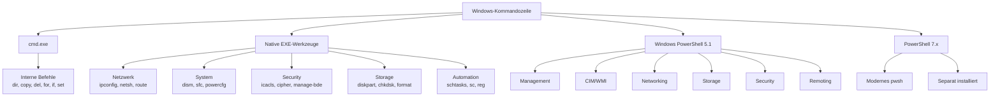
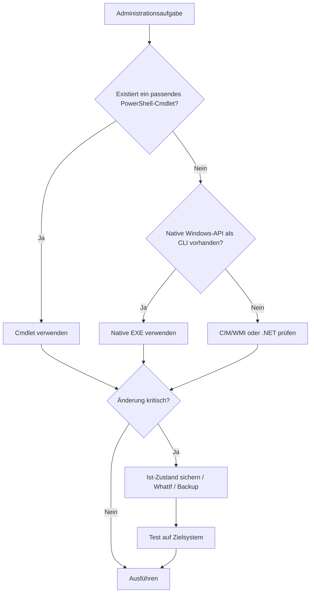

# Windows-Diagnose-Wissensbasis für Windows 10 und Windows 11

**Arbeitsstand:** 17. August 2026  
**Zweck:** Technische Grundlage für eine lokale Windows-Diagnoseanwendung mit externer KI-Auswertung und kontrollierter, bestätigungspflichtiger Befehlsausführung.

## 1. Zweck und Abgrenzung

Diese Masterdatei führt die bisher recherchierten Windows-Befehle, PowerShell-Module, Diagnosewerkzeuge, Performance- und Debugging-Werkzeuge sowie Sysinternals-Funktionen in einer gemeinsamen Referenz zusammen.

Sie soll der Anwendung drei Fragen beantworten:

1. Welche Windows-Fähigkeit oder welches Werkzeug ist für ein Problem relevant?
2. Welche konkrete Diagnose- oder Reparaturaktion ist möglich?
3. Welche Risiken, Voraussetzungen, Nebenwirkungen und Nachkontrollen gehören zu dieser Aktion?

Der Bestand ist **vollständig gegen die jeweils genannten Microsoft-Referenzen zum angegebenen Prüfdatum**, aber nicht als unveränderliche Liste jedes jemals verfügbaren Windows- oder Drittanbieterwerkzeugs zu verstehen. Windows-Features, RSAT, Serverrollen, PowerShell-Versionen, Microsoft Store-Komponenten und nachinstallierte Module verändern den tatsächlich verfügbaren Befehlsbestand.

Die lokale Anwendung muss deshalb immer zusätzlich inventarisieren:

```powershell
$PSVersionTable

Get-Module -ListAvailable |
    Select-Object Name, Version, Path

Get-Command |
    Select-Object Name, CommandType, Source, Version
```

## 2. Wissensebenen

### 2.1 Fähigkeitskatalog

Der Fähigkeitskatalog beschreibt Verwaltungsbereiche wie Netzwerk, Storage, Updates, Geräte, Defender, Domäne, Ereignisprotokolle, Performance und Recovery. Er verweist auf passende PowerShell-Module, native Programme, Windows-APIs und optionale Werkzeuge.

### 2.2 Aktionskatalog

Der Aktionskatalog beschreibt konkrete, erlaubte Diagnose- und Reparaturschritte. Das Risiko wird nicht nur nach dem Namen eines Programms, sondern nach der vollständigen Parameterkombination bewertet.

Beispiele:

| Aktion | Einordnung |
|---|---|
| `ipconfig /all` | lesend, niedriges Risiko |
| `ipconfig /flushdns` | begrenzte Zustandsänderung |
| `ipconfig /release` | kann die Netzwerkerreichbarkeit unterbrechen |
| `chkdsk C:` | überwiegend lesend |
| `chkdsk C: /f` | verändert Dateisystemstrukturen |
| `diskpart` → `list disk` | lesend |
| `diskpart` → `clean` | destruktiv |

### 2.3 Problemkatalog

Der Problemkatalog verbindet Symptome, Ereignisse und Messwerte mit möglichen Ursachen. Er darf ein einzelnes Windows-Ereignis nicht automatisch als Ursache behandeln. Beispielsweise beschreibt Kernel-Power 41 normalerweise einen ungeplanten Neustart, aber nicht zwingend dessen Ursache.

### 2.4 Erfahrungswissen

Community-Berichte werden getrennt von offiziellen Verfahren gespeichert. Sie können Hypothesen und Workarounds liefern, gelten aber nicht automatisch als bestätigte Reparaturanweisung.

## 3. Verbindliches Risikomodell

### 3.1 Gesamtrisikostufen

| Stufe | Bedeutung |
|---|---|
| **R0 – Information** | ausschließlich Anzeige oder lokale Berechnung |
| **R1 – Diagnose** | lesende oder leicht belastende Diagnose |
| **R2 – begrenzte Änderung** | normalerweise reversible Änderung mit begrenzter Auswirkung |
| **R3 – erhebliche Änderung** | System-, Netzwerk-, Dienst-, Sicherheits- oder Softwareänderung |
| **R4 – kritisch** | Boot-, Storage-, Domain-, Credential- oder Verfügbarkeitsrisiko |
| **R5 – destruktiv** | erwartbarer Datenverlust oder schwer rückgängig zu machende Aktion |

### 3.2 Einzelne Risikodimensionen

Jede Aktion benötigt zusätzlich getrennte Bewertungen:

```json
{
  "systemIntegrity": "low",
  "dataLoss": "none",
  "confidentiality": "medium",
  "availability": "low",
  "networkConnectivity": "none",
  "bootability": "none",
  "domainImpact": "none"
}
```

Ein lesender Befehl kann ein hohes Vertraulichkeitsrisiko besitzen. Beispiele sind das Auslesen eines LAPS-Kennworts, das Exportieren eines privaten Zertifikatschlüssels oder das Analysieren eines vollständigen Speicherabbilds.

## 4. Verbindliches Schema für ausführbare Aktionen

Eine Aktion ist erst ausführbar, wenn mindestens folgende Angaben geprüft wurden:

```json
{
  "actionId": "network.dns.resolve_name",
  "displayName": "DNS-Namen auflösen",
  "category": "network.dns",
  "mode": "diagnostic",
  "program": "powershell.exe",
  "command": "Resolve-DnsName",
  "arguments": ["-Name", "${validatedName}", "-ErrorAction", "Stop"],
  "supportedSystems": ["Windows 10", "Windows 11"],
  "requiresAdministrator": false,
  "requiresModule": "DnsClient",
  "changesSystem": false,
  "requiresRestart": false,
  "mayInterruptNetwork": false,
  "riskLevel": "R1",
  "automaticExecutionAllowed": true,
  "timeoutSeconds": 30,
  "successCriteria": ["structured result returned"],
  "failureSignals": ["DNS name does not exist", "DNS server timeout"],
  "preChecks": ["validate hostname", "detect available module"],
  "postChecks": [],
  "rollback": null,
  "outputSensitivity": "internal-network-data",
  "officialSources": [],
  "lastVerified": "2026-08-17"
}
```

Für Reparaturaktionen sind zusätzlich verpflichtend:

- genauer vorheriger Zustand
- Backup oder Exportmöglichkeit
- Rückgängig-Aktion
- Neustart- und Ausfallauswirkung
- explizite Benutzerbestätigung
- technische Nachkontrolle
- Abbruchverhalten und Timeout

## 5. Verbindliches Schema für Problemprofile

```json
{
  "problemId": "storage.nvme.timeout",
  "title": "NVMe-Timeout oder Controller-Reset",
  "symptoms": [
    "kurzzeitiger oder vollständiger Freeze",
    "Datenträgerauslastung bei 100 Prozent",
    "Anwendungen reagieren nicht"
  ],
  "evidence": [
    "stornvme oder storahci Ereignis 129",
    "Disk Ereignis 153",
    "erhöhte Datenträgerlatenz vor dem Ausfall"
  ],
  "possibleCauses": [
    "Treiber oder Firmware",
    "Energieverwaltung oder PCIe-Verbindung",
    "Datenträger- oder Controllerdefekt"
  ],
  "diagnosticActions": [],
  "repairActions": [],
  "exclusionCriteria": [],
  "verificationActions": [],
  "communityReports": [],
  "officialSources": []
}
```

## 6. Schema für Community-Erfahrungen

```json
{
  "reportId": "community.example.001",
  "problemId": "domain.secure_channel",
  "reportedEnvironment": "Windows 11, Active Directory",
  "attemptedAction": "Domäne verlassen und erneut beitreten",
  "reportedOutcome": "Problem laut Autor behoben",
  "evidenceLevel": "anecdotal",
  "independentConfirmations": 1,
  "possibleSideEffects": [
    "lokaler Administratorzugang erforderlich",
    "Neustarts erforderlich",
    "Profilzuordnung prüfen"
  ],
  "recommendedPosition": "last-resort",
  "sourceUrl": "",
  "lastVerified": ""
}
```

Community-Einträge dürfen eine offizielle Lösung ergänzen, aber niemals ohne zusätzliche Prüfung eine ausführbare Reparatur erzeugen.

## 7. Entscheidungsregeln für die Anwendung

1. Zuerst Problem und Zeitraum erfassen.
2. Vorhandene Module, Programme, Rechte und Windows-Version prüfen.
3. Zuerst ausschließlich lesende Beweise sammeln.
4. Ergebnisse zeitlich korrelieren.
5. Ursache und Folge unterscheiden.
6. Hypothesen nach Beweislage gewichten.
7. Zuerst die risikoärmste reversible Reparatur anbieten.
8. Befehl, Zweck, Risiko und Auswirkungen vor Ausführung anzeigen.
9. Kritische Aktionen nie automatisch ausführen.
10. Nach jeder Reparatur das ursprüngliche Symptom technisch erneut prüfen.

## 8. Erste Problemklassen für den späteren Ausbau

| Problemklasse | Primäre Beweise | Typische Werkzeugfamilien |
|---|---|---|
| Bootfehler | Bootphase, BCD, Setup-/Recovery-Logs | `bcdedit`, `bcdboot`, `reagentc`, WinRE |
| Bluescreen | BugCheck-Code, Dump, WHEA, Treiber | WinDbg, DumpChk, ProcDump, Event Logs |
| Freeze/Neustart | Timeline vor Event 41/6008, Storage, WHEA | Event Logs, WPR, SMART, RAM-Diagnose |
| Langsamer Rechner | CPU, RAM, Disk-I/O, Autostarts | WPR/WPA, Process Explorer, Autoruns, RAMMap |
| Storagefehler | SMART, Ereignisse 7/51/55/129/153, Latenz | Storage-Cmdlets, `chkdsk`, Herstellerdiagnose |
| Netzwerk/DNS | Adapter, IP, Route, DNS, Port, Paketverlust | NetTCPIP, DnsClient, `pktmon`, `curl.exe` |
| Windows Update | Fehlercode, CBS, DISM, SetupDiag | DISM, SetupDiag, DeliveryOptimization |
| Programmabsturz | WER, Event 1000/1002, Dump, Module | ProcDump, Process Monitor, WinDbg |
| Domänenvertrauen | DNS, Zeit, DC-Erreichbarkeit, Secure Channel | `nltest`, `netdom`, `Test-ComputerSecureChannel` |
| Entra/Hybrid Join | Device-, Tenant- und SSO-Zustand | `dsregcmd`, Ereignisprotokolle |
| GPU/Anzeige | Treiberversion, Event 4101, DxDiag | `dxdiag`, WPR, Herstellerdiagnose |
| Geräte/USB | PnP-Status, SetupAPI-Logs, Treiber | PnpDevice, `pnputil`, Process Monitor |
| Drucker | Spooler, Queue, Treiber, PrintService-Logs | PrintManagement, Event Logs |
| Defenderlast | Defender-ETL und Prozess-/Pfadkosten | DefenderPerformance |

## 9. Sicherheitsgrenzen

- Die KI erhält keinen freien Administratorzugriff.
- Die KI darf nur bekannte `actionId`-Werte anfordern.
- Parameter werden typisiert und validiert.
- Logtexte und Community-Inhalte gelten als nicht vertrauenswürdige Daten, nicht als Anweisungen.
- Secrets, Tokens, Kennwörter und private Schlüssel werden nicht in normale Logs geschrieben.
- R4- und R5-Aktionen benötigen eine besonders deutliche Bestätigung und einen Rückfallplan.
- Laborwerkzeuge wie NotMyFault dürfen auf Produktivsystemen nicht angeboten werden.
- Externe Downloads werden nicht automatisch als vertrauenswürdig behandelt.

## 10. Quellen- und Qualitätsfelder

Jeder Wissenseintrag benötigt:

```text
SourceTitle
SourceUrl
Publisher
SourceType
ApplicableVersions
LastVerified
DocumentationQuality
EvidenceLevel
```

Interne Recherchemarker wie `turn12search4` oder `turn0file2` sind keine dauerhaften Quellenangaben und wurden aus dieser Masterfassung entfernt. Nicht auflösbare Detailquellen müssen vor Freigabe einer ausführbaren Aktion erneut gegen die Originaldokumentation geprüft werden.

## 11. Aktueller Reifegrad

| Bereich | Stand |
|---|---|
| Klassische Windows-Commands | sehr umfassend inventarisiert |
| PowerShell-Module und Versionen | sehr umfassend inventarisiert |
| Moderne CLI, WSL, WinGet und OpenSSH | umfassend inventarisiert |
| Performance, ETW, Dumps und Sysinternals | umfassend inventarisiert |
| Allgemeine Risikobewertung | vorhanden |
| Risiko pro konkrete Parameterkombination | schrittweise auszubauen |
| Maschinenlesbare Aktionsprofile | Schema vorhanden, Inhalte auszubauen |
| Problem-Ursachen-Profile | Schema und Startklassen vorhanden, Inhalte auszubauen |
| Community-Erfahrungen | Schema vorhanden, Inhalte zu recherchieren |
| Ergebnisparser und Nachkontrollen | pro Aktion auszubauen |

---

# Teil I – Aktueller Werkzeug-, Modul- und Diagnoseabgleich

## Zusammengeführter Delta-Abgleich für Werkzeuge und Module

## Abgrenzung und Ergebnis des vollständigen Abgleichs

Nach dem Abgleich deiner hochgeladenen Microsoft-Referenzen, deiner eingefügten Modultabelle und der aktuellen Microsoft-Dokumentation ist die wichtigste Erkenntnis: **Dein bisheriger Bestand ist für die klassische Windows-Command-Referenz bereits sehr groß, aber er ist noch nicht vollständig, wenn das Ziel eine umfassende Windows-10/11-Diagnose- und Administrationsdatenbank ist.**

Die hochgeladene Windows-Commands-Referenz beschreibt Microsofts klassische Win32-/Konsolenbefehle und gilt laut Microsoft unter anderem für Windows 10, Windows 11 und mehrere Windows-Server-Versionen. Sie enthält auch sehr große Unterbefehlshierarchien wie `auditpol`, `bitsadmin`, `diskpart`, `fsutil`, `ftp`, `manage-bde`, `netsh`, `reg`, `robocopy` usw.

Sie ist aber **keine Auflistung jeder ausführbaren EXE, jedes optionalen Features, jedes ADK-Werkzeugs, jedes Debuggers, jedes Sysinternals-Programms und jedes PowerShell-Moduls**, das auf Windows 10/11 sinnvoll oder verfügbar sein kann. Microsoft beschreibt selbst getrennte Werkzeugfamilien für WinGet, WSL, OpenSSH, Windows Performance Toolkit, Debugging Tools, Sysinternals und PowerShell-Module.

Auch deine PowerShell-PDF ist ein sehr wichtiger Ausgangspunkt. Die Seiten 1–6 listen die mit Windows Server 2025 und Windows 11 verbundenen Windows-PowerShell-Module auf; die späteren Seiten enthalten zusätzlich Microsofts PowerShell-7-Kompatibilitätstabelle. Dadurch kommen Module wie `CimCmdlets`, `Microsoft.PowerShell.Management`, `Microsoft.PowerShell.Utility`, `PackageManagement`, `PowerShellGet`, `PSDiagnostics` und weitere hinzu, die in der ersten Modultabelle nicht als eigene Einträge stehen.

Der entscheidende neue Punkt ist, dass Microsofts **aktuelle** Windows-Server-2025-/Windows-11-Modulreferenz gegenüber deiner älteren Tabelle weitergewachsen ist. Nach Normalisierung offensichtlicher Namensunterschiede wie `DeviceHealthAttestion` → `DeviceHealthAttestation`, `DirectAccessClientComponent` → `DirectAccessClientComponents` und `PKI` → `PKIClient` ergibt mein Abgleich **24 weitere Modulnamen**, die in deiner alten Tabelle nicht als eigene Module vorhanden waren. Das ist ein Delta aus den beiden Microsoft-Listen, kein von Microsoft selbst veröffentlichter „24 fehlen“-Wert.

Für die folgende Risikobewertung verwende ich:

| Stufe | Bedeutung für deine Diagnose-App |
|---|---|
| **N – Niedrig** | im Wesentlichen Abfrage, Inventarisierung oder Analyse; normalerweise keine dauerhafte Systemänderung |
| **M – Mittel** | erzeugt Logs/Dumps, verändert begrenzte Einstellungen oder kann Leistung, Speicher, Netzwerk oder Datenschutz beeinflussen |
| **H – Hoch** | verändert Netzwerk, Security, Rollen, Zertifikate, Storage, Benutzer, Dienste, Provisionierung oder produktive Infrastruktur |
| **K – Kritisch** | Datenverlust, Bootausfall, Cluster-/Domänenstörung, Credential-Offenlegung oder schwer rückgängig zu machende Änderung möglich |

**Wichtig:** Die Risikostufe muss später **pro Parameterkombination** berechnet werden und nicht nur pro Befehlsname. Ein `Get-*` ist beispielsweise nicht automatisch harmlos: `Get-LapsADPassword` ist technisch lesend, gibt aber ein hochsensibles Administratorkennwort zurück. Ebenso ist `winget search` harmlos, während `winget configure` den Sollzustand eines Rechners verändern kann.


## Fehlende Windows-PowerShell-Module aus der aktuellen Microsoft-Referenz

Die folgenden Module sind die wichtigste echte Lücke gegenüber deiner bisherigen Tabelle. Ich führe **alle auf den jeweiligen Microsoft-Modulseiten dokumentierten Cmdlets** mit Zweck und Risikoklasse auf.

### Neue Diagnose-, Client- und Sicherheitsmodule

| Modul | Vollständiger dokumentierter Befehlsbestand, Zweck und Risiko |
|---|---|
| **`DefenderPerformance`** | **Warum:** Wenn Defender ungewöhnlich viel CPU/I/O erzeugt, lässt sich ermitteln, welche Dateien, Pfade oder Prozesse die größten Scan-Kosten verursachen. `New-MpPerformanceRecording` **[M]** zeichnet eine Defender-Performance-ETL auf; Risiko sind zusätzlicher I/O-/Speicherbedarf und möglicherweise sensible Pfad-/Prozessinformationen. `Get-MpPerformanceReport` **[N/M]** analysiert die Aufzeichnung und erzeugt einen Bericht. Für eine Diagnose-App ist das wesentlich präziser als Defender „auf Verdacht“ zu deaktivieren. |
| **`DeliveryOptimization`** | **Warum:** Diagnose von Windows-Update-/Store-Downloadproblemen, Peer-to-Peer-Delivery und Bandbreitennutzung. `Get-DeliveryOptimizationStatus` **[N]** zeigt aktuelle Transfers; `Get-DeliveryOptimizationLog` **[N/M]** liest Logs; `Get-DeliveryOptimizationLogAnalysis` **[N]** analysiert sie; `Get-DeliveryOptimizationPerfSnap` und `Get-DeliveryOptimizationPerfSnapThisMonth` **[N]** zeigen Leistungsdaten; `Get-DOConfig`, `Get-DODownloadMode`, `Get-DOPercentageMaxBackgroundBandwidth`, `Get-DOPercentageMaxForegroundBandwidth` **[N]** lesen die Konfiguration. `Enable-DeliveryOptimizationVerboseLogs` und `Disable-DeliveryOptimizationVerboseLogs` **[M]** verändern Logging und können zusätzliche sensible Daten/Platzverbrauch erzeugen. `Delete-DeliveryOptimizationCache` **[M]** entfernt den Cache und kann erneute Downloads verursachen. `Set-DeliveryOptimizationStatus`, `Set-DODownloadMode`, `Set-DOMaxBackgroundBandwidth`, `Set-DOMaxForegroundBandwidth`, `Set-DOPercentageMaxBackgroundBandwidth`, `Set-DOPercentageMaxForegroundBandwidth` **[M/H]** verändern Download- oder Bandbreitenverhalten. |
| **`LAPS`** | **Warum:** Sehr wichtig in verwalteten Windows-Umgebungen für Windows Local Administrator Password Solution. `Find-LapsADExtendedRights` **[N/M]** sucht erweiterte AD-Rechte; `Get-LapsDiagnostics` **[N/M]** sammelt Diagnosedaten; `Get-LapsADPassword` und `Get-LapsAADPassword` **[H]** lesen verwaltete lokale Administratorkennwörter und müssen deshalb als **Secret** behandelt und niemals ungefiltert protokolliert werden. `Invoke-LapsPolicyProcessing` **[M]** erzwingt Richtlinienverarbeitung; `Reset-LapsPassword` **[H]** fordert einen Kennwortwechsel an; `Set-LapsADPasswordExpirationTime` **[H]** beeinflusst Rotation. `Set-LapsADAuditing`, `Set-LapsADComputerSelfPermission`, `Set-LapsADReadPasswordPermission`, `Set-LapsADResetPasswordPermission` **[H]** verändern AD-Berechtigungen. `Update-LapsADSchema` **[K]** erweitert das Active-Directory-Schema und gehört hinter eine besonders starke Bestätigungssperre. |
| **`LanguagePackManagement`** | **Warum:** Hilfreich bei beschädigten oder falsch installierten Sprachpaketen und bei automatisierter Clientbereitstellung. `Get-InstalledLanguage` und `Get-SystemPreferredUILanguage` **[N]** lesen Sprachkonfiguration. `Install-Language` **[M]** installiert Sprachkomponenten und kann Downloads/Neustart erfordern; `Set-SystemPreferredUILanguage` **[M]** ändert die bevorzugte System-UI-Sprache; `Uninstall-Language` **[M/H]** entfernt Sprachressourcen. Microsoft beschreibt dieses Modul als Client-OS-Modul und verweist auf die Zusammenarbeit mit dem `International`-Modul. |
| **`Microsoft.DiagnosticDataViewer`** | **Warum:** Lokale Einsicht in Windows-Diagnosedaten und ihre Kategorien. `Get-DiagnosticData`, `Get-DiagnosticDataTypes`, `Get-DiagnosticDataViewingSetting`, `Get-DiagnosticStoreCapacity` **[N/M]** lesen Telemetrie-/Diagnoseinformationen, wobei die Daten selbst datenschutzrelevant sein können. `Enable-DiagnosticDataViewing` und `Disable-DiagnosticDataViewing` **[M]** aktivieren/deaktivieren die lokale Speicherung für Betrachtung; `Set-DiagnosticStoreCapacity` **[M]** ändert deren Kapazität. Für deine App sollte die Ausgabe als **privacy-sensitive** markiert werden. |
| **`WindowsDiagnosticData`** | `Clear-WindowsDiagnosticData` **[M/H]** fordert die Löschung der von diesem Gerät an Microsoft hochgeladenen Diagnosedaten an. Das ist kein normaler „Cleanup“-Befehl: Historische Diagnosedaten gehen dadurch als Analysequelle verloren. Für Datenschutzfunktionen sinnvoll, aber nicht automatisch während einer allgemeinen Reparatur ausführen. |
| **`SecurityCmdlets`** | `Backup-AuditPolicy` **[N]** und `Backup-SecurityPolicy` **[N]** sichern Audit- beziehungsweise Security-Policy-Daten. `Restore-AuditPolicy` und `Restore-SecurityPolicy` **[H/K]** spielen diese zurück und können die Sicherheits- und Überwachungsrichtlinie eines Systems erheblich verändern. Sehr sinnvoll als Backup-/Rollback-Werkzeug, aber Restore nie automatisch. |
| **`WinHttpProxy`** | **Warum:** Moderne PowerShell-Verwaltung des WinHTTP-Proxys, relevant für Dienste, Update-/Management-Komponenten und Anwendungen, die WinHTTP verwenden. `Get-WinhttpProxy` und `Export-WinhttpProxy` **[N]** lesen/sichern die Konfiguration. `Set-WinhttpProxy`, `Import-WinhttpProxy` und `Reset-WinhttpProxy` **[H]** verändern die Proxykonfiguration und können bei Fehlkonfiguration Update, Aktivierung, Cloudzugriffe und andere Dienstkommunikation unterbrechen. |
| **`OsConfiguration`** | `Get-OSConfiguration`, `Get-OsConfigurationDocument`, `Get-OsConfigurationDocumentContent`, `Get-OsConfigurationDocumentResult`, `Get-OsConfigurationProperty` **[N]** dienen dem Lesen von OS-Konfigurationszuständen/-dokumenten; `Set-OsConfigurationDocument` und `Set-OsConfigurationProperty` **[M/H]** schreiben Konfiguration; `Remove-OsConfigurationDocument` **[H]** entfernt ein Dokument. **Qualitätshinweis:** Teile der aktuellen Microsoft-Referenz enthalten noch Platzhalter statt vollständiger Beschreibungen; deshalb sollte deine Datenbank für dieses Modul `docs_quality = incomplete` setzen und zusätzlich `Get-Help -Full` auf dem Zielsystem auswerten. |

### Neue Netzwerk-, Cluster- und Servermodule

| Modul | Vollständiger dokumentierter Befehlsbestand, Zweck und Risiko |
|---|---|
| **`FailoverClusterSet`** | **Warum:** Verwaltung von Cluster Sets über mehrere Failovercluster. Abfragen `Get-ClusterSet`, `Get-ClusterSetAvailabilitySet`, `Get-ClusterSetFaultDomain`, `Get-ClusterSetLog`, `Get-ClusterSetMember`, `Get-ClusterSetNode`, `Get-ClusterSetOptimalNodeForVm`, `Get-ClusterSetVM` **[N]**. Erzeugung/Initialisierung `New-ClusterSet`, `New-ClusterSetAvailabilitySet`, `New-ClusterSetFaultDomain`, `Initialize-ClusterSet`, `Initialize-ClusterSetMember` **[H]**. Mitgliedschaft `Add-ClusterSetMember`, `Register-ClusterSetMember`, `Clear-ClusterSetMember`, `Unregister-ClusterSetMember`, `Remove-ClusterSetMember` **[H/K]**. Fault Domains `Add-ClusterSetFaultDomainMember`, `Remove-ClusterSetFaultDomainMember`, `Remove-ClusterSetFaultDomain` **[H]**. Tags `Add-ClusterSetMemberTag`/`Remove-ClusterSetMemberTag` **[M]**. Availability Sets `Add-ClusterSetParticipantToAvailabilitySet`, `Remove-ClusterSetParticipantFromAvailabilitySet`, `Remove-ClusterSetAvailabilitySet` **[H]**. VM-Operationen `Register-ClusterSetVM`, `Unregister-ClusterSetVM`, `Move-ClusterSetVM`, `Set-ClusterSetVm` **[H]**. Storage Replica `Register-ClusterSetSRPartnership` **[H]**. `Set-ClusterSet` **[H]** und `Remove-ClusterSet` **[K]** verändern bzw. entfernen die Gesamtstruktur. |
| **`Gatewaytunnel`** | `Get-GatewayConfiguration`, `Get-GatewayRoutingDomain`, `Get-GatewayTunnel`, `Get-GatewayTunnelStatistics` **[N]** lesen Gateway-/Tunnelzustände. `Enable-GatewayTunnelPacketTrace` und `Disable-GatewayTunnelPacketTrace` **[M]** steuern Packet Tracing; dabei können sensible Netzwerkdaten anfallen. `Connect-GatewayTunnel`, `Disconnect-GatewayTunnel`, `Enable-GatewayRoutingDomain`, `Disable-GatewayRoutingDomain` **[H]** können aktive Erreichbarkeit beeinflussen. `Set-GatewayConfiguration`, `Set-GatewayTunnel` **[H]** ändern die Konfiguration; `Remove-GatewayTunnel` **[H/K]** entfernt einen Tunnel. Teile der Referenz besitzen aktuell nur sehr knappe beziehungsweise Platzhalterbeschreibungen, daher muss die App die installierte Version zur Laufzeit prüfen. |
| **`HostNetworkingService`** | `Get-HnsEndpoint`, `Get-HnsEndpointAddresses`, `Get-HnsEndpointStats`, `Get-HnsNamespace`, `Get-HnsNetwork`, `Get-HnsPolicyList` **[N]** sind wertvoll für Container-/virtuelle Netzwerkdiagnose. `Remove-HnsEndpoint`, `Remove-HnsNamespace`, `Remove-HnsNetwork`, `Remove-HnsPolicyList` **[H/K]** entfernen HNS-Objekte und können Container-, Hyper-V- oder andere virtuelle Netzwerke unterbrechen. Die `Remove-*`-Befehle dürfen in einer Diagnose-App niemals Teil einer automatischen „Netzwerk zurücksetzen“-Routine sein. |
| **`NetworkATC`** | **Warum:** Intent-basierte Netzwerkkonfiguration, insbesondere Server/Azure-Local-/Clusterumgebungen. Lesend: `Get-AllNetIntents`, `Get-HUDSwitchlessMapping`, `Get-NetIntent`, `Get-NetIntentAllGoalStates`, `Get-NetIntentStatus` **[N]**. Override-Objekte erstellen: `New-NetIntentAdapterPropertyOverrides`, `New-NetIntentAdapterRssOverrides`, `New-NetIntentGlobalClusterOverrides`, `New-NetIntentGlobalProxyOverrides`, `New-NetIntentQoSPolicyOverrides`, `New-NetIntentSiteOverrides`, `New-NetIntentStorageOverrides`, `New-NetIntentSwitchConfigurationOverrides` **[N/M]** – das Erstellen des Objekts allein konfiguriert noch nicht zwingend den Host. `Add-NetIntent`, `Copy-NetIntent`, `Set-NetIntent`, `Set-NetIntentRetryState`, `Update-NetIntentAdapter`, `Update-NetIntentType`, `Update-NetworkATC` **[H]** können Hostnetzwerke ändern. `Remove-NetIntent` **[H]** entfernt eine Intent-Konfiguration. `Set-NetIntentTracing` **[M]** beeinflusst Tracing. `Start-NetworkAtc`/`Stop-NetworkAtc` **[H/K]** können produktive Netzwerkautomatisierung beeinflussen. |
| **`NetworkControllerFc`** | `Get-NetworkControllerOnFailoverCluster` und `Get-NetworkControllerOnFailoverClusterReplica` **[N]** lesen Status. `Enable-NetworkControllerOnFailoverClusterLogging`, `Enable-NetworkControllerOnFailoverClusterLoggingOnDevice`, `Disable-NetworkControllerOnFailoverClusterLogging`, `Update-NetworkControllerOnFailoverClusterLogging` **[M]** steuern Diagnoseaufzeichnung. `Add-NetworkControllerOnFailoverClusterNode`, `Install-NetworkControllerOnFailoverCluster`, `Set-NetworkControllerOnFailoverCluster`, `Update-NetworkControllerOnFailoverCluster`, `Restore-NetworkControllerOnFailoverCluster` **[H]** verändern die Clusterbereitstellung. `Uninstall-NetworkControllerOnFailoverCluster` **[K]** kann die Funktion entfernen. Microsoft weist bei mehreren schreibenden Operationen auf Cluster-Administratorrechte hin. |

### Neue Storage-, Migration- und ReFS-Module

| Modul | Vollständiger dokumentierter Befehlsbestand, Zweck und Risiko |
|---|---|
| **`Microsoft.ReFsDedup.Commands`** | `Get-ReFSDedupSchedule`, `Get-ReFSDedupScrubSchedule`, `Get-ReFSDedupStatus` **[N]** lesen ReFS-Deduplizierungsstatus. `Set-ReFSDedupSchedule`, `Set-ReFSDedupScrubSchedule`, `Clear-ReFSDedupSchedule`, `Clear-ReFSDedupScrubSchedule`, `Resume-ReFSDedupSchedule`, `Suspend-ReFSDedupSchedule` **[M/H]** verändern Zeitplanung. `Enable-ReFSDedup`, `Disable-ReFSDedup` **[H]** verändern den Deduplizierungsbetrieb; `Start-ReFSDedupJob`, `Stop-ReFSDedupJob` **[H]** beeinflussen aktive Jobs und können erhebliche Storage-I/O-Last verursachen. Primär Server/ReFS. |
| **`PersistentMemory`** | `Get-PmemDedicatedMemory`, `Get-PmemDisk`, `Get-PmemPhysicalDevice`, `Get-PmemUnusedRegion` **[N]** inventarisieren Persistent Memory. `New-PmemDedicatedMemory`, `New-PmemDisk` **[H]** erstellen Speicherbereiche/Disks. `Initialize-PmemPhysicalDevice` **[K]** initialisiert physische PMem-Hardware. `Remove-PmemDedicatedMemory` und `Remove-PmemDisk` **[K]** können bereitgestellte Speicherobjekte entfernen und dadurch Datenzugriff zerstören. Nur auf passenden Serverplattformen relevant. |
| **`StorageBusCache`** | Lesend: `Get-StorageBusBinding`, `Get-StorageBusCache`, `Get-StorageBusClientDevice`, `Get-StorageBusDisk`, `Get-StorageBusTargetCacheStore`, `Get-StorageBusTargetCacheStoresInstance`, `Get-StorageBusTargetDevice`, `Get-StorageBusTargetDeviceInstance` **[N]**. `Resume-StorageBusDisk`/`Suspend-StorageBusDisk` **[H]** verändern Disk-Verfügbarkeit. `Enable-StorageBusCache`, `Disable-StorageBusCache`, `Enable-StorageBusDisk`, `Disable-StorageBusDisk`, `Set-StorageBusCache`, `Set-StorageBusProfile`, `Update-StorageBusCache`, `New-StorageBusBinding`, `New-StorageBusCacheStore` **[H]** ändern die Storage-Bus-/Cachetopologie. `Remove-StorageBusBinding` und besonders `Clear-StorageBusDisk` **[K]** sind destruktiv beziehungsweise können Daten-/Storage-Zustände wesentlich verändern. |
| **`StorageMigrationService`** | Status/Analyse: `Get-SmsCutover`, `Get-SmsCutoverPairing`, `Get-SmsCutoverStages`, `Get-SmsDestinationConfig`, `Get-SmsInventory`, `Get-SmsNasPrescan`, `Get-SmsProxy`, `Get-SmsState`, `Get-SmsTransfer`, `Get-SmsTransferPairing`, `Get-SmsVersion`, `Test-SmsMigration` **[N/M]**. Vorbereitung: `New-SmsInventory`, `Start-SmsInventory`, `Stop-SmsInventory`, `Set-SmsInventory`, `Remove-SmsInventory`, `New-SmsNasPrescan`, `Start-SmsNasPrescan` **[M]**. Transfer: `New-SmsTransfer`, `Set-SmsTransfer`, `Set-SmsTransferPairing`, `Start-SmsTransfer`, `Stop-SmsTransfer`, `Remove-SmsTransfer`, `Remove-SmsTransferPairing` **[H]**. Proxy: `Register-SmsProxy`/`Unregister-SmsProxy` **[H]**. Cutover: `New-SmsCutover`, `Set-SmsCutover`, `Set-SmsCutoverPairing`, `Resume-SmsCutover`, `Start-SmsCutover`, `Stop-SmsCutover`, `Remove-SmsCutover`, `Remove-SmsCutoverPairing` **[H/K]**, weil der eigentliche Produktionswechsel Identität, Netzwerk und Storage betreffen kann. |
| **`VMDirectStorage`** | `Get-VMDirectVirtualDisk` **[N]** zeigt Direct-Storage-Zuordnungen. `Add-VMDirectVirtualDisk` **[H]** ordnet einem virtuellen System direkten Storage zu; `Remove-VMDirectVirtualDisk` **[H/K]** entfernt die Zuordnung und kann Workloads den Zugriff auf Storage nehmen. |

### Neue Server-, Provisioning- und Insights-Module

| Modul | Vollständiger dokumentierter Befehlsbestand, Zweck und Risiko |
|---|---|
| **`Microsoft.ServerCore.SConfig`** | `Get-SConfig` **[N]** liest SConfig-Zustand. `Invoke-SConfig` und `Invoke-SConfigLogon` **[M]** starten SConfig-Funktionen/Oberfläche. `Set-SConfig` **[H]** kann Server-Core-Konfiguration verändern; `Reset-SConfig` **[H]** setzt Zustände zurück. Kein Windows-11-Clientmodul, sondern Server-Core-Kontext. Teile der Modulreferenz enthalten derzeit nur sehr knappe Platzhaltertexte. |
| **`Microsoft.Windows.ServerManager.Migration`** | `Get-WindowsFeature`, `Get-SmigServerFeature` **[N]** inventarisieren Rollen/Features. `Export-SmigServerSetting` **[M]** exportiert Migrationsdaten; `Send-SmigServerData` **[M/H]** überträgt sie. `Enable-ServerManagerStandardUserRemoting`/`Disable-ServerManagerStandardUserRemoting` **[H]** verändern Remote-Management-Berechtigung. `Install-WindowsFeature` **[H]**, `Uninstall-WindowsFeature` **[H/K]**, `Import-SmigServerSetting` und `Receive-SmigServerData` **[H]** verändern den Zielserver. Das gehört ausdrücklich in eine Server-/Migrationsebene, nicht in normale Windows-Client-Reparaturen. |
| **`Provisioning`** | `Get-ProvisioningPackage`, `Get-TrustedProvisioningCertificate` **[N]** inventarisieren Pakete/Zertifikate. `Export-ProvisioningPackage`, `Export-Trace` **[N/M]** exportieren Inhalte beziehungsweise Diagnoseinformationen. `Install-ProvisioningPackage` **[H]** kann zahlreiche Geräteeinstellungen und Richtlinien anwenden; `Uninstall-ProvisioningPackage` **[H]** entfernt sie. `Install-TrustedProvisioningCertificate`/`Uninstall-TrustedProvisioningCertificate` **[H/K]** verändern die Vertrauenskette für Provisioning und gehören hinter Admin-/Bestätigungsbarrieren. |
| **`SystemInsights`** | `Get-InsightsCapability`, `Get-InsightsCapabilityAction`, `Get-InsightsCapabilityResult`, `Get-InsightsCapabilitySchedule` **[N]** lesen Prognose-/Capability-Daten. `Add-InsightsCapability`, `Enable-InsightsCapability`, `Disable-InsightsCapability`, `Update-InsightsCapability`, `Remove-InsightsCapability` **[M/H]** verwalten Capabilities. `Enable-InsightsCapabilitySchedule`, `Disable-InsightsCapabilitySchedule`, `Set-InsightsCapabilitySchedule` **[M]** beeinflussen Ausführungspläne. `Invoke-InsightsCapability` **[M]** führt eine Analyse aus. `Set-InsightsCapabilityAction` und `Remove-InsightsCapabilityAction` **[H]** sind besonders zu prüfen, wenn automatisierte Aktionen mit einem Ergebnis verknüpft sind. Windows-Server-Funktion, nicht typische Clientbasis. |

### Neue Boot- und Plattformmodule

| Modul | Vollständiger dokumentierter Befehlsbestand, Zweck und Risiko |
|---|---|
| **`Microsoft.Windows.Bcd.Cmdlets`** | Das ist eine besonders wichtige Ergänzung, weil sie PowerShell-native BCD-Verwaltung bereitstellt. `Get-BcdEntry`, `Get-BcdEntryDebugSettings`, `Get-BcdEntryHypervisorSettings`, `Get-BcdStore` **[N]** lesen Bootdaten. `Export-BcdStore` **[N]** sollte vor riskanten Änderungen als Sicherung dienen. `Copy-BcdEntry`, `New-BcdEntry`, `New-BcdStore` **[H]** erstellen Bootobjekte/Stores. `Enable-BcdElementBootDebug`, `Disable-BcdElementBootDebug`, `Enable-BcdElementBootEms`, `Disable-BcdElementBootEms`, `Enable-BcdElementDebug`, `Disable-BcdElementDebug`, `Enable-BcdElementEms`, `Disable-BcdElementEms`, `Enable-BcdElementEventLogging`, `Disable-BcdElementEventLogging`, `Enable-BcdElementHypervisorDebug`, `Disable-BcdElementHypervisorDebug` **[M/H]** ändern Boot-/Debugverhalten. `Set-BcdBootDefault`, `Set-BcdBootDisplayOrder`, `Set-BcdBootSequence`, `Set-BcdBootTimeout`, `Set-BcdBootToolsDisplayOrder`, `Set-BcdDebugSettings`, `Set-BcdElement`, `Set-BcdHypervisorSettings` **[H/K]** verändern den Bootpfad. `Import-BcdStore`, `Remove-BcdElement`, `Remove-BcdEntry` **[K]** können bei falscher Auswahl ein nicht bootfähiges System erzeugen. |

Damit ist ein wichtiger Teil deines bisherigen Bestands korrigiert: **Es fehlen nicht nur Gallery-Module wie WinGet.Client; selbst innerhalb Microsofts aktueller Windows-/Server-Modulreferenz gibt es gegenüber deiner älteren Tabelle einen echten Delta-Bestand.**


## PowerShell-Core-, Kompatibilitäts- und optionale Microsoft-Module

Die zweite große Lücke entsteht dadurch, dass Microsofts Windows-Modulliste und die tatsächlich relevanten PowerShell-Module **nicht dieselbe Menge** sind. Die PowerShell-7-Kompatibilitätsmatrix deiner PDF führt zusätzliche Module auf. Microsoft unterscheidet unter anderem „Natively Compatible“, „Works with Compatibility Layer“, „Untested with Compatibility Layer“, „Not Supported“ und „Partially“.

### PowerShell-Module, die zusätzlich als eigener Bestand geführt werden sollten

| Modul | Einordnung, Grund und Risiko |
|---|---|
| `CimCmdlets` | PowerShell-Core-Bereich für CIM/WMI-artige Managementzugriffe. Unter anderem Grundlage für `Get-CimInstance`, `Invoke-CimMethod`, `New-CimSession` usw. **Risiko reicht von N bis H**, weil Lesen harmlos sein kann, ein `Invoke-CimMethod` aber remote oder lokal Änderungen auslösen kann. Microsoft führt es als in PowerShell 7 integriert und nativ kompatibel. |
| `Microsoft.PowerShell.Archive` | ZIP-/Archivfunktionen wie `Compress-Archive` und `Expand-Archive`. **N/M**; Überschreiben/Extrahieren untrusted Archives muss wegen Pfaden und vorhandenen Daten geprüft werden. In PowerShell 7 integriert. |
| `Microsoft.PowerShell.Diagnostics` | Diagnose- und Performance-Counter-Funktionen. Bestandteil von PowerShell 7. **N/M**, je nach Aufzeichnung. |
| `Microsoft.PowerShell.Host` | Hostinteraktion. Core-Modul. Normalerweise **N/M**. |
| `Microsoft.PowerShell.LocalAccounts` | Lokale Benutzer/Gruppen: `Add-LocalGroupMember`, `Disable-LocalUser`, `Enable-LocalUser`, `Get-LocalGroup`, `Get-LocalGroupMember`, `Get-LocalUser`, `New-LocalGroup`, `New-LocalUser`, `Remove-LocalGroup`, `Remove-LocalGroupMember`, `Remove-LocalUser`, `Rename-LocalGroup`, `Rename-LocalUser`, `Set-LocalGroup`, `Set-LocalUser`. `Get-*` **[N]**; Create/Set/Rename **[M/H]**; Entfernen oder Deaktivieren **[H/K]**, falls Adminzugriff verloren geht. Microsoft weist außerdem auf Einschränkungen in 32-Bit-PowerShell auf 64-Bit-Systemen hin. |
| `Microsoft.PowerShell.Management` | Zentrales Core-Modul für Dateien, Prozesse, Dienste, Computer, Pfade usw. **N–K je Cmdlet/Parameter**; beispielsweise ist `Get-Service` völlig anders zu bewerten als `Stop-Computer` oder eine Dateioperation mit `-Force`. In PowerShell 7 integriert. |
| `Microsoft.PowerShell.Security` | Execution Policy, Signaturen, Secure Strings und andere Security-Funktionen. **N–H** abhängig vom Vorgang. In PowerShell 7 integriert. |
| `Microsoft.PowerShell.Utility` | Sehr großes Core-Modul für Objektverarbeitung, JSON/CSV, Webzugriffe, Hashing, Messungen usw. **N–H**. Gerade `Invoke-WebRequest`/`Invoke-RestMethod` benötigen Netzwerk-/Credential-Risikoprofile. |
| `Microsoft.WSMan.Management` | WSMan/Remoting-Konfiguration. Abfragen **N**, Änderungen am Remoting-/TrustedHosts-/WSMan-Zustand **H**. In PowerShell 7 integriert. |
| `PackageManagement` | Ältere/kompatible Paketmanagementschicht. Installation/Deinstallation **M/H**. Microsoft führt sie weiterhin als PowerShell-7-kompatibel. |
| `PowerShellGet` | Klassisches PowerShell-Modul-/Skriptpaketmanagement. Suche **N**, Installation/Update/Uninstall **M/H**, insbesondere bei nicht vertrauenswürdigen Repositories. |
| `Microsoft.PowerShell.PSResourceGet` | **Soll neu aufgenommen werden.** Microsoft beschreibt PSResourceGet als die neuere Paketmanagementlösung; aktuelle PowerShell-Versionen liefern es mit und es kann neben PowerShellGet/PackageManagement existieren. Für eine neue Diagnose-App ist es langfristig die wichtigere moderne Schnittstelle. Suche **N**, Installation/Update/Uninstall **M/H**. |
| `PSDesiredStateConfiguration` | DSC. Teilweise in PowerShell 7 integriert beziehungsweise versionsabhängig. Eine reine Statusabfrage kann **N** sein; das Durchsetzen eines Konfigurationszustands **H/K**, weil Dienste, Features, Registry, Dateien und Pakete verändert werden können. |
| `PSDiagnostics` | PowerShell-Diagnosefunktionen; Microsoft führt es als nativ kompatibel/in PowerShell integriert. Aufzeichnungen **M**, Auswertung **N**. |
| `PSScheduledJob` | Vor allem Windows PowerShell 5.1; Microsofts Kompatibilitätstabelle führt es als nicht durch den Kompatibilitätslayer unterstützt. Deshalb **Legacy markieren**, nicht als normalen PowerShell-7-Standard behandeln. |
| `PSWorkflow`, `PSWorkflowUtility` | Windows-PowerShell-/Workflow-Legacybereich; in der alten Kompatibilitätsmatrix nicht als moderner nativer PS7-Bestand zu behandeln. Für eine neue App nur Legacy-Import, nicht primäre Automatisierungsbasis. |
| `WindowsUpdateProvider` | Von Microsofts Kompatibilitätsmatrix zusätzlich aufgeführt und von `WindowsUpdate` beziehungsweise dem Drittanbieter-Modul `PSWindowsUpdate` sauber zu trennen. |
| `Microsoft.PowerShell.ODataUtils`, `ISE`, `SMS` | Tauchen in der Kompatibilitätsmatrix auf, sind aber nicht als moderne allgemeine Windows-11-Coremodule zu behandeln. Sie brauchen eine **Legacy/Feature/Produkt**-Kennzeichnung statt „immer installiert“. |

Ein weiterer wichtiger Architekturpunkt: Für ältere Windows-PowerShell-Module besitzt PowerShell 7 die Möglichkeit, Module über Windows PowerShell beziehungsweise den Kompatibilitätsmechanismus zu laden. Deshalb sollte `Microsoft.PowerShell.Compatibility` beziehungsweise das alte WindowsCompatibility-Konzept **nicht pauschal als zwingendes Basismodul** in deiner Datenbank geführt werden; zuerst sollte die native PS7-Funktionalität und `Import-Module -UseWindowsPowerShell` berücksichtigt werden.

### Microsoft- und PowerShell-Ökosystemmodule für die Diagnose-App

Diese sind sinnvoll, aber **nicht mit den in Windows integrierten Windows-PowerShell-Modulen vermischen**:

| Modul | Befehle/Funktion | Einordnung |
|---|---|---|
| **`Microsoft.WinGet.Client`** | Die Microsoft-PowerShell-Gallery listet unter anderem `Get-WinGetVersion`, `Find-WinGetPackage`, `Get-WinGetPackage`, `Get-WinGetSource`, `Install-WinGetPackage`, `Uninstall-WinGetPackage`, `Update-WinGetPackage`, `Get-WinGetUserSetting`, `Set-WinGetUserSetting`, `Test-WinGetUserSetting`, `Assert-WinGetPackageManager`, `Repair-WinGetPackageManager`, `Enable-WinGetSetting`, `Disable-WinGetSetting`, `Get-WinGetSetting`, `Add-WinGetSource`, `Remove-WinGetSource`, `Reset-WinGetSource`, `Export-WinGetPackage`, `Repair-WinGetPackage`. Lesende `Get/Find/Test/Assert` **N**; Settings/Sources **M/H**; Install/Update/Repair **H**; Uninstall **H/K je Paket**. Microsoft selbst nutzt `Repair-WinGetPackageManager` beispielsweise zum Bootstrapping/Reparieren von WinGet. |
| **`Microsoft.PowerShell.SecretManagement`** | Abstraktionsschicht für Secrets/Vaults. Sehr nützlich, damit deine App Kennwörter/Tokens **nicht selbst im Klartext speichert**. Abfragen von Vault-Metadaten N/M, tatsächliches Lesen/Setzen von Secrets **H sensitiv**. |
| **`Microsoft.PowerShell.SecretStore`** | Lokaler SecretManagement-Vault. Für sichere lokale Credential-/Tokenverwaltung sinnvoll, aber nicht Windows-Basismodul. Zugriff auf Secrets **H sensitiv**. |
| **`PSScriptAnalyzer`** | Statische Analyse von PowerShell-Skripten und Modulen. Für deine Entwicklungs- und Sicherheits-Pipeline **sehr empfehlenswert**, weil Skripte geprüft werden können, bevor die App sie ausführt. Operational normalerweise **N**. Microsoft führt es in den PowerShell Utility Modules. |
| **`Pester`** | Test- und Mocking-Framework. Perfekt für automatisierte Tests von Diagnose- und Reparaturaktionen, aber kein integriertes Windows-Grundmodul. Tests **N/M**, sofern sie keine produktiven Änderungen ausführen. |
| **`PlatyPS`** | Erzeugt/verwaltet PowerShell-Hilfedokumentation. Für deine Befehlsdatenbank beziehungsweise Dokumentationspipeline sehr nützlich, aber zur Laufzeit einer Diagnose nicht nötig. |
| **`Microsoft.PowerShell.Crescendo`** | Wrapper-/Adapterframework, um native EXE-Programme als objektorientierte PowerShell-Cmdlets abzubilden. Das Konzept passt hervorragend zu einer Diagnose-App, aber Crescendo sollte als **Entwicklungsabhängigkeit**, nicht als Windows-Grundbestand betrachtet werden. Microsofts aktuelle PowerShell-Utility-Dokumentation führt es als Zusatzmodul. |

Cloud-/Managementfamilien wie `Microsoft.Graph.*`, `Az.*`, Intune-/Autopilot-Module sowie Dell-/HP-/Lenovo-/NVIDIA-/AMD-spezifische Module gehören **in eine weitere Produkt-/Herstellerdatenbank**, nicht in den Kern „Windows 10/11 lokal“. Damit bleibt deine Datenbank semantisch sauber.


## Moderne Windows-CLI- und integrierte Diagnosewerkzeuge außerhalb der A–Z-Referenz

### WinGet vollständig als eigene Befehlsfamilie

WinGet ist aktuell auf Windows 10 ab Version 1809 beziehungsweise Build 17763 und später unterstützt und wird mit App Installer verteilt. Microsofts aktuelle Dokumentation vom Juli 2026 führt folgende Hauptbefehle.

| Befehl | Was er macht / warum man ihn braucht | Risiko |
|---|---|---|
| `winget search` | Durchsucht Paketquellen. Ideal, um Paket-ID und Verfügbarkeit festzustellen. | **N** |
| `winget show` | Zeigt Metadaten eines Pakets, ohne es zu installieren. | **N** |
| `winget list` | Inventarisiert installierte Pakete. | **N** |
| `winget install` | Installiert eine Anwendung. | **H** – führt fremden Installer aus |
| `winget upgrade` | Aktualisiert ein oder mehrere Pakete. | **H** – Versions-/Kompatibilitätsänderung |
| `winget uninstall` | Entfernt Software. | **H/K** – Konfiguration/Daten können verloren gehen |
| `winget source` | Zeigt, fügt hinzu, verändert oder entfernt Repositories. | Lesen **N**, Schreiben **H** – Supply-Chain-Vertrauen |
| `winget hash` | Erzeugt SHA-256-Hashes. | **N** |
| `winget validate` | Validiert WinGet-Manifeste. | **N** |
| `winget settings` | Öffnet beziehungsweise verwaltet WinGet-Einstellungen. | **M** |
| `winget features` | Zeigt experimentelle Featurezustände. | **N** |
| `winget export` | Exportiert die installierte Paketliste. | **N/M** – Inventardaten |
| `winget import` | Installiert Pakete aus einer Exportdatei. | **H/K**, besonders bei großer Liste |
| `winget pin` | Begrenzung/Blockierung bestimmter Paketupdates. | **M/H** – kann Security-Updates verhindern |
| `winget configure` | Setzt mit WinGet Configuration/DSC einen gewünschten Systemzustand um. | **K** bei unbeaufsichtigter Verwendung |
| `winget download` | Lädt Installer herunter, ohne Installation. | **M** – untrusted Datei/Storage |
| `winget repair` | Führt den Reparaturmechanismus eines Pakets aus. | **H** |
| `winget dscv3` | Stellt DSC-v3-Ressourcenfunktionen bereit. | Abfrage **N**, Konfiguration **H/K** |

Diese Liste entspricht Microsofts aktuell dokumentierten Hauptbefehlen.

Parameter wie `--force`, Sicherheits-Hash-Umgehungen oder das Ignorieren von Malware-/Integritätsprüfungen müssen in deiner Datenbank **die Risikobewertung des übergeordneten Befehls erhöhen**. Die App sollte niemals aufgrund eines fehlgeschlagenen Pakets automatisch Sicherheitsprüfungen abschalten.

### WSL als eigene Befehlsfamilie

WSL besitzt eine eigene CLI und gehört deshalb nicht unter klassische CMD-Kommandos einsortiert. Microsoft dokumentiert unter anderem:

| Befehl | Zweck | Risiko |
|---|---|---|
| `wsl --status` | WSL-Grundkonfiguration/-Status | **N** |
| `wsl --version` | WSL-/Kernel-/Komponentenversion | **N** |
| `wsl --list`, `wsl -l` | Distributionen anzeigen | **N** |
| `wsl --list --verbose` | Distribution, Status und WSL-Version anzeigen | **N** |
| `wsl --list --online` | verfügbare Distributionen anzeigen | **N** |
| `wsl --install` | WSL und/oder Distribution installieren | **H** |
| `wsl --update` | WSL aktualisieren | **M/H** |
| `wsl --set-default <Distro>` | Standarddistribution ändern | **M** |
| `wsl --set-default-version 1/2` | Standardversion neuer Distributionen ändern | **M** |
| `wsl --set-version <Distro> 1/2` | bestehende Distribution konvertieren | **H** – lang laufend, Storagebedarf |
| `wsl --shutdown` | alle laufenden WSL-Instanzen beenden | **M/H** – laufende Prozesse werden beendet |
| `wsl --terminate <Distro>` | eine Distribution hart beenden | **H** |
| `wsl --export` | Distribution sichern/exportieren | **M** – große/sensible Datei |
| `wsl --import` | Distribution importieren | **M/H** |
| `wsl --import-in-place` | vorhandene virtuelle Disk registrieren | **H** |
| `wsl --mount` | Datenträger in WSL einbinden | **H** |
| `wsl --unmount` | Datenträger lösen | **H**, falls aktiv verwendet |
| `wsl --unregister <Distro>` | Registrierung **und alle zugehörigen Distributionsdaten** entfernen | **K – Datenverlust** |

Gerade `wsl --unregister` ist ein perfektes Beispiel dafür, weshalb deine App eine echte **destructive-action**-Kategorie braucht: Microsoft warnt ausdrücklich vor dem dauerhaften Verlust der Daten, Einstellungen und installierten Software dieser Distribution.

### OpenSSH unter Windows

OpenSSH ist auf modernen Windows-Systemen eine Windows-Funktion beziehungsweise Capability; Microsoft dokumentiert auf Windows die Client-/Serverkomponenten und die OpenSSH-Werkzeuge.

| Werkzeug | Zweck | Risiko |
|---|---|---|
| `ssh.exe` | interaktive/automatisierte SSH-Verbindung | **M/H** wegen Credentials und Host-Trust |
| `sshd.exe` | SSH-Serverdienst | **H/K** – eröffnet Remotezugriff und Angriffsfläche |
| `scp.exe` | Dateiübertragung über SSH | **H** – Überschreiben/Exfiltration möglich |
| `sftp.exe` | interaktive SFTP-Dateiübertragung | **H** |
| `ssh-keygen.exe` | Schlüssel erzeugen/verwalten | **M/H**; Überschreiben bestehender Keys kritisch |
| `ssh-agent.exe` | privates Schlüsselmaterial für Sessions bereitstellen | **H sensitiv** |
| `ssh-add.exe` | Schlüssel zum Agent hinzufügen/entfernen | **H sensitiv** |
| `ssh-keyscan.exe` | Host Keys erfassen | **N/M**; Ergebnis darf nicht ungeprüft als vertrauenswürdig gelten |

Eine Diagnose-App sollte bei SSH-Problemen zuerst **read-only** prüfen: Capability-Status, Dienste, Portzustand, Konfigurationspfad, Schlüsselrechte und Logs. Automatisches Generieren neuer Hostkeys oder Ersetzen von `sshd_config` sollte nicht Teil einer ersten Reparaturstufe sein.

### `curl.exe`

Windows liefert `curl.exe` auf modernen Systemen mit; es ist sehr nützlich, um HTTP/HTTPS-Endpunkte, Proxies, Header, TLS und Downloads unabhängig von PowerShell-Webcmdlets zu testen. Wichtig bei Windows PowerShell 5.1: Dort kann `curl` als Alias auf `Invoke-WebRequest` aufgelöst werden, weshalb für reproduzierbare Diagnose der explizite Aufruf `curl.exe` sinnvoll ist.

`curl.exe https://example...` ist in einer einfachen GET-Abfrage **N/M**. Uploads, Authentifizierungsheader, Clientzertifikate oder Credentials sind **H sensitiv**. Eine TLS-Prüfung mit Optionen, die Zertifikatsvalidierung abschalten, sollte **H** erhalten und niemals als dauerhafte „Lösung“ gespeichert werden.

### `powershell.exe` und `pwsh.exe`

Beide Shellhosts verdienen eigene Profile. Sie sind nicht einfach „ein weiterer Befehl“, weil ihr Risiko fast vollständig vom übergebenen Payload abhängt.

Windows PowerShell unterstützt unter anderem `-NoProfile`, `-NonInteractive`, `-InputFormat`, `-OutputFormat`, `-WindowStyle`, `-File`, `-Command`, `-EncodedCommand`, `-EncodedArguments`, `-ExecutionPolicy`, `-NoExit`, `-Version` und weitere Hostoptionen.

PowerShell 7 (`pwsh.exe`) besitzt unter anderem `-File`, `-Command`, `-CommandWithArgs`, `-ConfigurationFile`, `-ConfigurationName`, `-CustomPipeName`, `-EncodedCommand`, `-ExecutionPolicy`, `-InputFormat`, `-Interactive`, `-NoExit`, `-NoLogo`, `-NonInteractive`, `-NoProfile`, `-OutputFormat`, `-SettingsFile`, `-SSHServerMode`, `-STA`, `-MTA`, `-Version`, `-WindowStyle` und `-WorkingDirectory`.

Für deine App sollte daher gelten:

`powershell.exe` → Basisrisiko **M**, Payload analysieren.  
`pwsh.exe` → Basisrisiko **M**, Payload analysieren.  
`-EncodedCommand` → nicht automatisch böse, aber **dekodieren und vor Ausführung analysieren**.  
`-Command`/`-File` → Risiko wird vom enthaltenen Code geerbt.  
`-ExecutionPolicy` → Sicherheits-/Policyrelevanz **H**, selbst wenn der Parameter bei einem einzelnen Prozess nicht zwingend die persistente Maschinenkonfiguration ändert.

### Weitere integrierte Diagnoseprogramme

| Werkzeug | Warum es in deine Datenbank gehört | Risiko |
|---|---|---|
| **`dsregcmd.exe`** | Zentral für Microsoft-Entra-/Hybrid-Join-Diagnose. `dsregcmd /status` liefert unter anderem Geräte-/Join-/SSO-Zustände und ist deshalb wesentlich für moderne Unternehmensclients. `/status` **N/M**, weil IDs und Tenant-/Benutzerinformationen sensibel sein können. Schreibende Join-/Leave-Szenarien separat **H/K** bewerten. |
| **`dxdiag.exe`** | DirectX-, Grafik-, Audio-, Treiber- und Systemdiagnose. Microsoft unterstützt das Werkzeug unter Windows 10/11; „Save All Information“ erzeugt einen Supportbericht. **N/M**, weil exportierte Hardware-/Treiberinformationen datenschutzrelevant sein können. |
| **`msconfig.exe`** | System Configuration für Boot-, Service- und Troubleshooting-Konfiguration. Lesen/öffnen **N/M**, Veränderungen **H/K**, weil ein falsches Boot-/Service-Setup die normale Systemfunktion oder den Start verhindern kann. |
| **`fltmc.exe`** | Besonders wichtig bei Antivirus-, EDR-, Verschlüsselungs-, Backup- und Dateisystemproblemen. `fltmc filters` **N** zeigt aktive Minifilter. `load`, `unload`, `attach`, `detach` **H/K**, da Filtertreiber sicherheits- oder storagekritisch sein können. Microsoft verwendet `fltmc` selbst in der Minifilter-Dokumentation. |
| **`resmon.exe`** | Ressourcenmonitor für CPU, Disk, Netzwerk und Speicher. Als GUI-Diagnosewerkzeug sinnvoll. Für maximale Versionssicherheit sollte deine App seine Existenz mit `Get-Command`/`Test-Path` feststellen statt ihn pauschal für jede Edition fest zu verdrahten. |
| **`mdsched.exe`** | Windows Memory Diagnostic ist historisch ein wichtiges RAM-Diagnosewerkzeug, aber für eine robuste App sollte die tatsächliche Verfügbarkeit zur Laufzeit geprüft werden. Die Aktion kann einen Neustart erfordern und erhält daher **M/H**. |
| **`sigverif.exe`** | Legacy-Werkzeug für Signaturprüfungen. Für eine neue Diagnose-App ist Sysinternals `Sigcheck` leistungsfähiger und sollte bevorzugt werden; `sigverif.exe` kann trotzdem als Legacy-Fallback runtime-detektiert werden. |


## Setup-, Performance-, ETW- und Dumpanalyse

Dieser Bereich war in deinem bisherigen Bestand deutlich zu klein. Für eine professionelle Windows-Diagnose-App ist er besonders wertvoll, weil hier **Beweise gesammelt werden**, statt Systemzustände vorschnell zu verändern.

### SetupDiag

`SetupDiag.exe` analysiert Windows-Setup-Protokolle und versucht zu bestimmen, warum ein Windows-Upgrade fehlgeschlagen ist. Microsoft beschreibt es für Windows 10/11; es kann Online- und Offline-Logs analysieren und ist in aktuellen unterstützten Windows-Setup-Versionen bereits in den Setup-Dateien enthalten. Für manuelle Analysen empfiehlt Microsoft die aktuelle Version.

Wichtige Parameter:

| Parameter | Bedeutung | Risiko |
|---|---|---|
| `/?` | Hilfe | **N** |
| `/Output:<Pfad>` | Ausgabedatei festlegen | **N/M** |
| `/LogsPath:<Pfad>` | alternative Setup-Logs analysieren | **N** |
| `/ZipLogs:True/False` | Logs bündeln | **M**, da ZIP sensible Logs enthalten kann |
| `/Format:xml` / `json` | strukturiertes Ausgabeformat | **N** |
| `/Scenario:Recovery` | Recovery-Szenario | **N/M** |
| `/Scenario:Debug` | Debug-Analyse | **M** |
| `/Verbose` | ausführlichere Diagnose | **M** wegen zusätzlicher Daten |
| `/NoTel` | Telemetrieverhalten beeinflussen | **N/M** |
| `/RegPath` | Registry-Ausgabeziel | **M** |
| `/AddReg` | Ergebnis zusätzlich in Registry schreiben | **M** |

SetupDiag ist daher eine ideale **Stufe-1-/Stufe-2-Aktion**: erst analysieren, dann gezielt reparieren. Microsoft weist außerdem darauf hin, dass bei mehreren erkannten Fehlern typischerweise der letzte relevante Fehler der fatale Setupfehler sein kann.

### Windows Performance Recorder und Analyzer

Die wichtigste Korrektur zu deinem bisherigen Entwurf: **`wpr.exe` ist nicht dasselbe wie „Windows Performance Toolkit muss vollständig installiert sein“.** Microsoft dokumentiert, dass die Kommandozeilenversion des Windows Performance Recorder auf modernen Windows-Versionen mitgeliefert wird; die umfangreicheren WPT-Komponenten wie Windows Performance Analyzer beziehungsweise ADK-Komponenten gehören zum Windows Performance Toolkit.

| Werkzeug | Zweck | Risiko |
|---|---|---|
| **`wpr.exe`** | ETW-basierte Performanceaufzeichnung für CPU, Disk, File I/O, Netzwerk, Boot, Shutdown und weitere Provider | **M/H** – Recording erzeugt Last, Dateien und möglicherweise sensible Daten |
| **Windows Performance Recorder GUI (`WPRUI`)** | grafische Konfiguration der gleichen Trace-Idee | **M/H** |
| **`wpa.exe` / Windows Performance Analyzer** | Analyse vorhandener ETL-Aufzeichnungen | **N/M**, praktisch read-only; Trace selbst ist sensitiv |
| **`xperf.exe`** | ältere/fortgeschrittene ETW-Kommandozeilenschnittstelle; weiterhin Teil des Performance-Tooling | **M/H** |
| **benutzerdefinierte WPR-Profile** | definieren Provider, Stackwalking, Buffer und Ereignismengen | **H**, wenn sehr umfangreich |
| **Boot-/Shutdown-Tracing** | findet langsame Treiber, Dienste, Prozesse | **H**, oft Neustart und große Trace-Mengen |
| **CPU-Sampling** | identifiziert CPU-Hotspots und Callstacks | **M** |
| **Disk-I/O-Tracing** | ermittelt hohe I/O-Latenzen und Verursacher | **M** |
| **DPC-/ISR-Tracing** | Treiber-/Latenzdiagnose | **M/H** |
| **Heap-/Memory-Tracing** | Speicherallokationen und Leaks | **H**, potenziell enorme Datenmenge/Overhead |

WPR basiert auf Event Tracing for Windows; WPA ist das Analysewerkzeug für solche Aufzeichnungen. Microsoft beschreibt Xperf als ältere Kommandozeilentechnik, während WPA das aktuelle Analysewerkzeug für Aufzeichnungen darstellt.

Für deine App wäre hier besonders sinnvoll:

```text
max_recording_duration
max_trace_size
memory_vs_file_mode
requires_reboot
sensitive_trace = true
auto_stop_on_timeout = true
```

Eine Diagnose darf nicht versehentlich über Stunden unlimitiert ETW-Daten sammeln.

### WinDbg und DumpChk

Microsofts aktuelles WinDbg unterstützt Windows 11 und unterstützte Windows-10-Versionen; Microsoft dokumentiert unter anderem die Installation per WinGet.

Ein typischer Dump-Aufruf ist nach Microsofts Debuggerdokumentation beispielsweise strukturell:

```text
windbg -y <SymbolPath> -i <ImagePath> -z <DumpFile>
```

Die Risikoanalyse ist hier ungewöhnlich:

**Öffnen eines Dumps:** technisch meist **N**, aber **H hinsichtlich Datenschutz/Sicherheit**, weil ein Speicherabbild Passwörter, Tokens, Schlüssel, URLs, Benutzerinhalte oder andere geheime Daten enthalten kann.

**Live User-Mode Debugging:** **H**, weil Prozesse angehalten und verändert werden können.

**Kernel Debugging:** **K**, weil das gesamte System angehalten oder manipuliert werden kann.

`DumpChk.exe` ist dagegen ein schnelles Werkzeug zum Prüfen, ob eine Crashdump-Datei korrekt ist und welche Grundinformationen sie enthält. Microsoft dokumentiert `DumpChk [-y SymbolPath] DumpFile`; das Werkzeug gehört zu den Debugging Tools for Windows und ist nicht einfach gleichbedeutend mit dem eigenständigen modernen WinDbg-Paket.

### ProcDump als Brücke zwischen einfacher Diagnose und Debugging

Sysinternals `ProcDump` ist für deine App vermutlich viel praktischer als sofort WinDbg live zu starten. Microsoft beschreibt es als Kommandozeilenwerkzeug, das Prozesse unter anderem auf CPU-Spikes, Hänger und unbehandelte Exceptions überwacht und dabei Dumps erzeugen kann.

Risiko:

`procdump <PID>` mit kontrolliertem Minidump → **M**.  
Vollständiger Prozessdump → **M/H sensitiv**.  
Trigger auf Exception/Hang → **M**.  
Unbegrenzte wiederholte Dumps → **H**, weil Storage gefüllt werden kann.

Deine App sollte deshalb immer `max_dump_count`, `max_total_size`, `timeout` und `dump_contains_secrets = true` besitzen.


## Sysinternals als vollständige eigene Werkzeugfamilie

Dein bisheriger Entwurf hat nur die wichtigsten Sysinternals-Werkzeuge erwähnt. Für ein vollständiges Nachschlagewerk sollte die **gesamte aktuell von Microsoft gelistete Sysinternals Suite** aufgenommen werden. Microsoft aktualisierte die Suite zuletzt am 9. Juli 2026 und listet darin eine sehr große Auswahl einzelner Werkzeuge.

Die folgende Tabelle ist bewusst kompakt, führt aber **jeden aktuell in dieser Suite-Liste genannten Eintrag** auf. Die Risikoeinstufung ist meine operationelle Einstufung für deine Diagnose-App; bei Werkzeugen mit Lese- und Schreibmodus muss später der konkrete Parameter die endgültige Stufe bestimmen.

| Sysinternals-Werkzeug | Was es macht und warum man es einsetzen würde | Risiko |
|---|---|---|
| **AccessChk** | Untersucht effektive Zugriffsrechte auf Dateien, Registry, Services, Prozesse und andere securable objects. Sehr gut für „Warum hat Benutzer X keinen Zugriff?“. | **N/M** |
| **AccessEnum** | Zeigt auffällige Berechtigungen auf Dateisystem- und Registry-Bäumen übersichtlich an. | **N** |
| **AD Explorer** | Leistungsfähiger Active-Directory-Browser mit Snapshot-/Vergleichsmöglichkeiten und Bearbeitungsfunktionen. Diagnose **N**, AD-Änderungen **H/K**. | **N–K** |
| **ADInsight** | Traced LDAP-/Active-Directory-Clientaktivität für detaillierte AD-Fehleranalyse. | **M**, sensible Directorydaten |
| **ADRestore** | Unterstützt das Wiederherstellen gelöschter AD-Objekte. | **H/K** |
| **Autologon** | Konfiguriert automatische Windows-Anmeldung. Credentials werden dafür geschützt hinterlegt, trotzdem verändert dies die Sicherheitsarchitektur des Geräts erheblich. | **H/K** |
| **Autoruns** | Zeigt sehr umfangreich Autostarts, Services, Treiber, Explorer-Erweiterungen, Scheduled Tasks usw. Ansehen **N**; Deaktivieren/Löschen **H**. | **N–H** |
| **BgInfo** | Schreibt Systeminformationen auf den Desktop-Hintergrund. Nützlich in Labs/Serverfarmen. | **N/M** |
| **BlueScreen** | Taucht in Microsofts aktueller Suite-Aufzählung auf; gleichzeitig sagt der Einführungstext, dass Nicht-Troubleshooting-Tools wie der BSOD-Screensaver nicht Teil der Suite sein sollen. Deshalb als **Dokumentationssonderfall** behandeln und nicht als Diagnoseabhängigkeit voraussetzen. | **N / nicht erforderlich** |
| **CacheSet** | Zeigt oder verändert Working-Set-/Cache-Parameter des Systemcaches. | Lesen **N**, Ändern **H** |
| **ClockRes** | Zeigt Auflösung des Systemtimers. | **N** |
| **Contig** | Defragmentiert einzelne Dateien beziehungsweise versucht zusammenhängende Dateiablage. | **M/H**, I/O und Datenträgeroperation |
| **Coreinfo** | Zeigt CPU-Topologie, Features, Virtualisierung und Sicherheits-/Prozessorfunktionen. Hervorragend für Hyper-V/VBS-Diagnose. | **N** |
| **Ctrl2Cap** | Kernel-/Filtertreiber zur Tastenremapping-Funktion. Kein allgemeines Diagnosetool. | **H** |
| **DebugView** | Zeigt Debug-Ausgaben von Anwendungen/Treibern live an. | **M**, Log-/Datenschutz |
| **Desktops** | Mehrere virtuelle Desktops über Windows-Desktopobjekte. | **M**, für Diagnose meist gering relevant |
| **Disk2vhd** | Erzeugt VHD/VHDX-artige Abbilder laufender Systeme unter Nutzung von Snapshot-Techniken. Sehr hilfreich vor tiefen Reparaturen/Forensik. | **H**, großes Abbild + sensible Daten |
| **DiskExt** | Zeigt Zuordnung von Volumes zu physischen Datenträgern/Extents. | **N** |
| **DiskMon** | Überwacht Datenträgeraktivität. | **N/M** |
| **DiskView** | Visualisiert Datenträgersektoren/-belegung. | **N** |
| **DU / Disk Usage** | Rekursive Datenträger-/Verzeichnisgrößenanalyse. | **N/M**, Dateinamen können sensibel sein |
| **EFSDump** | Zeigt Informationen zu EFS-verschlüsselten Dateien beziehungsweise Zertifikaten. | **N/M sensitiv** |
| **FindLinks** | Findet Hardlinks zu Dateien. | **N** |
| **Handle** | Listet offene Handles. Bestens für „Datei kann nicht gelöscht werden“. Das erzwungene Schließen eines Handles kann Anwendungen beschädigen. | Listen **N**, Close **H/K** |
| **Hex2dec** | Hexadezimal-/Dezimalkonvertierung. | **N** |
| **Junction** | Listet, erstellt und entfernt Junctions/Reparse Points. | Lesen **N**, Erstellen/Löschen **H** |
| **LDMDump** | Untersucht Daten der Logical Disk Manager Database. | **N** |
| **ListDLLs** | Listet von Prozessen geladene DLLs. Gut für DLL-/Injection-/Versionsprobleme. | **N/M** |
| **LiveKd** | Ermöglicht Kernel-Debugging-/Dumpanalyse eines laufenden Systems. | **H/K** |
| **LoadOrder** | Zeigt Reihenfolge von Treibern und Diensten beim Laden. | **N** |
| **LogonSessions** | Zeigt aktive Logonsessions und zugehörige Prozesse. | **N/M**, Benutzerinformationen |
| **MoveFile** | Plant Datei-Verschiebungen oder Löschungen für den nächsten Bootvorgang. Hilfreich bei gesperrten Dateien. | **H/K** |
| **NotMyFault** | Absichtlich für Crash-, Hang- und Kernel-Leak-Szenarien gedacht. Microsoft aktualisierte es 2026; es kann gezielt Systemfehler erzeugen. **Nur Labor/Testsystem. Niemals automatisiert auf Produktionsrechnern.** | **K – LAB ONLY** |
| **NTFSInfo** | Zeigt detaillierte NTFS-/Volumeinformationen. | **N** |
| **PendMoves** | Zeigt Dateien an, deren Umbenennung/Löschung für den nächsten Neustart vorgemerkt ist. | **N** |
| **PipeList** | Listet Named Pipes. Nützlich für IPC-/Serviceanalyse. | **N/M** |
| **PortMon** | Überwacht serielle/parallele Portaktivität. | **M** |
| **ProcDump** | Erzeugt Prozessdumps bei CPU-Spikes, Hängern, Exceptions oder anderen Triggern. Microsoft nennt genau diese Einsatzzwecke. | **M/H sensitiv** |
| **Process Explorer** | Erweitertes Prozess-, Handle-, DLL- und Prozessbaumwerkzeug. Prozesse untersuchen **N/M**, Kill/Handle-Close **H**. | **N–H** |
| **Process Monitor** | Echtzeitüberwachung von File System, Registry, Prozess-/Thread- und Image-/DLL-Aktivität. Eines der wichtigsten Werkzeuge deiner ganzen App. | **M/H**, extrem viele/sensible Events |
| **PsExec** | Führt Prozesse lokal oder remote aus und kann Prozesse unter anderem als SYSTEM starten. Microsoft weist darauf hin, dass das Werkzeug auch von Schadsoftware missbraucht wird. | **K** bei Remote/SYSTEM-Ausführung |
| **PsFile** | Zeigt remote geöffnete Dateien; je nach Aktion können Sessions/Handles geschlossen werden. | Lesen **N/M**, Close **H** |
| **PsGetSid** | Ermittelt SIDs für Konten/Computer. | **N/M** |
| **PsInfo** | Systeminventar lokal/remote. | **N/M** |
| **PsKill** | Beendet Prozesse lokal oder remote, optional inklusive Prozessbaum. | **H/K** – produktive Prozesse/Dienste können beendet werden. |
| **PsList** | Prozessliste lokal/remote. | **N/M** |
| **PsLoggedOn** | Zeigt angemeldete Benutzer lokal/remote. | **N/M**, personenbezogene Informationen |
| **PsLogList** | Liest Eventlogs lokal/remote. | **N/M**, Logs können sensible Daten enthalten |
| **PsPasswd** | Ändert Kennwörter lokal/remote. | **K**, Credential-/Lockout-Risiko |
| **PsPing** | ICMP/TCP-Latenz- und Bandbreitentests. | **N/M**, erzeugt Netzwerkverkehr |
| **PsService** | Abfrage und Verwaltung von Diensten lokal/remote. Microsoft dokumentiert Query, Config, Start, Stop, Restart, Security usw. | Query **N**, Steuerung **H/K** |
| **PsShutdown** | Shutdown/Reboot/Power-Aktionen lokal und remote. | **K** |
| **PsSuspend** | Suspendiert beziehungsweise reaktiviert Prozesse. | **H** |
| **PsTools** | Bezeichnung/Sammlung der Ps*-Werkzeuge; eher Werkzeugfamilie als einzelne Diagnoseaktion. | abhängig vom Unterwerkzeug |
| **RAMMap** | Detaillierte Analyse der physischen Windows-Speicherverwendung, File Cache, Standby Lists usw. | **N/M** |
| **RDCMan** | Remote Desktop Connection Manager für viele RDP-Ziele. | **M/H**, Credentials und Remotezugriff |
| **RegDelNull** | Findet beziehungsweise entfernt Registry-Schlüssel mit eingebetteten Nullzeichen, die normale Tools problematisch handhaben können. | Suche **N**, Löschung **H/K** |
| **RegHide** | Demonstriert/arbeitet mit ungewöhnlich versteckten Registry-Inhalten; eher Spezial-/Security-Testwerkzeug. | **H**, nicht automatisch |
| **RegJump** | Öffnet Regedit direkt an einem angegebenen Registry-Pfad. | **N** |
| **RU / Registry Usage** | Analysiert Registry-Platzverbrauch. | **N/M** |
| **SDelete** | Sicheres beziehungsweise überschreibendes Löschen und Bereinigen freien Speicherplatzes. **Irreversibel.** | **K – destruktiv** |
| **ShareEnum** | Inventarisiert Netzwerkfreigaben und deren Sicherheitsinformationen. | **N/M** |
| **ShellRunas** | Startet Programme unter anderem Benutzerkontext. | **H**, Credential-/Privilege-Kontext |
| **Sigcheck** | Prüft Dateiversionen, digitale Signaturen und Hashes und ist für deine App die bessere moderne Signaturdiagnose als `sigverif`. Netzbasierte Reputationsabfragen separat als Datenschutzfunktion behandeln. | lokal **N**, online **M** |
| **Streams** | Listet beziehungsweise entfernt NTFS Alternate Data Streams. | Listen **N**, Löschen **H** |
| **Strings** | Extrahiert lesbare Strings aus Binär-/Datendateien. | **N/M**, Inhalt kann Geheimnisse enthalten |
| **Sync** | Erzwingt das Flushen von Dateisystemcaches. | **M** |
| **Sysmon** | Installiert/konfiguriert tiefgehende Systemüberwachung und schreibt Ereignisse ins Eventlog. Sehr wertvoll für Security/Forensik. | Installation/Config **H**, Log-Lesen **N/M** |
| **TCPView** | Zeigt TCP-/UDP-Endpunkte mit Prozessen; sehr gut als grafische Ergänzung zu `netstat`. | Anzeigen **N/M**, aktive Verbindung schließen **H** |
| **VMMap** | Analysiert virtuellen und committed Speicher eines Prozesses. | **N/M**, Speicher-/Prozessdaten sensibel |
| **VolumeID** | Ändert Volume Serial Numbers. | **H/K**, kann Software/Identifikationen beeinflussen |
| **WhoIs** | WHOIS-Abfrage von Domains. | **N/M**, externe Netzwerkabfrage |
| **WinObj** | Durchsucht Windows Object Manager Namespace, Handles/Objekte usw. | **N** |
| **ZoomIt** | Screen-Zoom-/Annotation-/Präsentationswerkzeug; für Diagnose kaum erforderlich. | **N** |

Microsoft nennt in der aktuellen Suite insgesamt genau diese ausgewählten Utilities als Bestandteil der gebündelten Sysinternals-Werkzeugsammlung; für die Detailbeschreibungen besitzt Microsoft zusätzlich den Sysinternals Utilities Index und einzelne Werkzeugseiten.

Für deine Diagnose-App würde ich daraus insbesondere **Process Monitor, Process Explorer, ProcDump, Autoruns, RAMMap, VMMap, TCPView, Sigcheck, Handle, AccessChk, Coreinfo und Sysmon** als primäre professionelle Diagnoseebene einordnen. `NotMyFault`, `SDelete`, `PsExec -s`, `PsShutdown`, `PsPasswd`, AD-schreibende Tools und erzwungene Handle-/Prozessoperationen gehören dagegen in eine **explizit gefährliche Expertenebene**. Diese Priorisierung ist eine Risikoinferenz aus den dokumentierten Fähigkeiten der Werkzeuge.


## Korrigierter Sollbestand und Risikomodell für deine Datenbank

Nach diesem Deep-Research-Abgleich würde ich deinen Bestand nicht mehr als einfache Liste `CMD + PowerShell` aufbauen. Die Quellen zeigen, dass dafür zu viele verschiedene Klassen existieren. Microsoft selbst trennt klassische Windows Commands, Windows-/Server-PowerShell-Module, PowerShell-Coremodule, optionale Windows Capabilities, WinGet, WSL, OpenSSH, Performance Toolkit, Debugging Tools und Sysinternals.

Der **vollständige Sollbestand** sollte deshalb mindestens diese Ebenen besitzen:

| Ebene | Inhalt | Stand nach diesem Abgleich |
|---|---|---|
| Klassische Windows Commands | Microsoft A–Z mit allen Unterbefehlen | in deiner PDF sehr weitgehend vorhanden |
| Windows-/Server-PowerShell-Module | deine bisherige Tabelle plus aktuelles Microsoft-Delta | **24 aktuelle Modul-Deltas ergänzt** |
| PowerShell-Coremodule | Management, Utility, Security, CIM, WSMan, Archive usw. | müssen als eigener Bestand behandelt werden |
| PowerShell-Paketmanagement | PowerShellGet, PackageManagement, PSResourceGet | jetzt getrennt |
| WinGet CLI | alle Hauptbefehle | ergänzt |
| Microsoft.WinGet.Client | PowerShell-native WinGet-Verwaltung | ergänzt |
| WSL | vollständige Hauptbefehlsebene | ergänzt |
| OpenSSH | Client, Server, Key-/Transferwerkzeuge | ergänzt |
| Windows-Diagnose | dsregcmd, dxdiag, msconfig, fltmc usw. | ergänzt/klassifiziert |
| Windows Setup | SetupDiag | ergänzt |
| ETW/Performance | WPR, WPA, WPRUI, Xperf | ergänzt |
| Dump-/Debugger | WinDbg, DumpChk, ProcDump | ergänzt |
| Sysinternals | gesamte aktuelle Suite | ergänzt |
| PowerShell Entwicklungs-/Qualitätsmodule | Pester, PSScriptAnalyzer, PlatyPS, SecretManagement usw. | getrennt vom OS-Core |
| Cloud/Hersteller | Graph, Az, Intune, Dell, HP, Lenovo usw. | bewusst eigene Erweiterungsebene |

### Was gegenüber deinem bisherigen Entwurf korrigiert werden muss

**`wpr.exe` sollte nicht als bloß „fehlendes externes ADK-Tool“ behandelt werden.** Microsoft dokumentiert die WPR-Kommandozeilenversion auf modernen Windows-Systemen; WPA/WPRUI/Xperf gehören dagegen zum breiteren Windows Performance Toolkit-/ADK-Kontext.

**`PSWindowsUpdate` darf nicht mit Microsofts `WindowsUpdate` beziehungsweise `WindowsUpdateProvider` gleichgesetzt werden.** Der Name ist in einer Diagnose-Datenbank zwingend zusammen mit Publisher/Quelle zu speichern.

**`Microsoft.WinGet.Client` ist nicht dasselbe wie `winget.exe`.** Das eine ist ein PowerShell-Modul mit Cmdlets wie `Find-WinGetPackage` und `Repair-WinGetPackageManager`, das andere die WinGet-CLI.

**PowerShell 7 braucht einen eigenen Versions-/Kompatibilitätslayer.** Die Microsoft-Kompatibilitätsmatrix zeigt deutlich, dass manche Windows-Module nativ funktionieren, andere über Kompatibilität, andere nur teilweise beziehungsweise gar nicht.

**Module wie DHCPServer, DNSServer, FailoverClusters, ADDSDeployment, StorageMigrationService, NetworkATC, NetworkControllerFc, WDS oder UpdateServices dürfen nicht als normale „Windows-11-Basis“ gekennzeichnet werden.** Sie hängen von Serverrollen, RSAT, Windows Capabilities, optionalen Features oder bestimmten Produkten ab. Microsoft erklärt selbst, dass Windows-Managementmodule je nach Edition über Windows Features, Capabilities beziehungsweise Server Features installiert werden.

### Das Risikomodell muss parameterabhängig werden

Für jeden Befehl sollte deine Datenbank mindestens folgende Felder besitzen:

```text
id
tool_family
module
command
subcommand
aliases

publisher
source_type
official_source
documentation_url
documentation_version
last_verified

supported_os
minimum_build
maximum_build
windows_10
windows_11
windows_server
client_or_server
edition_requirements

required_feature
required_capability
required_module
required_service
required_binary
requires_admin
requires_system
requires_domain_admin
requires_enterprise_admin
supports_remote

powershell_min_version
powershell_max_version
ps51_compatible
ps7_native
ps7_compatibility_layer

syntax
parameters
parameter_sets
examples

purpose
why_use_it
diagnostic_category
preconditions
expected_output
success_conditions
failure_conditions

risk_base
risk_per_parameter
risk_reason
destructive
credential_sensitive
privacy_sensitive
network_sensitive
boot_sensitive
storage_sensitive
domain_sensitive
cluster_sensitive

changes_system
requires_reboot
can_disconnect_network
can_kill_process
can_stop_service
can_remove_data
can_change_security
can_change_boot

backup_required
backup_command
rollback_available
rollback_command
reversible

max_runtime
max_output_size
max_trace_size
requires_user_confirmation
confirmation_level
supports_whatif
supports_dry_run

postcheck
cleanup_command
notes
docs_quality
```

Das ist nicht bloß theoretisch. Die jetzt gefundenen Befehle zeigen direkt, warum diese Felder notwendig sind:

| Beispiel | Falsche einfache Bewertung | Richtige Bewertung |
|---|---|---|
| `Get-LapsADPassword` | „Get = ungefährlich“ | **H**, weil ein Administrator-Secret offengelegt wird. |
| `wsl --unregister` | „WSL-Verwaltung“ | **K**, weil die Distribution mitsamt Daten verloren geht. |
| `Remove-BcdEntry` | „PowerShell Remove“ | **K**, weil Bootfähigkeit betroffen sein kann. |
| `fltmc filters` | `fltmc = gefährlich` | **N**, reine Anzeige. |
| `fltmc unload <Filter>` | gleicher EXE-Name | **H/K**, weil Security-/Storage-Minifilter entfernt werden können. |
| `winget search` | WinGet | **N**, reine Suche. |
| `winget configure` | WinGet | **H/K**, gewünschter Maschinenzustand kann automatisiert umgesetzt werden. |
| `procdump -ma` | Diagnose | operativ meist **M**, aber **H sensitiv**, weil kompletter Prozessspeicher gespeichert wird. |
| `NotMyFault` | Sysinternals = Diagnose | **K / nur Testlabor**, weil absichtlich Crash-/Hang-/Leak-Situationen erzeugt werden können. |
| `SDelete` | Cleanup | **K**, weil sichere Löschung gerade darauf ausgelegt ist, Wiederherstellung zu verhindern. |
| `Update-LapsADSchema` | PowerShell-Cmdlet | **K**, da Active-Directory-Schemaänderung. |
| `Process Monitor` | nur Logtool | **M/H privacy**, weil enorme Mengen an Datei-, Registry-, Prozess- und Threadaktivität aufgezeichnet werden. |

### Endgültiges Ergebnis des Deep-Research-Abgleichs

Die Aussage **„meine A–Z-Liste plus die alte PowerShell-Modultabelle enthält jetzt wirklich alles“ wäre weiterhin falsch.**

Die präzisere Aussage lautet:

**Die klassische Microsoft-Windows-Commands-A–Z-Ebene ist in deinen hochgeladenen Dateien bereits sehr umfangreich und weitgehend abgebildet.**

**Deine alte Windows-11-/Server-2025-PowerShell-Modultabelle war ein guter Ausgangspunkt, aber gegenüber Microsofts aktuellem Modulbrowser fehlten nach normalisiertem Abgleich mindestens die oben dokumentierten 24 Modulnamen.**

**Zusätzlich müssen PowerShell-Core- und Kompatibilitätsmodule separat aufgenommen werden**, insbesondere `CimCmdlets`, `Microsoft.PowerShell.*`, `Microsoft.WSMan.Management`, `PackageManagement`, `PowerShellGet`, `PSResourceGet`, `PSDiagnostics`, DSC und die Legacy-Kompatibilitätsfälle.

**Die moderne CLI-Ebene benötigt mindestens WinGet, WSL, OpenSSH, curl, `powershell.exe` und `pwsh.exe`.**

**Die professionelle Diagnoseebene benötigt darüber hinaus SetupDiag, dsregcmd, WPR/WPA, WinDbg, DumpChk und eine vollständige Sysinternals-Ebene.**

Damit ist der fehlende Bestand nicht mehr nur eine kleine Liste von zehn Werkzeugen, sondern eine **mehrschichtige Windows-Wissensbasis**, in der ein Befehl nicht nur mit seinem Namen gespeichert wird, sondern mit **Herkunft, Verfügbarkeit, Cmdlet-/Unterbefehlstruktur, Zweck, Voraussetzungen, Rechten, PowerShell-Kompatibilität, Datenschutz, Nebenwirkungen, Risikostufe, Backup, Rollback und Erfolgskontrolle**. Genau diese Struktur verhindert später, dass eine Diagnose-App etwa `Get-LapsADPassword` als harmloses `Get-*`, `wsl --unregister` als gewöhnliche WSL-Verwaltung oder `Remove-BcdEntry` als normale PowerShell-Aufräumaktion behandelt.

# Teil II – Ergänzende vollständige PowerShell-Kerninventarisierung

## Die bisher fehlenden PowerShell-Kernmodule

Dieser Teil ist mindestens genauso wichtig wie die Windows-Server-Module. Microsoft führt in der **aktuellen Release-Historie von PowerShell 7.6** eine Reihe von Modulen auf, die in deiner Windows-Server-Modultabelle gar nicht auftauchen, weil es sich um PowerShell-Kern-, Versions- oder Windows-PowerShell-Legacymodule handelt. Die aktuelle Tabelle unterscheidet außerdem sauber zwischen PowerShell 5.1 und PowerShell 7.4+.

### Die vollständige zusätzlich aufzunehmende Kernmodulliste

| Modul | Status und Zweck | Cmdlets |
|---|---|---|
| `CimCmdlets` | Kernmodul für CIM/WMI-basierte Systemverwaltung. Wichtig für lokale und Remote-Administration. Windows-bezogene CIM-Cmdlets sind in 5.1 und modernem PowerShell vorhanden, während `Export-BinaryMiLog` und `Import-BinaryMiLog` nur im alten Bestand auftauchen. | **14:** `Export-BinaryMiLog`, `Get-CimAssociatedInstance`, `Get-CimClass`, `Get-CimInstance`, `Get-CimSession`, `Import-BinaryMiLog`, `Invoke-CimMethod`, `New-CimInstance`, `New-CimSession`, `New-CimSessionOption`, `Register-CimIndicationEvent`, `Remove-CimInstance`, `Remove-CimSession`, `Set-CimInstance`. |
| `ISE` | Windows PowerShell ISE; nicht Teil des modernen PowerShell-7-Bestands. | `Get-IseSnippet`, `Import-IseSnippet`, `New-IseSnippet`. |
| `Microsoft.PowerShell.Archive` | ZIP-Erstellung und -Extraktion. | `Compress-Archive`, `Expand-Archive`. |
| `Microsoft.PowerShell.Core` | **Fehlte in unserer bisherigen Betrachtung komplett.** Enthält grundlegende Engine-Befehle für Module, Jobs, Remoting, Sessions, Hilfe und Pipeline. | **67 inventarisierte Einträge** über 5.1/7.x; vollständige Liste weiter unten und in der Excel-Datei. |
| `Microsoft.PowerShell.Diagnostics` | Event Logs/ETW und Performance Counter. | `Export-Counter`, `Get-Counter`, `Get-WinEvent`, `Import-Counter`, `New-WinEvent`; Export/Import Counter sind dabei 5.1-spezifisch. |
| `Microsoft.PowerShell.Host` | Transcript-/Sitzungsprotokollierung. | `Start-Transcript`, `Stop-Transcript`. |
| `Microsoft.PowerShell.LocalAccounts` | Lokale Benutzer und Gruppen. Die aktuelle Release-Historie führt das **mitgelieferte Modul** bei Windows PowerShell 5.1/64-Bit, nicht als mit PowerShell 7 gebündeltes Modul. Das widerspricht nicht zwingend der älteren Kompatibilitätsmatrix, die ein Windows-Modul als unter PS7 lauffähig bezeichnen kann. | **15:** `Add-LocalGroupMember`, `Disable-LocalUser`, `Enable-LocalUser`, `Get-LocalGroup`, `Get-LocalGroupMember`, `Get-LocalUser`, `New-LocalGroup`, `New-LocalUser`, `Remove-LocalGroup`, `Remove-LocalGroupMember`, `Remove-LocalUser`, `Rename-LocalGroup`, `Rename-LocalUser`, `Set-LocalGroup`, `Set-LocalUser`. |
| `Microsoft.PowerShell.Management` | Eine der größten Lücken: Dateien, Provider/Registry, Prozesse, Dienste, Computerverwaltung, klassische WMI-/EventLog-Funktionen usw. | **90 Einträge** in der 5.1/7.x-Gesamtmenge. |
| `Microsoft.PowerShell.ODataUtils` | Altes Windows-PowerShell-Modul für OData-Proxys. | `Export-ODataEndpointProxy`. Aktuelle Release-Historie: Windows PowerShell, nicht PS7-Bundle. |
| `Microsoft.PowerShell.Operation.Validation` | War in deiner bisherigen Liste ebenfalls nicht enthalten. Operational-Validation-Tests finden/ausführen. | `Get-OperationValidation`, `Invoke-OperationValidation`; Windows-PowerShell-Bestand. |
| `Microsoft.PowerShell.PSResourceGet` | **Moderne Paketverwaltung** für PowerShell-Ressourcen. In PowerShell 7.6 aktualisiert. | **19** inventarisierte Cmdlets, darunter `Find-PSResource`, `Install-PSResource`, `Update-PSResource`, `Uninstall-PSResource`, Repository- und Manifestbefehle. |
| `Microsoft.PowerShell.Security` | ACLs, SecureString, Execution Policy, Authenticode, CMS und Zertifikatsfunktionen. | **15** Cmdlets. |
| `Microsoft.PowerShell.Utility` | Sehr großes Basismodul für Konvertierung, Formatierung, CSV/JSON/XML, Web, Events, Variablen, Ausgaben, Hashes usw. | **120 inventarisierte 5.1/7.x-Einträge**. |
| `Microsoft.WSMan.Management` | WS-Management/WinRM. | **13** Cmdlets von `Connect-WSMan` über `Set-WSManQuickConfig` bis `Test-WSMan`. Windows-only. |
| `PackageManagement` | Providerbasierte Paketverwaltung. | **13:** `Find-Package`, `Find-PackageProvider`, `Get-Package`, `Get-PackageProvider`, `Get-PackageSource`, `Import-PackageProvider`, `Install-Package`, `Install-PackageProvider`, `Register-PackageSource`, `Save-Package`, `Set-PackageSource`, `Uninstall-Package`, `Unregister-PackageSource`. |
| `PowerShellGet` | Klassische PowerShell-Gallery-Verwaltung. | **26** inventarisierte 2.x-Cmdlets einschließlich `Find-Module`, `Install-Module`, `Save-Module`, `Publish-Module`, `Update-Module` und Repositoryverwaltung. |
| `PSDesiredStateConfiguration` | DSC. Sehr versionsabhängig: v1.1 gehört zu Windows PowerShell; neuere DSC-Versionen sind nicht einfach das gleiche integrierte PS7-Modul. | v1.1 besitzt **17** inventarisierte Befehle; Microsoft dokumentiert v2.0.5 separat aus der Gallery. |
| `PSDiagnostics` | PowerShell-/WSMan-/ETW-Tracing. | `Disable-PSTrace`, `Disable-PSWSManCombinedTrace`, `Disable-WSManTrace`, `Enable-PSTrace`, `Enable-PSWSManCombinedTrace`, `Enable-WSManTrace`, `Get-LogProperties`, `Set-LogProperties`, `Start-Trace`, `Stop-Trace`. Einige Operationen benötigen erhöhte Rechte. |
| `PSReadLine` | Interaktive Konsoleneingabe, History/Keybindings und ReadLine-Verhalten. | `Get-PSReadLineKeyHandler`, `Get-PSReadLineOption`, `PSConsoleHostReadLine`, `Remove-PSReadLineKeyHandler`, `Set-PSReadLineKeyHandler`, `Set-PSReadLineOption`. PowerShell 7.6 liefert PSReadLine 2.4.5. |
| `PSScheduledJob` | Geplante PowerShell-Jobs. **Nur Windows PowerShell** in Microsofts aktueller Release-Historie. | **16** Cmdlets: `Add-JobTrigger`, `Disable-JobTrigger`, `Disable-ScheduledJob`, `Enable-JobTrigger`, `Enable-ScheduledJob`, `Get-JobTrigger`, `Get-ScheduledJob`, `Get-ScheduledJobOption`, `New-JobTrigger`, `New-ScheduledJobOption`, `Register-ScheduledJob`, `Remove-JobTrigger`, `Set-JobTrigger`, `Set-ScheduledJob`, `Set-ScheduledJobOption`, `Unregister-ScheduledJob`. |
| `PSWorkflow` | Windows-PowerShell-Workflow. Nicht Teil des modernen PS7-Workflows, weil diese Technologie entfernt wurde. | `New-PSWorkflowExecutionOption`, `New-PSWorkflowSession`. |
| `PSWorkflowUtility` | Hilfsmodul für den alten PowerShell Workflow. | `Invoke-AsWorkflow`. |
| `ThreadJob` | Bisheriger PowerShell-6/7-Modulname. | `Start-ThreadJob`. |
| `Microsoft.PowerShell.ThreadJob` | **Neuer Name ab PowerShell 7.6.** | Weiterhin `Start-ThreadJob`. |

### Microsoft.PowerShell.Core vollständig

Die 67 von Microsoft über die PowerShell-Versionen dokumentierten Kernbefehle, die wir in die Datenbank aufnehmen müssen, sind:

```text
Add-History
Add-PSSnapin
Clear-History
Clear-Host
Connect-PSSession
Debug-Job
Disable-ExperimentalFeature
Disable-PSRemoting
Disable-PSSessionConfiguration
Disconnect-PSSession
Enable-ExperimentalFeature
Enable-PSRemoting
Enable-PSSessionConfiguration
Enter-PSHostProcess
Enter-PSSession
Exit-PSHostProcess
Exit-PSSession
Export-Console
Export-ModuleMember
ForEach-Object
Get-Command
Get-ExperimentalFeature
Get-Help
Get-History
Get-Job
Get-Module
Get-PSHostProcessInfo
Get-PSSession
Get-PSSessionCapability
Get-PSSessionConfiguration
Get-PSSnapin
Get-Verb
Import-Module
Invoke-Command
Invoke-History
New-Module
New-ModuleManifest
New-PSRoleCapabilityFile
New-PSSession
New-PSSessionConfigurationFile
New-PSSessionOption
New-PSTransportOption
Out-Default
Out-Host
Out-Null
Receive-Job
Receive-PSSession
Register-ArgumentCompleter
Register-PSSessionConfiguration
Remove-Job
Remove-Module
Remove-PSSession
Remove-PSSnapin
Resume-Job
Save-Help
Set-PSDebug
Set-PSSessionConfiguration
Set-StrictMode
Start-Job
Stop-Job
Suspend-Job
Test-ModuleManifest
Test-PSSessionConfigurationFile
Unregister-PSSessionConfiguration
Update-Help
Wait-Job
Where-Object
```

Microsofts Versionsmatrix zeigt dabei ausdrücklich, dass beispielsweise `Add-PSSnapin`, `Get-PSSnapin`, `Remove-PSSnapin`, `Export-Console` und `Suspend-Job` Alt-/Windows-PowerShell-spezifische Einträge sind, während Experimental-Feature-Cmdlets erst mit modernem PowerShell hinzugekommen sind. Die Datenbank darf deshalb nicht bloß ein Feld `Cmdlet vorhanden = ja/nein` besitzen; wir brauchen **minimale und maximale PowerShell-Version beziehungsweise eine Versionsmatrix**.

### Microsoft.PowerShell.Management vollständig

Auch diese Befehlsmenge fehlte als eigenständiger Bereich:

```text
Add-Computer
Add-Content
Checkpoint-Computer
Clear-Content
Clear-EventLog
Clear-Item
Clear-ItemProperty
Clear-RecycleBin
Complete-Transaction
Convert-Path
Copy-Item
Copy-ItemProperty
Debug-Process
Disable-ComputerRestore
Enable-ComputerRestore
Get-ChildItem
Get-Clipboard
Get-ComputerInfo
Get-ComputerRestorePoint
Get-Content
Get-ControlPanelItem
Get-EventLog
Get-HotFix
Get-Item
Get-ItemProperty
Get-ItemPropertyValue
Get-Location
Get-Process
Get-PSDrive
Get-PSProvider
Get-Service
Get-TimeZone
Get-Transaction
Get-WmiObject
Invoke-Item
Invoke-WmiMethod
Join-Path
Limit-EventLog
Move-Item
Move-ItemProperty
New-EventLog
New-Item
New-ItemProperty
New-PSDrive
New-Service
New-WebServiceProxy
Pop-Location
Push-Location
Register-WmiEvent
Remove-Computer
Remove-EventLog
Remove-Item
Remove-ItemProperty
Remove-PSDrive
Remove-Service
Remove-WmiObject
Rename-Computer
Rename-Item
Rename-ItemProperty
Reset-ComputerMachinePassword
Resolve-Path
Restart-Computer
Restart-Service
Restore-Computer
Resume-Service
Set-Clipboard
Set-Content
Set-Item
Set-ItemProperty
Set-Location
Set-Service
Set-TimeZone
Set-WmiInstance
Show-ControlPanelItem
Show-EventLog
Split-Path
Start-Process
Start-Service
Start-Transaction
Stop-Computer
Stop-Process
Stop-Service
Suspend-Service
Test-ComputerSecureChannel
Test-Connection
Test-Path
Undo-Transaction
Use-Transaction
Wait-Process
Write-EventLog
```

Das ist die **vereinigte 5.1/7.x-Menge**, nicht die Behauptung, dass jedes Cmdlet in jeder PowerShell-Version existiert. Microsoft zeigt zum Beispiel `Get-WmiObject`, `Invoke-WmiMethod`, `Set-WmiInstance`, die klassischen EventLog-Cmdlets und mehrere Computer-Restore-/Domain-Funktionen nur im alten Windows-PowerShell-Bestand, während `Remove-Service` wiederum in modernem PowerShell auftaucht.

Genau diese Unterscheidung ist für Windows 10/11 sehr wichtig: **Windows PowerShell 5.1 und PowerShell 7 sind zwei verschiedene Laufzeitwelten und dürfen in unserem Katalog nicht zusammengeschmissen werden.** Microsoft weist in der offiziellen PowerShell-Dokumentation ausdrücklich darauf hin, dass Änderungen an PowerShell 7 nicht zurück in Windows PowerShell 5.1 portiert werden.

### Microsoft.PowerShell.Utility vollständig

Das große Utility-Modul bringt über den kombinierten 5.1/7.x-Bestand 120 Einträge mit:

```text
Add-Member
Add-Type
Clear-Variable
Compare-Object
Convert-String
ConvertFrom-CliXml
ConvertFrom-Csv
ConvertFrom-Json
ConvertFrom-Markdown
ConvertFrom-SddlString
ConvertFrom-String
ConvertFrom-StringData
ConvertTo-CliXml
ConvertTo-Csv
ConvertTo-Html
ConvertTo-Json
ConvertTo-Xml
Debug-Runspace
Disable-PSBreakpoint
Disable-RunspaceDebug
Enable-PSBreakpoint
Enable-RunspaceDebug
Export-Alias
Export-Clixml
Export-Csv
Export-FormatData
Export-PSSession
Format-Custom
Format-Hex
Format-List
Format-Table
Format-Wide
Get-Alias
Get-Culture
Get-Date
Get-Error
Get-Event
Get-EventSubscriber
Get-FileHash
Get-FormatData
Get-Host
Get-MarkdownOption
Get-Member
Get-PSBreakpoint
Get-PSCallStack
Get-Random
Get-Runspace
Get-RunspaceDebug
Get-SecureRandom
Get-TraceSource
Get-TypeData
Get-UICulture
Get-Unique
Get-Uptime
Get-Variable
Get-Verb
Group-Object
Import-Alias
Import-Clixml
Import-Csv
Import-LocalizedData
Import-PowerShellDataFile
Import-PSSession
Invoke-Expression
Invoke-RestMethod
Invoke-WebRequest
Join-String
Measure-Command
Measure-Object
New-Alias
New-Event
New-Guid
New-Object
New-TemporaryFile
New-TimeSpan
New-Variable
Out-File
Out-GridView
Out-Printer
Out-String
Read-Host
Register-EngineEvent
Register-ObjectEvent
Remove-Alias
Remove-Event
Remove-PSBreakpoint
Remove-TypeData
Remove-Variable
Select-Object
Select-String
Select-Xml
Send-MailMessage
Set-Alias
Set-Date
Set-MarkdownOption
Set-PSBreakpoint
Set-TraceSource
Set-Variable
Show-Command
Show-Markdown
Sort-Object
Start-Sleep
Tee-Object
Test-Json
Trace-Command
Unblock-File
Unregister-Event
Update-FormatData
Update-List
Update-TypeData
Wait-Debugger
Wait-Event
Write-Debug
Write-Error
Write-Host
Write-Information
Write-Output
Write-Progress
Write-Verbose
Write-Warning
```

Auch hier enthält die Versionshistorie wichtige Unterschiede: `Convert-String` und `ConvertFrom-String` gehören beispielsweise zum alten Bestand, während `ConvertFrom-Markdown`, Markdown-Kommandos, `Get-Error`, `Get-Uptime`, `Join-String`, `Test-Json` oder `Get-SecureRandom` mit neueren PowerShell-Versionen hinzugekommen sind.

### PSResourceGet, PackageManagement und PowerShellGet

Für eine moderne Admin-Datenbank sollten **alle drei Generationen/Familien** separat erhalten bleiben.

`Microsoft.PowerShell.PSResourceGet`:

```text
Compress-PSResource
Find-PSResource
Get-InstalledPSResource
Get-PSResource
Get-PSResourceRepository
Get-PSScriptFileInfo
Import-PSGetRepository
Install-PSResource
New-PSScriptFileInfo
Publish-PSResource
Register-PSResourceRepository
Save-PSResource
Set-PSResourceRepository
Test-PSScriptFileInfo
Uninstall-PSResource
Unregister-PSResourceRepository
Update-PSModuleManifest
Update-PSResource
Update-PSScriptFileInfo
```

Microsoft führt PSResourceGet bei PowerShell 7.4+ und aktualisiert es in PowerShell 7.6 auf Version 1.2.0.

`PackageManagement`:

```text
Find-Package
Find-PackageProvider
Get-Package
Get-PackageProvider
Get-PackageSource
Import-PackageProvider
Install-Package
Install-PackageProvider
Register-PackageSource
Save-Package
Set-PackageSource
Uninstall-Package
Unregister-PackageSource
```

`PowerShellGet 2.x`:

```text
Find-Command
Find-DscResource
Find-Module
Find-RoleCapability
Find-Script
Get-CredsFromCredentialProvider
Get-InstalledModule
Get-InstalledScript
Get-PSRepository
Install-Module
Install-Script
New-ScriptFileInfo
Publish-Module
Publish-Script
Register-PSRepository
Save-Module
Save-Script
Set-PSRepository
Test-ScriptFileInfo
Uninstall-Module
Uninstall-Script
Unregister-PSRepository
Update-Module
Update-ModuleManifest
Update-Script
Update-ScriptFileInfo
```

Für die Risikoanalyse bedeutet das: `Find-*`, `Get-*` und meist `Save-*` sind 🟢–🟡. `Install-*`, `Update-*`, `Publish-*`, Repositoryregistrierung und insbesondere das Installieren fremder Skripte/Module sind mindestens 🟡–🟠, weil damit fremder Code in die PowerShell-Umgebung gebracht werden kann. Das Risiko hängt stark von Repositoryvertrauen, Signaturprüfung, Paketquelle und dem später ausgeführten Inhalt ab.

## Versions-, Namens- und Legacy-Fallen

Der Abgleich hat nicht nur fehlende Module gefunden, sondern mehrere Stellen, an denen eine einfache alphabetische Liste später falsche Aussagen erzeugen würde.

**`PKI` ist der auffälligste Namensfall.** Deine alte Tabelle nennt `PKI` und verlinkt auf `/powershell/module/pki`. Die aktuelle Microsoft-Rootseite dieses Pfades heißt jedoch ausdrücklich **PKIClient Module** und führt 17 Cmdlets auf: `Add-CertificateEnrollmentPolicyServer`, `Export-Certificate`, `Export-PfxCertificate`, `Get-Certificate`, `Get-CertificateAutoEnrollmentPolicy`, `Get-CertificateEnrollmentPolicyServer`, `Get-CertificateNotificationTask`, `Get-PfxData`, `Import-Certificate`, `Import-PfxCertificate`, `New-CertificateNotificationTask`, `New-SelfSignedCertificate`, `Remove-CertificateEnrollmentPolicyServer`, `Remove-CertificateNotificationTask`, `Set-CertificateAutoEnrollmentPolicy`, `Switch-Certificate` und `Test-Certificate`. Deshalb würde ich in der Datenbank `CanonicalModuleName = PKIClient` und `Legacy/Alias = PKI` speichern, statt beide fälschlich als zwei unabhängige Module zu zählen.

Dasselbe Prinzip brauchen wir für `DirectAccessClientComponent` gegenüber dem kanonischen `DirectAccessClientComponents` sowie für reine Case-Unterschiede wie `Dfsn`/`DFSN`, `Dfsr`/`DFSR`, `Mpio`/`MPIO`, `Msmq`/`MSMQ` und ähnliche Bezeichnungen. Das sind keine zusätzlichen Funktionsmodule.

**`ThreadJob` und `Microsoft.PowerShell.ThreadJob` sind ein Versionswechsel.** Microsoft dokumentiert, dass PowerShell 7.6 das Modul umbenannt hat; `Start-ThreadJob` selbst bleibt unverändert. Beide Namen sollten deshalb in der Datenbank stehen, aber mit derselben `ModuleFamilyId`.

**`PSDesiredStateConfiguration` braucht zwingend eine Versionsdimension.** Microsoft führt v1.1 als Windows-PowerShell-Modul mit `Configuration`, `Disable-DscDebug`, `Enable-DscDebug`, `Get-DscConfiguration`, `Get-DscConfigurationStatus`, `Get-DscLocalConfigurationManager`, `Get-DscResource`, `Invoke-DscResource`, `New-DSCCheckSum`, `Publish-DscConfiguration`, `Remove-DscConfigurationDocument`, `Restore-DscConfiguration`, `Set-DscLocalConfigurationManager`, `Start-DscConfiguration`, `Stop-DscConfiguration`, `Test-DscConfiguration` und `Update-DscConfiguration`. Die v2.0.5-Referenz ist dagegen Gallery-basiert und enthält nur einen Teil dieses Modells; Microsoft kennzeichnet `Invoke-DscResource` dort zudem als experimentell.

**`ISE`, `PSScheduledJob`, `PSWorkflow`, `PSWorkflowUtility`, `Microsoft.PowerShell.ODataUtils` und `Microsoft.PowerShell.Operation.Validation` dürfen nicht als normale moderne PS7-Module markiert werden.** Microsofts aktuelle Release-Historie weist diese als Windows-PowerShell-Bestand aus. Für Workflows dokumentiert Microsoft zusätzlich, dass die frühere Workflow-Technik aus modernem PowerShell entfernt wurde.

**`Microsoft.PowerShell.LocalAccounts` ist ein besonders gutes Beispiel für „kompatibel“ versus „mitgeliefert“.** Die ältere Windows-Server-Kompatibilitätsmatrix bezeichnet das Modul als unter PowerShell 7 nativ kompatibel, während die aktuelle PowerShell-Release-Historie es nicht als mit PowerShell 7 gebündeltes Modul aufführt. Beides kann gleichzeitig stimmen: Ein Windows-seitig bereitgestelltes Modul kann von PS7 verwendet werden, ohne Bestandteil der PS7-Distribution selbst zu sein.

**`WindowsUpdateProvider`** steht ebenfalls in der älteren Microsoft-Kompatibilitätsmatrix, taucht aber in der aktuellen PowerShell-7.6-Modul-Release-Historie nicht als heutiges Kernmodul auf. Deshalb habe ich es als **Legacy/Compatibility-only** aufgenommen und bewusst keine vermeintlich aktuelle Cmdlet-Liste erfunden.

**`SMS`** ist ebenfalls kein Eintrag, den ich heute blind als eigenständiges Modul anlegen würde. Die aktuelle Storage-Migration-Referenz führt die `Get-Sms*`, `New-Sms*`, `Set-Sms*`, `Start-Sms*` usw. unter **`StorageMigrationService`**. Deshalb ist `SMS` in meinem Katalog als Legacy-/Mehrdeutigkeitsmarker vermerkt und nicht als zweites aktuelles Storage-Migration-Modul.

## Risikomodell für jeden einzelnen Befehl

Für deine geplante Wissensbasis reicht eine einzige Spalte `Risk = High` langfristig nicht aus. Die 773 Zeilen im Delta-Workbook haben zwar bereits eine erste Risikoabschätzung, für die endgültige Datenbank sollte sie jedoch aus mehreren Dimensionen zusammengesetzt werden.

| Klasse | Bedeutung | Typische Beispiele |
|---|---|---|
| 🟢 **Niedrig** | Primär lesend/diagnostisch; normalerweise keine persistente Änderung. | `Get-Service`, `Get-NetIntentStatus`, `Get-PmemDisk`, `Get-WinEvent`, `Test-Path` |
| 🟡 **Mittel** | Erzeugt Dateien/Logs, ändert Benutzer-/Sitzungseinstellungen oder führt begrenzte Konfigurationsänderungen durch. | `New-MpPerformanceRecording`, `Export-Csv`, `Install-Language`, `Set-PSReadLineOption` |
| 🟠 **Hoch** | Persistente System-, Dienst-, Netzwerk-, Benutzer-, Sicherheits- oder Paketänderung; kann Funktionalität oder Erreichbarkeit beeinträchtigen. | `Set-WinhttpProxy`, `Set-Service`, `Enable-PSRemoting`, `Install-Module`, `Set-Acl` |
| 🔴 **Kritisch** | Kann Bootfähigkeit, Storage, Cluster, Domänen-Security, privilegierte Credentials oder produktive Migrationen erheblich beeinflussen. | `Update-LapsADSchema`, `Remove-BcdEntry`, `Initialize-PmemPhysicalDevice`, `Clear-StorageBusDisk`, `Start-SmsCutover`, `Remove-ClusterSet` |

Diese Einstufung muss **pro Cmdlet und teilweise pro Parameterkombination** erfolgen. Ein einzelnes Cmdlet kann mehrere Risikostufen besitzen. Beispielsweise ist `Set-Acl` auf einer Testdatei wesentlich weniger kritisch als `Set-Acl` rekursiv auf einem produktiven Datenstamm; `Remove-Item` auf einer temporären Datei ist etwas völlig anderes als eine rekursive Löschung eines System- oder Datenverzeichnisses. Microsofts Cmdlet-Modell unterstützt bei vielen schreibenden Befehlen `-WhatIf` und/oder `-Confirm`, aber diese Möglichkeiten müssen ebenfalls pro Befehl dokumentiert werden.

Außerdem darf die Risikologik nicht nur auf dem Verb beruhen. `Get-LapsADPassword` verändert kein Objekt, kann aber ein privilegiertes Kennwort offenlegen. `Export-PfxCertificate` kann private Schlüsselmaterialien in eine Datei überführen. `Start-Transcript` verändert den Rechner kaum, kann aber sensible Befehlszeilen und Ausgaben protokollieren. `Invoke-Expression` kann abhängig vom Eingabestring praktisch beliebigen PowerShell-Code ausführen. Microsoft führt diese Befehle in den jeweiligen Security-, Host- und Utility-Modulen.

Für die endgültige Datenbank würde ich deshalb mindestens diese Felder fest definieren:

```text
CommandId
CommandName
CommandType
Module
ModuleFamily
ModuleVersion
PowerShellMinVersion
PowerShellMaxVersion
Windows10
Windows11
WindowsServer
EditionRequirement
FeatureRequirement
RSATRequirement
RequiresElevation
RequiresDomainPrivileges
RequiresClusterPrivileges
SupportsWhatIf
SupportsConfirm

ShortDescription
DetailedDescription
WhyUseIt
TypicalScenarios
Syntax
Parameters
Examples

ReadOnly
ChangesPersistentState
CanDeleteData
CanExposeSecrets
CanBreakNetworking
CanBreakBoot
CanAffectStorage
CanCauseDowntime
CanAffectDomain
RiskLevel
RiskReason

RollbackPossible
RollbackMethod
BackupRecommended
PreChecks
PostChecks

Deprecated
Legacy
ReplacementCommand
DocumentationQuality

MicrosoftLearnUrl
AdditionalOfficialSource
LastVerified
```

Damit kann deine spätere Diagnose-App beispielsweise nicht nur anzeigen:

> `Set-WinhttpProxy` – Risiko Hoch

sondern wesentlich hilfreicher:

> **Ändert die systemweite WinHTTP-Proxykonfiguration.**  
> Einsatz: Proxy für Dienste, Windows-Komponenten oder Serverkommunikation setzen.  
> Risiko: Hoch, weil falscher Host/Port Update-, API- und Managementkommunikation unterbrechen kann.  
> Vorher: `Get-WinhttpProxy` bzw. `Export-WinhttpProxy`.  
> Rollback: vorherige Konfiguration importieren oder gezielt zurücksetzen.  
> Adminrechte: abhängig von der Operation/Systemkonfiguration.  
> Plattform: Windows-Modul.  
> Quelle: Microsoft Learn.

Genau diese Tiefe ist für einen echten Admin-Katalog sinnvoller als eine bloße Befehlsliste.

# Teil III – Katalog der CMD- und PowerShell-Befehle mit Detailprofilen

## Befehls- und PowerShell-Katalog

## Executive Summary

Windows 10 und Windows 11 besitzen nicht **eine** einheitliche Befehlsmenge. Für Administration sind mindestens drei Ebenen zu unterscheiden: klassische `cmd.exe`-interne Befehle, native Windows-Kommandozeilenprogramme wie `robocopy.exe`, `dism.exe`, `netsh.exe`, `reg.exe` oder `wevtutil.exe`, sowie PowerShell-Cmdlets aus den mit Windows ausgelieferten Modulen. Microsoft dokumentiert die ersten beiden Gruppen primär in der Referenz **Windows Commands** und PowerShell über die PowerShell-Modulreferenz. Die Microsoft-PowerShell-Dokumentation und der offizielle Dokumentations-Quellbestand sind weiterhin die maßgeblichen Quellen für Syntax und Versionszuordnung.

Für Windows 10/11 ist insbesondere zwischen **Windows PowerShell 5.1**, das zur Windows-Verwaltungsplattform gehört, und dem separat installierbaren modernen **PowerShell 7.x** zu unterscheiden. Ein Cmdlet, das in Windows PowerShell 5.1 vorhanden ist, muss daher nicht automatisch in PowerShell 7 verfügbar sein und umgekehrt. Microsoft führt Windows PowerShell und dessen Anforderungen weiterhin separat in der Dokumentation.

Die wichtigste praktische Erkenntnis für Administration und Homelabbing lautet:

> **CMD ist vor allem die Schnittstelle zu vielen langlebigen nativen Windows-Werkzeugen; PowerShell ist für neue Automatisierung in der Regel die bessere Ebene, weil Objekte statt formatiertem Text durch Pipelines übertragen werden. Native Programme bleiben dennoch unverzichtbar.**

Besonders risikoreich sind Befehle, die Bootkonfiguration, Datenträger, Dateisysteme, ACLs, Registrierung, Firewall, BitLocker, Defender, Dienste, geplante Tasks oder Remotezugriff verändern. Ein syntaktisch korrekter Befehl kann dort einen Rechner nicht bootfähig machen, Daten löschen oder Schutzmechanismen außer Kraft setzen.

### Umfang und Annahmen

Für diesen Bericht bedeutet **„alle Windows-10/11-Befehle“**:

1. klassische CMD-Kommandos und native Windows-Kommandowerkzeuge, die Microsoft in der Windows-Commands-Familie dokumentiert;
2. die wesentlichen mit Windows 10/11 ausgelieferten Windows-PowerShell-5.1-Cmdlets und administrativen Windows-Module;
3. keine Drittanbieter-, Azure-, Microsoft-365-, Exchange-, SQL-Server- oder beliebigen PowerShell-Gallery-Module;
4. serverrollenspezifische Cmdlets wie reine AD-DS-, Hyper-V-, Failover-Clustering-, IIS- oder DHCP-Server-Kommandos nur dann, wenn sie gleichzeitig für die Windows-Clientverwaltung relevant sind.

Das ist eine wichtige Abgrenzung: Die von Microsoft angebotene Windows-Server-2025-PowerShell-Referenz enthält zusätzliche Serverrollen und kann deshalb **nicht ohne Filterung als Liste der auf Windows 10/11 vorhandenen Befehle** interpretiert werden. Microsoft beschreibt die Modulreferenz ausdrücklich als Cmdlet-/Syntaxreferenz für Windows-Server-PowerShell-Module.

**Primäre Microsoft-Quellen**

- Windows Commands:  
  https://learn.microsoft.com/de-de/windows-server/administration/windows-commands/windows-commands
- PowerShell unter Windows / Einstieg:  
  https://learn.microsoft.com/de-de/powershell/windows/get-started?view=windowsserver2025-ps
- PowerShell-Modulbrowser:  
  https://learn.microsoft.com/de-de/powershell/module/
- Windows-Server-PowerShell-Modulreferenz:  
  https://learn.microsoft.com/de-de/powershell/windows-server/
- Offizielles MicrosoftDocs-Repository für Windows-PowerShell-Dokumentation:  
  https://github.com/MicrosoftDocs/windows-powershell-docs

Microsoft stellt die zugrunde liegende Windows-PowerShell-Dokumentation außerdem öffentlich als Dokumentationsrepository bereit, was für Versionsvergleiche und automatisierte Referenzpflege hilfreich ist.

### Risikoskala

| Risiko | Bedeutung |
|---|---|
| **Niedrig** | Normalerweise nur lesend oder leicht reversibel |
| **Mittel** | Kann Prozesse, Dateien, Netzwerkzustand oder Benutzerumgebung verändern |
| **Hoch** | Kann Dienste, ACLs, Firewall, Registry, Updates oder Systemkonfiguration wesentlich verändern |
| **Kritisch** | Kann Datenverlust, Bootfehler, Verschlüsselungs-/Recovery-Probleme oder den Verlust des administrativen Zugangs verursachen |

Die Bewertung ist eine **operative Einschätzung**, keine von Microsoft vergebene Klassifikation.

## Befehlslandschaft und Auswahlmodell



Für neue Skripte ist häufig diese Entscheidungsreihenfolge sinnvoll:



PowerShell eignet sich besonders für strukturierte Weiterverarbeitung, beispielsweise:

```powershell
Get-Service |
    Where-Object Status -eq 'Running' |
    Sort-Object DisplayName |
    Select-Object Name, DisplayName, Status
```

Dagegen bleiben native Werkzeuge beispielsweise für Komponentenspeicher, Bootmanager oder bestimmte Low-Level-Dateisystemoperationen maßgeblich:

```cmd
DISM /Online /Cleanup-Image /ScanHealth
bcdedit /enum
fsutil fsinfo drives
```

Der PowerShell-Modulbrowser dokumentiert die einzelnen Cmdlets einschließlich Syntax und Modulzuordnung; damit sollte vor allem bei Versionsunterschieden geprüft werden, für welche PowerShell- und Windows-Version ein Cmdlet gilt.

## Durchsuchbare Befehlsübersicht

Die Tabelle ist bewusst nach Befehlsfamilien strukturiert und kann per Browser-Suche nach Befehlsname, Zweck oder Risiko durchsucht werden. Die Syntaxspalte enthält die **kanonische Aufrufform**; bei Werkzeugen mit sehr umfangreicher Grammatik führt die Docs-URL zur vollständigen Microsoft-Syntax.

### CMD und native Windows-Kommandos

| Name | Syntax | Purpose | Risiko | Docs URL |
|---|---|---|---|---|
| `arp` | `arp [-a [inet_addr] [-N if_addr]] [-g ...] [-d inet_addr] [-s inet_addr eth_addr]` | ARP-Cache anzeigen/verändern | Mittel | https://learn.microsoft.com/windows-server/administration/windows-commands/arp |
| `assoc` | `assoc [.ext[=[fileType]]]` | Dateierweiterungs-Zuordnungen | Mittel | https://learn.microsoft.com/windows-server/administration/windows-commands/assoc |
| `attrib` | `attrib [{+|-}r] [{+|-}a] [{+|-}s] [{+|-}h] [drive:][path][filename] [/s [/d]]` | Dateiattribute | Mittel | https://learn.microsoft.com/windows-server/administration/windows-commands/attrib |
| `bcdboot` | `bcdboot <source> [/l <locale>] [/s <volume-letter>] [/f <firmware>] ...` | Bootdateien erzeugen/reparieren | Kritisch | https://learn.microsoft.com/windows-hardware/manufacture/desktop/bcdboot-command-line-options-techref-di |
| `bcdedit` | `bcdedit [/store <filename>] <command>` | Boot Configuration Data | Kritisch | https://learn.microsoft.com/windows-hardware/drivers/devtest/bcdedit--set |
| `bitsadmin` | `bitsadmin <verb> ...` | BITS-Transfers, Legacy | Mittel | https://learn.microsoft.com/windows-server/administration/windows-commands/bitsadmin |
| `break` | `break [on|off]` | Legacy-Ctrl+C-Verhalten | Niedrig | https://learn.microsoft.com/windows-server/administration/windows-commands/break |
| `cacls` | `cacls <filename> [...]` | Legacy-ACL-Verwaltung | Hoch | https://learn.microsoft.com/windows-server/administration/windows-commands/cacls |
| `call` | `call [drive:][path]<filename> [arguments]` | Batch-Datei aufrufen | Niedrig | https://learn.microsoft.com/windows-server/administration/windows-commands/call |
| `cd` / `chdir` | `cd [/d] [drive:][path]` | Arbeitsverzeichnis wechseln | Niedrig | https://learn.microsoft.com/windows-server/administration/windows-commands/cd |
| `certutil` | `certutil [options] -<command> [arguments]` | Zertifikate/PKI/Encoding | Hoch | https://learn.microsoft.com/windows-server/administration/windows-commands/certutil |
| `chcp` | `chcp [<nnn>]` | Konsolen-Codepage | Niedrig | https://learn.microsoft.com/windows-server/administration/windows-commands/chcp |
| `chkdsk` | `chkdsk [<volume>[[<path>]<filename>]] [/f] [/r] [/x] ...` | Dateisystem prüfen/reparieren | Hoch | https://learn.microsoft.com/windows-server/administration/windows-commands/chkdsk |
| `chkntfs` | `chkntfs <volume> [...] [/d] [/t[:<time>]] [/x ...] [/c ...]` | Autochk-Konfiguration | Mittel | https://learn.microsoft.com/windows-server/administration/windows-commands/chkntfs |
| `choice` | `choice [/c <choices>] [/n] [/cs] [/t <timeout> /d <choice>] [/m <text>]` | Benutzerauswahl in Batch | Niedrig | https://learn.microsoft.com/windows-server/administration/windows-commands/choice |
| `cipher` | `cipher [/e|/d] [/s:<directory>] ...` | EFS/NTFS-Verschlüsselung und verwandte Funktionen | Hoch | https://learn.microsoft.com/windows-server/administration/windows-commands/cipher |
| `clip` | `<command> \| clip` | Ausgabe in Zwischenablage | Niedrig | https://learn.microsoft.com/windows-server/administration/windows-commands/clip |
| `cls` | `cls` | Konsolenfenster leeren | Niedrig | https://learn.microsoft.com/windows-server/administration/windows-commands/cls |
| `cmd` | `cmd [/c|/k] [<string>] ...` | CMD-Interpreter starten | Mittel | https://learn.microsoft.com/windows-server/administration/windows-commands/cmd |
| `color` | `color [<attr>]` | Konsolenfarben | Niedrig | https://learn.microsoft.com/windows-server/administration/windows-commands/color |
| `compact` | `compact [/c|/u] [/s[:dir]] ... [filename ...]` | NTFS-Kompression | Mittel | https://learn.microsoft.com/windows-server/administration/windows-commands/compact |
| `comp` | `comp [<data1>] [<data2>] [/d] [/a] [/l] [/n=<number>] [/c]` | Dateien binär vergleichen | Niedrig | https://learn.microsoft.com/windows-server/administration/windows-commands/comp |
| `convert` | `convert <volume> /fs:ntfs [...]` | FAT/FAT32 nach NTFS | Hoch | https://learn.microsoft.com/windows-server/administration/windows-commands/convert |
| `copy` | `copy [/d] [/v] [/n] [/y|-y] [/z] <source> [...] <destination>` | Dateien kopieren | Mittel | https://learn.microsoft.com/windows-server/administration/windows-commands/copy |
| `date` | `date [/t | <date>]` | Systemdatum | Hoch | https://learn.microsoft.com/windows-server/administration/windows-commands/date |
| `defrag` | `defrag <volumes> <operations> [options]` | Datenträger optimieren | Mittel | https://learn.microsoft.com/windows-server/administration/windows-commands/defrag |
| `del` / `erase` | `del [/p] [/f] [/s] [/q] [/a[:]<attributes>] <names>` | Dateien löschen | Hoch | https://learn.microsoft.com/windows-server/administration/windows-commands/del |
| `dir` | `dir [drive:][path][filename] [/a] [/b] [/s] ...` | Verzeichnisinhalt anzeigen | Niedrig | https://learn.microsoft.com/windows-server/administration/windows-commands/dir |
| `diskpart` | `diskpart [/s <script>]` | Partitionen/Datenträger verwalten | Kritisch | https://learn.microsoft.com/windows-server/administration/windows-commands/diskpart |
| `diskshadow` | `diskshadow [/s <script>]` | VSS-Snapshots verwalten | Hoch | https://learn.microsoft.com/windows-server/administration/windows-commands/diskshadow |
| `dism` | `DISM.exe {/Online | /Image:<path>} <servicing-command> [options]` | Windows-Images/Features reparieren und warten | Hoch | https://learn.microsoft.com/windows-hardware/manufacture/desktop/dism-reference--deployment-image-servicing-and-management |
| `doskey` | `doskey [/reinstall] [/listsize=<size>] [/macros] ...` | CMD-Historie/Makros | Niedrig | https://learn.microsoft.com/windows-server/administration/windows-commands/doskey |
| `driverquery` | `driverquery [/s <system>] [/fo <format>] [/v] [/si]` | Treiber auflisten | Niedrig | https://learn.microsoft.com/windows-server/administration/windows-commands/driverquery |
| `echo` | `echo [on|off]` / `echo <message>` | Batch-Ausgabe | Niedrig | https://learn.microsoft.com/windows-server/administration/windows-commands/echo |
| `endlocal` | `endlocal` | SETLOCAL-Umgebung beenden | Niedrig | https://learn.microsoft.com/windows-server/administration/windows-commands/endlocal |
| `expand` | `expand <source> <destination>` | Komprimierte Microsoft-Dateien expandieren | Mittel | https://learn.microsoft.com/windows-server/administration/windows-commands/expand |
| `fc` | `fc [/a] [/c] [/l] [/n] ... <file1> <file2>` | Dateien vergleichen | Niedrig | https://learn.microsoft.com/windows-server/administration/windows-commands/fc |
| `find` | `find [/v] [/c] [/n] [/i] "<string>" [[drive:][path]filename...]` | Text suchen | Niedrig | https://learn.microsoft.com/windows-server/administration/windows-commands/find |
| `findstr` | `findstr [/b] [/e] [/l|/r] [/s] [/i] ... <strings> [files]` | Text/Regex-Suche | Niedrig | https://learn.microsoft.com/windows-server/administration/windows-commands/findstr |
| `for` | `for {%variable|%%variable} in (<set>) do <command>` | Schleifen in CMD | Mittel | https://learn.microsoft.com/windows-server/administration/windows-commands/for |
| `format` | `format <volume> [/fs:<filesystem>] [/q] ...` | Dateisystem erstellen | Kritisch | https://learn.microsoft.com/windows-server/administration/windows-commands/format |
| `fsutil` | `fsutil <subcommand> [arguments]` | Low-Level-Dateisystemverwaltung | Kritisch | https://learn.microsoft.com/windows-server/administration/windows-commands/fsutil |
| `ftype` | `ftype [<filetype>[=[<opencommand>]]]` | Dateityp-Startkommando | Mittel | https://learn.microsoft.com/windows-server/administration/windows-commands/ftype |
| `getmac` | `getmac [/s <computer>] [/v] [/fo <format>]` | MAC-Adressen | Niedrig | https://learn.microsoft.com/windows-server/administration/windows-commands/getmac |
| `goto` | `goto <label>` | Batch-Sprung | Niedrig | https://learn.microsoft.com/windows-server/administration/windows-commands/goto |
| `gpresult` | `gpresult [/s <computer>] [/scope {user|computer}] [/r|/h <file> ...]` | Resultierende Gruppenrichtlinien | Niedrig | https://learn.microsoft.com/windows-server/administration/windows-commands/gpresult |
| `gpupdate` | `gpupdate [/target:{computer|user}] [/force] [/wait:<value>] ...` | Gruppenrichtlinien aktualisieren | Mittel | https://learn.microsoft.com/windows-server/administration/windows-commands/gpupdate |
| `hostname` | `hostname` | Computername anzeigen | Niedrig | https://learn.microsoft.com/windows-server/administration/windows-commands/hostname |
| `icacls` | `icacls <name> [/grant ...] [/deny ...] [/remove ...] [/inheritance...]` | NTFS-ACLs verwalten | Hoch | https://learn.microsoft.com/windows-server/administration/windows-commands/icacls |
| `if` | `if [not] <condition> <command> [else <expression>]` | Bedingungen in CMD | Niedrig | https://learn.microsoft.com/windows-server/administration/windows-commands/if |
| `ipconfig` | `ipconfig [/all] [/release] [/renew] [/flushdns] ...` | TCP/IP-Konfiguration | Mittel | https://learn.microsoft.com/windows-server/administration/windows-commands/ipconfig |
| `label` | `label [<drive>:][<label>]` | Volume-Label | Mittel | https://learn.microsoft.com/windows-server/administration/windows-commands/label |
| `manage-bde` | `manage-bde <command> [<drive>] [options]` | BitLocker verwalten | Kritisch | https://learn.microsoft.com/windows-server/administration/windows-commands/manage-bde |
| `md` / `mkdir` | `md [drive:]<path>` | Verzeichnis erzeugen | Niedrig | https://learn.microsoft.com/windows-server/administration/windows-commands/md |
| `mklink` | `mklink [[/d] | [/h] | [/j]] <link> <target>` | Symbolic-/Hardlink/Junction | Mittel | https://learn.microsoft.com/windows-server/administration/windows-commands/mklink |
| `mode` | `mode <device> ...` | Geräte/Konsoleneinstellungen | Mittel | https://learn.microsoft.com/windows-server/administration/windows-commands/mode |
| `more` | `more [/e] [/c] [/p] [/s] ... [files]` | Ausgabe seitenweise | Niedrig | https://learn.microsoft.com/windows-server/administration/windows-commands/more |
| `mountvol` | `mountvol [<drive>:]<path> <volume-name>` | Volume-Mountpoints | Hoch | https://learn.microsoft.com/windows-server/administration/windows-commands/mountvol |
| `move` | `move [/y|-y] <source> <target>` | Dateien verschieben | Mittel | https://learn.microsoft.com/windows-server/administration/windows-commands/move |
| `net` | `net <subcommand> [...]` | Konten, Shares, Dienste usw. | Hoch | https://learn.microsoft.com/windows-server/administration/windows-commands/net |
| `netsh` | `netsh [-a <aliasfile>] [-c <context>] [-r <remote>] [command]` | Netzwerk-Subsysteme verwalten | Hoch | https://learn.microsoft.com/windows-server/networking/technologies/netsh/netsh |
| `netstat` | `netstat [-a] [-b] [-e] [-n] [-o] [-p protocol] [-r] [-s] [interval]` | Verbindungen/Ports/Routing | Niedrig | https://learn.microsoft.com/windows-server/administration/windows-commands/netstat |
| `nslookup` | `nslookup [<option>] [<host> [<server>]]` | DNS-Abfragen | Niedrig | https://learn.microsoft.com/windows-server/administration/windows-commands/nslookup |
| `openfiles` | `openfiles <query|disconnect|localfiles> ...` | Geöffnete Dateien/Sessions | Mittel | https://learn.microsoft.com/windows-server/administration/windows-commands/openfiles |
| `path` | `path [[drive:]path[;...]]` | CMD-Suchpfad | Mittel | https://learn.microsoft.com/windows-server/administration/windows-commands/path |
| `pathping` | `pathping [-n] [-h hops] [-g host-list] ... <target>` | Netzwerkpfad + Paketverlust | Niedrig | https://learn.microsoft.com/windows-server/administration/windows-commands/pathping |
| `pause` | `pause` | Batch anhalten | Niedrig | https://learn.microsoft.com/windows-server/administration/windows-commands/pause |
| `ping` | `ping [/t] [/a] [/n <count>] [/l <size>] ... <target>` | ICMP-Erreichbarkeit | Niedrig | https://learn.microsoft.com/windows-server/administration/windows-commands/ping |
| `pnputil` | `pnputil /<command> [arguments]` | Plug-and-Play-/Treiberverwaltung | Hoch | https://learn.microsoft.com/windows-hardware/drivers/devtest/pnputil-command-syntax |
| `popd` | `popd` | PUSHD-Verzeichnis wiederherstellen | Niedrig | https://learn.microsoft.com/windows-server/administration/windows-commands/popd |
| `powercfg` | `powercfg /<command> [arguments]` | Energie-/Sleep-Konfiguration | Hoch | https://learn.microsoft.com/windows-hardware/design/device-experiences/powercfg-command-line-options |
| `prompt` | `prompt [<text>]` | CMD-Prompt ändern | Niedrig | https://learn.microsoft.com/windows-server/administration/windows-commands/prompt |
| `pushd` | `pushd <path>` | Verzeichnis-Stack | Niedrig | https://learn.microsoft.com/windows-server/administration/windows-commands/pushd |
| `rd` / `rmdir` | `rd [/s] [/q] <directory>` | Verzeichnisse löschen | Hoch | https://learn.microsoft.com/windows-server/administration/windows-commands/rd |
| `reagentc` | `reagentc.exe /<command>` | Windows Recovery Environment | Kritisch | https://learn.microsoft.com/windows-hardware/manufacture/desktop/reagentc-command-line-options |
| `reg` | `reg <add|compare|copy|delete|export|import|load|query|restore|save|unload> ...` | Registry verwalten | Hoch | https://learn.microsoft.com/windows-server/administration/windows-commands/reg |
| `rem` | `rem <comment>` | Batch-Kommentar | Niedrig | https://learn.microsoft.com/windows-server/administration/windows-commands/rem |
| `ren` / `rename` | `ren [drive:][path]<old> <new>` | Umbenennen | Mittel | https://learn.microsoft.com/windows-server/administration/windows-commands/ren |
| `replace` | `replace <source> <destination> [/a] [/p] [/r] [/w] [/s]` | Dateien ersetzen | Mittel | https://learn.microsoft.com/windows-server/administration/windows-commands/replace |
| `robocopy` | `robocopy <source> <destination> [<file> ...] [options]` | Robustes Dateikopieren/Synchronisieren | Hoch | https://learn.microsoft.com/windows-server/administration/windows-commands/robocopy |
| `route` | `route [-f] [-p] <command> [destination] [mask ...] [gateway] [metric ...] [if ...]` | Routingtabelle | Hoch | https://learn.microsoft.com/windows-server/administration/windows-commands/route_ws2008 |
| `runas` | `runas [{/profile|/noprofile}] /user:<account> <program>` | Programm als anderes Konto | Mittel | https://learn.microsoft.com/windows-server/administration/windows-commands/runas |
| `sc.exe` | `sc.exe [\\server] <command> [service] [options]` | Service Control Manager | Hoch | https://learn.microsoft.com/windows-server/administration/windows-commands/sc-query |
| `schtasks` | `schtasks /<create|query|change|run|end|delete> ...` | Geplante Tasks | Hoch | https://learn.microsoft.com/windows-server/administration/windows-commands/schtasks |
| `set` | `set [<variable>=[<string>]]` | CMD-Umgebungsvariablen | Mittel | https://learn.microsoft.com/windows-server/administration/windows-commands/set_1 |
| `setlocal` | `setlocal [enableextensions|disableextensions] [enabledelayedexpansion|disabledelayedexpansion]` | Lokaler Batch-Kontext | Niedrig | https://learn.microsoft.com/windows-server/administration/windows-commands/setlocal |
| `sfc` | `sfc [/scannow] [/verifyonly] [/scanfile=<file>] ...` | Windows-Systemdateien prüfen/reparieren | Mittel | https://learn.microsoft.com/windows-server/administration/windows-commands/sfc |
| `shutdown` | `shutdown [/i|/l|/s|/sg|/r|/g|/a|/p|/h|/hybrid] ...` | Shutdown/Restart | Hoch | https://learn.microsoft.com/windows-server/administration/windows-commands/shutdown |
| `sort` | `sort [/r] [/+<N>] [/m <KB>] [/l <locale>] [/o <output>] [file]` | Text sortieren | Niedrig | https://learn.microsoft.com/windows-server/administration/windows-commands/sort |
| `start` | `start "<title>" [options] [command/program]` | Programm/Prozess starten | Mittel | https://learn.microsoft.com/windows-server/administration/windows-commands/start |
| `subst` | `subst <drive>: <path>` | Pfad als Laufwerk abbilden | Mittel | https://learn.microsoft.com/windows-server/administration/windows-commands/subst |
| `systeminfo` | `systeminfo [/s <system>] [/fo <format>]` | Systeminventar | Niedrig | https://learn.microsoft.com/windows-server/administration/windows-commands/systeminfo |
| `takeown` | `takeown /f <filename> [/a] [/r] [/d ...]` | Eigentümer von Dateien übernehmen | Hoch | https://learn.microsoft.com/windows-server/administration/windows-commands/takeown |
| `taskkill` | `taskkill [/pid <pid>|/im <image>] [/f] [/t] ...` | Prozesse beenden | Hoch | https://learn.microsoft.com/windows-server/administration/windows-commands/taskkill |
| `tasklist` | `tasklist [/v] [/svc] [/fi <filter>] ...` | Prozesse auflisten | Niedrig | https://learn.microsoft.com/windows-server/administration/windows-commands/tasklist |
| `time` | `time [/t | <time>]` | Systemzeit | Hoch | https://learn.microsoft.com/windows-server/administration/windows-commands/time |
| `timeout` | `timeout /t <seconds> [/nobreak]` | Batch warten | Niedrig | https://learn.microsoft.com/windows-server/administration/windows-commands/timeout |
| `title` | `title <string>` | Fenstertitel | Niedrig | https://learn.microsoft.com/windows-server/administration/windows-commands/title |
| `tracert` | `tracert [/d] [/h <hops>] [/w <timeout>] <target>` | Netzwerkpfad ermitteln | Niedrig | https://learn.microsoft.com/windows-server/administration/windows-commands/tracert |
| `tree` | `tree [drive:][path] [/f] [/a]` | Verzeichnisbaum | Niedrig | https://learn.microsoft.com/windows-server/administration/windows-commands/tree |
| `type` | `type [drive:][path]<filename>` | Textdatei anzeigen | Niedrig | https://learn.microsoft.com/windows-server/administration/windows-commands/type |
| `ver` | `ver` | Windows-Version anzeigen | Niedrig | https://learn.microsoft.com/windows-server/administration/windows-commands/ver |
| `vol` | `vol [drive:]` | Volume-Label/Seriennummer | Niedrig | https://learn.microsoft.com/windows-server/administration/windows-commands/vol |
| `w32tm` | `w32tm <command> [options]` | Windows-Zeitdienst | Hoch | https://learn.microsoft.com/windows-server/networking/windows-time-service/windows-time-service-tools-and-settings |
| `wevtutil` | `wevtutil <command> [arguments]` | Event Logs verwalten | Hoch | https://learn.microsoft.com/windows-server/administration/windows-commands/wevtutil |
| `where` | `where [/r <dir>] [/q] [/f] [/t] <pattern>` | Dateien/Executables finden | Niedrig | https://learn.microsoft.com/windows-server/administration/windows-commands/where |
| `whoami` | `whoami [/user] [/groups] [/priv] [/all] ...` | Sicherheitskontext prüfen | Niedrig | https://learn.microsoft.com/windows-server/administration/windows-commands/whoami |
| `wmic` | `wmic [global switches] <alias> [verbs]` | Legacy-WMI-CLI | Mittel | https://learn.microsoft.com/windows/win32/wmisdk/wmic |
| `xcopy` | `xcopy <source> [destination] [/s] [/e] [/h] [/k] ...` | Legacy-Dateikopieren | Mittel | https://learn.microsoft.com/windows-server/administration/windows-commands/xcopy |

### PowerShell-Kernbefehle und Windows-Client-Administration

Die PowerShell-Referenz ist modulbasiert. Der Microsoft-Modulbrowser ist deshalb die übergeordnete authoritative Quelle für Syntax und Verfügbarkeit.

| Name | Syntax, kanonisch | Purpose | Risiko | Docs URL |
|---|---|---|---|---|
| `Get-Help` | `Get-Help [[-Name] <String>] ...` | Hilfe anzeigen | Niedrig | https://learn.microsoft.com/powershell/module/microsoft.powershell.core/get-help |
| `Get-Command` | `Get-Command [[-Name] <String[]>] ...` | Befehle ermitteln | Niedrig | https://learn.microsoft.com/powershell/module/microsoft.powershell.core/get-command |
| `Get-Member` | `<object> \| Get-Member` | Objekte untersuchen | Niedrig | https://learn.microsoft.com/powershell/module/microsoft.powershell.utility/get-member |
| `Get-ChildItem` | `Get-ChildItem [[-Path] <String[]>] ...` | Provider-Inhalte auflisten | Niedrig | https://learn.microsoft.com/powershell/module/microsoft.powershell.management/get-childitem |
| `Get-Item` | `Get-Item [-Path] <String[]> ...` | Objekt abrufen | Niedrig | https://learn.microsoft.com/powershell/module/microsoft.powershell.management/get-item |
| `New-Item` | `New-Item [-Path] <String[]> ...` | Objekt erstellen | Mittel | https://learn.microsoft.com/powershell/module/microsoft.powershell.management/new-item |
| `Copy-Item` | `Copy-Item [-Path] <String[]> [[-Destination] <String>] ...` | Objekt kopieren | Mittel | https://learn.microsoft.com/powershell/module/microsoft.powershell.management/copy-item |
| `Move-Item` | `Move-Item [-Path] <String[]> [-Destination] <String> ...` | Objekt verschieben | Mittel | https://learn.microsoft.com/powershell/module/microsoft.powershell.management/move-item |
| `Remove-Item` | `Remove-Item [-Path] <String[]> ...` | Objekt löschen | Hoch | https://learn.microsoft.com/powershell/module/microsoft.powershell.management/remove-item |
| `Rename-Item` | `Rename-Item [-Path] <String> [-NewName] <String> ...` | Objekt umbenennen | Mittel | https://learn.microsoft.com/powershell/module/microsoft.powershell.management/rename-item |
| `Test-Path` | `Test-Path [-Path] <String[]> ...` | Pfad testen | Niedrig | https://learn.microsoft.com/powershell/module/microsoft.powershell.management/test-path |
| `Get-Content` | `Get-Content [-Path] <String[]> ...` | Dateiinhalt lesen | Niedrig | https://learn.microsoft.com/powershell/module/microsoft.powershell.management/get-content |
| `Set-Content` | `Set-Content [-Path] <String[]> [-Value] <Object[]> ...` | Inhalt ersetzen | Hoch | https://learn.microsoft.com/powershell/module/microsoft.powershell.management/set-content |
| `Add-Content` | `Add-Content [-Path] <String[]> [-Value] <Object[]> ...` | Inhalt anhängen | Mittel | https://learn.microsoft.com/powershell/module/microsoft.powershell.management/add-content |
| `Get-Process` | `Get-Process [[-Name] <String[]>] ...` | Prozesse abrufen | Niedrig | https://learn.microsoft.com/powershell/module/microsoft.powershell.management/get-process |
| `Start-Process` | `Start-Process [-FilePath] <String> ...` | Prozess starten | Mittel | https://learn.microsoft.com/powershell/module/microsoft.powershell.management/start-process |
| `Stop-Process` | `Stop-Process [-Id] <Int32[]> ...` | Prozess beenden | Hoch | https://learn.microsoft.com/powershell/module/microsoft.powershell.management/stop-process |
| `Get-Service` | `Get-Service [[-Name] <String[]>] ...` | Dienste anzeigen | Niedrig | https://learn.microsoft.com/powershell/module/microsoft.powershell.management/get-service |
| `Start-Service` | `Start-Service [-Name] <String[]> ...` | Dienst starten | Mittel | https://learn.microsoft.com/powershell/module/microsoft.powershell.management/start-service |
| `Stop-Service` | `Stop-Service [-Name] <String[]> ...` | Dienst stoppen | Hoch | https://learn.microsoft.com/powershell/module/microsoft.powershell.management/stop-service |
| `Restart-Service` | `Restart-Service [-Name] <String[]> ...` | Dienst neu starten | Hoch | https://learn.microsoft.com/powershell/module/microsoft.powershell.management/restart-service |
| `Set-Service` | `Set-Service [-Name] <String> ...` | Service-Konfiguration | Hoch | https://learn.microsoft.com/powershell/module/microsoft.powershell.management/set-service |
| `Get-WinEvent` | `Get-WinEvent [-LogName] <String[]> ...` | Ereignisprotokolle abfragen | Niedrig | https://learn.microsoft.com/powershell/module/microsoft.powershell.diagnostics/get-winevent |
| `Get-CimInstance` | `Get-CimInstance [-ClassName] <String> ...` | CIM/WMI-Objekte lesen | Niedrig | https://learn.microsoft.com/powershell/module/cimcmdlets/get-ciminstance |
| `Invoke-CimMethod` | `Invoke-CimMethod [-ClassName] <String> [-MethodName] <String> ...` | CIM-Methode ausführen | Hoch | https://learn.microsoft.com/powershell/module/cimcmdlets/invoke-cimmethod |
| `New-CimSession` | `New-CimSession [[-ComputerName] <String[]>] ...` | CIM-Sitzung erstellen | Mittel | https://learn.microsoft.com/powershell/module/cimcmdlets/new-cimsession |
| `Get-ComputerInfo` | `Get-ComputerInfo [[-Property] <String[]>]` | Systeminventar | Niedrig | https://learn.microsoft.com/powershell/module/microsoft.powershell.management/get-computerinfo |
| `Restart-Computer` | `Restart-Computer [[-ComputerName] <String[]>] ...` | Rechner neu starten | Hoch | https://learn.microsoft.com/powershell/module/microsoft.powershell.management/restart-computer |
| `Stop-Computer` | `Stop-Computer [[-ComputerName] <String[]>] ...` | Rechner herunterfahren | Hoch | https://learn.microsoft.com/powershell/module/microsoft.powershell.management/stop-computer |
| `Test-Connection` | `Test-Connection [-ComputerName] <String[]> ...` | Erreichbarkeit testen | Niedrig | https://learn.microsoft.com/powershell/module/microsoft.powershell.management/test-connection |
| `Test-NetConnection` | `Test-NetConnection [[-ComputerName] <String>] ...` | TCP/ICMP/Routing testen | Niedrig | https://learn.microsoft.com/powershell/module/nettcpip/test-netconnection |
| `Get-NetIPConfiguration` | `Get-NetIPConfiguration [...]` | IP-Konfiguration | Niedrig | https://learn.microsoft.com/powershell/module/nettcpip/get-netipconfiguration |
| `Get-NetIPAddress` | `Get-NetIPAddress [...]` | IP-Adressen | Niedrig | https://learn.microsoft.com/powershell/module/nettcpip/get-netipaddress |
| `New-NetIPAddress` | `New-NetIPAddress [-IPAddress] <String> ...` | IP-Adresse hinzufügen | Hoch | https://learn.microsoft.com/powershell/module/nettcpip/new-netipaddress |
| `Set-NetIPInterface` | `Set-NetIPInterface ...` | IP-Interface konfigurieren | Hoch | https://learn.microsoft.com/powershell/module/nettcpip/set-netipinterface |
| `Get-NetAdapter` | `Get-NetAdapter [[-Name] <String[]>] ...` | NICs anzeigen | Niedrig | https://learn.microsoft.com/powershell/module/netadapter/get-netadapter |
| `Enable-NetAdapter` | `Enable-NetAdapter [-Name] <String[]> ...` | NIC aktivieren | Mittel | https://learn.microsoft.com/powershell/module/netadapter/enable-netadapter |
| `Disable-NetAdapter` | `Disable-NetAdapter [-Name] <String[]> ...` | NIC deaktivieren | Hoch | https://learn.microsoft.com/powershell/module/netadapter/disable-netadapter |
| `Get-DnsClientServerAddress` | `Get-DnsClientServerAddress [...]` | DNS-Server anzeigen | Niedrig | https://learn.microsoft.com/powershell/module/dnsclient/get-dnsclientserveraddress |
| `Set-DnsClientServerAddress` | `Set-DnsClientServerAddress ...` | DNS-Server konfigurieren | Hoch | https://learn.microsoft.com/powershell/module/dnsclient/set-dnsclientserveraddress |
| `Get-NetFirewallRule` | `Get-NetFirewallRule [...]` | Firewallregeln abfragen | Niedrig | https://learn.microsoft.com/powershell/module/netsecurity/get-netfirewallrule |
| `New-NetFirewallRule` | `New-NetFirewallRule [-DisplayName] <String> ...` | Firewallregel erstellen | Hoch | https://learn.microsoft.com/powershell/module/netsecurity/new-netfirewallrule |
| `Set-NetFirewallRule` | `Set-NetFirewallRule ...` | Firewallregel verändern | Hoch | https://learn.microsoft.com/powershell/module/netsecurity/set-netfirewallrule |
| `Remove-NetFirewallRule` | `Remove-NetFirewallRule ...` | Firewallregel löschen | Hoch | https://learn.microsoft.com/powershell/module/netsecurity/remove-netfirewallrule |
| `Get-SmbShare` | `Get-SmbShare [...]` | SMB-Freigaben anzeigen | Niedrig | https://learn.microsoft.com/powershell/module/smbshare/get-smbshare |
| `New-SmbShare` | `New-SmbShare [-Name] <String> [-Path] <String> ...` | SMB-Freigabe erstellen | Hoch | https://learn.microsoft.com/powershell/module/smbshare/new-smbshare |
| `Remove-SmbShare` | `Remove-SmbShare [-Name] <String[]> ...` | SMB-Freigabe entfernen | Hoch | https://learn.microsoft.com/powershell/module/smbshare/remove-smbshare |
| `Get-SmbSession` | `Get-SmbSession [...]` | SMB-Sitzungen anzeigen | Niedrig | https://learn.microsoft.com/powershell/module/smbshare/get-smbsession |
| `Get-ScheduledTask` | `Get-ScheduledTask [...]` | Tasks abfragen | Niedrig | https://learn.microsoft.com/powershell/module/scheduledtasks/get-scheduledtask |
| `Register-ScheduledTask` | `Register-ScheduledTask ...` | Task registrieren | Hoch | https://learn.microsoft.com/powershell/module/scheduledtasks/register-scheduledtask |
| `Start-ScheduledTask` | `Start-ScheduledTask ...` | Task starten | Mittel | https://learn.microsoft.com/powershell/module/scheduledtasks/start-scheduledtask |
| `Unregister-ScheduledTask` | `Unregister-ScheduledTask ...` | Task löschen | Hoch | https://learn.microsoft.com/powershell/module/scheduledtasks/unregister-scheduledtask |
| `Get-Disk` | `Get-Disk [...]` | Datenträger auflisten | Niedrig | https://learn.microsoft.com/powershell/module/storage/get-disk |
| `Initialize-Disk` | `Initialize-Disk ...` | Datenträger initialisieren | Kritisch | https://learn.microsoft.com/powershell/module/storage/initialize-disk |
| `Get-Partition` | `Get-Partition [...]` | Partitionen anzeigen | Niedrig | https://learn.microsoft.com/powershell/module/storage/get-partition |
| `New-Partition` | `New-Partition ...` | Partition erzeugen | Hoch | https://learn.microsoft.com/powershell/module/storage/new-partition |
| `Resize-Partition` | `Resize-Partition ...` | Partition vergrößern/verkleinern | Hoch | https://learn.microsoft.com/powershell/module/storage/resize-partition |
| `Get-Volume` | `Get-Volume [...]` | Volumes anzeigen | Niedrig | https://learn.microsoft.com/powershell/module/storage/get-volume |
| `Format-Volume` | `Format-Volume ...` | Volume formatieren | Kritisch | https://learn.microsoft.com/powershell/module/storage/format-volume |
| `Get-WindowsOptionalFeature` | `Get-WindowsOptionalFeature -Online ...` | Windows-Features abfragen | Niedrig | https://learn.microsoft.com/powershell/module/dism/get-windowsoptionalfeature |
| `Enable-WindowsOptionalFeature` | `Enable-WindowsOptionalFeature -Online ...` | Windows-Feature aktivieren | Hoch | https://learn.microsoft.com/powershell/module/dism/enable-windowsoptionalfeature |
| `Disable-WindowsOptionalFeature` | `Disable-WindowsOptionalFeature -Online ...` | Windows-Feature deaktivieren | Hoch | https://learn.microsoft.com/powershell/module/dism/disable-windowsoptionalfeature |
| `Get-AppxPackage` | `Get-AppxPackage [...]` | AppX/MSIX-Pakete anzeigen | Niedrig | https://learn.microsoft.com/powershell/module/appx/get-appxpackage |
| `Add-AppxPackage` | `Add-AppxPackage [-Path] <String> ...` | AppX/MSIX installieren | Mittel | https://learn.microsoft.com/powershell/module/appx/add-appxpackage |
| `Remove-AppxPackage` | `Remove-AppxPackage [-Package] <String> ...` | AppX entfernen | Mittel | https://learn.microsoft.com/powershell/module/appx/remove-appxpackage |
| `Get-MpComputerStatus` | `Get-MpComputerStatus` | Defender-Status | Niedrig | https://learn.microsoft.com/powershell/module/defender/get-mpcomputerstatus |
| `Start-MpScan` | `Start-MpScan [...]` | Defender-Scan | Mittel | https://learn.microsoft.com/powershell/module/defender/start-mpscan |
| `Update-MpSignature` | `Update-MpSignature [...]` | Defender-Signaturen aktualisieren | Niedrig | https://learn.microsoft.com/powershell/module/defender/update-mpsignature |
| `Get-BitLockerVolume` | `Get-BitLockerVolume [...]` | BitLocker-Status | Niedrig | https://learn.microsoft.com/powershell/module/bitlocker/get-bitlockervolume |
| `Enable-BitLocker` | `Enable-BitLocker ...` | BitLocker aktivieren | Kritisch | https://learn.microsoft.com/powershell/module/bitlocker/enable-bitlocker |
| `Disable-BitLocker` | `Disable-BitLocker ...` | Entschlüsselung starten | Hoch | https://learn.microsoft.com/powershell/module/bitlocker/disable-bitlocker |
| `Suspend-BitLocker` | `Suspend-BitLocker ...` | Schutz temporär aussetzen | Hoch | https://learn.microsoft.com/powershell/module/bitlocker/suspend-bitlocker |
| `Resume-BitLocker` | `Resume-BitLocker ...` | BitLocker-Schutz fortsetzen | Mittel | https://learn.microsoft.com/powershell/module/bitlocker/resume-bitlocker |
| `Get-LocalUser` | `Get-LocalUser [[-Name] <String[]>]` | Lokale Benutzer anzeigen | Niedrig | https://learn.microsoft.com/powershell/module/microsoft.powershell.localaccounts/get-localuser |
| `New-LocalUser` | `New-LocalUser [-Name] <String> ...` | Lokales Konto erstellen | Hoch | https://learn.microsoft.com/powershell/module/microsoft.powershell.localaccounts/new-localuser |
| `Set-LocalUser` | `Set-LocalUser [-Name] <String> ...` | Lokales Konto ändern | Hoch | https://learn.microsoft.com/powershell/module/microsoft.powershell.localaccounts/set-localuser |
| `Remove-LocalUser` | `Remove-LocalUser [-Name] <String[]>` | Lokales Konto löschen | Hoch | https://learn.microsoft.com/powershell/module/microsoft.powershell.localaccounts/remove-localuser |
| `Get-LocalGroup` | `Get-LocalGroup [[-Name] <String[]>]` | Lokale Gruppen | Niedrig | https://learn.microsoft.com/powershell/module/microsoft.powershell.localaccounts/get-localgroup |
| `Add-LocalGroupMember` | `Add-LocalGroupMember [-Group] <LocalGroup> [-Member] <LocalPrincipal[]>` | Gruppenmitglied hinzufügen | Hoch | https://learn.microsoft.com/powershell/module/microsoft.powershell.localaccounts/add-localgroupmember |
| `Remove-LocalGroupMember` | `Remove-LocalGroupMember ...` | Gruppenmitglied entfernen | Hoch | https://learn.microsoft.com/powershell/module/microsoft.powershell.localaccounts/remove-localgroupmember |
| `Get-Acl` | `Get-Acl [[-Path] <String[]>] ...` | ACL lesen | Niedrig | https://learn.microsoft.com/powershell/module/microsoft.powershell.security/get-acl |
| `Set-Acl` | `Set-Acl [-Path] <String[]> [-AclObject] <Object> ...` | ACL schreiben | Hoch | https://learn.microsoft.com/powershell/module/microsoft.powershell.security/set-acl |
| `Get-Credential` | `Get-Credential [[-Credential] <PSCredential>]` | Credentials erfassen | Mittel | https://learn.microsoft.com/powershell/module/microsoft.powershell.security/get-credential |
| `Get-ExecutionPolicy` | `Get-ExecutionPolicy [[-Scope] <ExecutionPolicyScope>]` | Execution Policy anzeigen | Niedrig | https://learn.microsoft.com/powershell/module/microsoft.powershell.security/get-executionpolicy |
| `Set-ExecutionPolicy` | `Set-ExecutionPolicy [-ExecutionPolicy] <ExecutionPolicy> ...` | Execution Policy ändern | Hoch | https://learn.microsoft.com/powershell/module/microsoft.powershell.security/set-executionpolicy |
| `Get-AuthenticodeSignature` | `Get-AuthenticodeSignature [-FilePath] <String[]>` | Signatur prüfen | Niedrig | https://learn.microsoft.com/powershell/module/microsoft.powershell.security/get-authenticodesignature |
| `Invoke-Command` | `Invoke-Command [-ComputerName] <String[]> [-ScriptBlock] <ScriptBlock> ...` | Remote-/lokalen Code ausführen | Hoch | https://learn.microsoft.com/powershell/module/microsoft.powershell.core/invoke-command |
| `Enter-PSSession` | `Enter-PSSession [-ComputerName] <String> ...` | Interaktive Remote-Sitzung | Hoch | https://learn.microsoft.com/powershell/module/microsoft.powershell.core/enter-pssession |
| `New-PSSession` | `New-PSSession [[-ComputerName] <String[]>] ...` | persistente PS-Sitzung | Mittel | https://learn.microsoft.com/powershell/module/microsoft.powershell.core/new-pssession |
| `Enable-PSRemoting` | `Enable-PSRemoting [-Force] ...` | PowerShell-Remoting einrichten | Hoch | https://learn.microsoft.com/powershell/module/microsoft.powershell.core/enable-psremoting |
| `Where-Object` | `<objects> \| Where-Object <condition>` | Objekte filtern | Niedrig | https://learn.microsoft.com/powershell/module/microsoft.powershell.core/where-object |
| `ForEach-Object` | `<objects> \| ForEach-Object <scriptblock>` | Pipeline-Iteration | Mittel | https://learn.microsoft.com/powershell/module/microsoft.powershell.core/foreach-object |
| `Select-Object` | `<objects> \| Select-Object ...` | Eigenschaften/Objekte auswählen | Niedrig | https://learn.microsoft.com/powershell/module/microsoft.powershell.utility/select-object |
| `Sort-Object` | `<objects> \| Sort-Object ...` | Objekte sortieren | Niedrig | https://learn.microsoft.com/powershell/module/microsoft.powershell.utility/sort-object |
| `Group-Object` | `<objects> \| Group-Object ...` | Objekte gruppieren | Niedrig | https://learn.microsoft.com/powershell/module/microsoft.powershell.utility/group-object |
| `Measure-Object` | `<objects> \| Measure-Object ...` | Anzahl/Summe/etc. | Niedrig | https://learn.microsoft.com/powershell/module/microsoft.powershell.utility/measure-object |
| `Export-Csv` | `<objects> \| Export-Csv -Path <file> ...` | CSV exportieren | Mittel | https://learn.microsoft.com/powershell/module/microsoft.powershell.utility/export-csv |
| `Import-Csv` | `Import-Csv [-Path] <String[]> ...` | CSV importieren | Niedrig | https://learn.microsoft.com/powershell/module/microsoft.powershell.utility/import-csv |
| `ConvertTo-Json` | `<object> \| ConvertTo-Json ...` | Objekt → JSON | Niedrig | https://learn.microsoft.com/powershell/module/microsoft.powershell.utility/convertto-json |
| `ConvertFrom-Json` | `<json> \| ConvertFrom-Json ...` | JSON → Objekt | Niedrig | https://learn.microsoft.com/powershell/module/microsoft.powershell.utility/convertfrom-json |
| `Out-File` | `<objects> \| Out-File [-FilePath] <String> ...` | Ausgabe in Datei | Mittel | https://learn.microsoft.com/powershell/module/microsoft.powershell.utility/out-file |
| `Compress-Archive` | `Compress-Archive -Path <String[]> -DestinationPath <String>` | ZIP erstellen | Mittel | https://learn.microsoft.com/powershell/module/microsoft.powershell.archive/compress-archive |
| `Expand-Archive` | `Expand-Archive -Path <String> -DestinationPath <String>` | ZIP entpacken | Mittel | https://learn.microsoft.com/powershell/module/microsoft.powershell.archive/expand-archive |

## Detailkatalog mit Einsatz, Berechtigungen und Risiko

Im Folgenden sind die für Windows-Clientadministration besonders relevanten Befehle vollständig als Betriebsprofile dokumentiert. Bei den übrigen Einträgen der Übersicht gilt dieselbe Risikologik; die jeweilige Microsoft-Seite enthält die vollständigen Parametersätze und Versionshinweise. PowerShell-Befehle sollten immer gegen die tatsächlich installierten Module geprüft werden:

```powershell
$PSVersionTable
Get-Module -ListAvailable
Get-Command
Get-Command -Name Get-NetIPAddress -Syntax
Get-Help Get-NetIPAddress -Full
```

Microsoft stellt genau für diese modulbasierte Ermittlung die PowerShell-Modulreferenz bereit.

### `robocopy`

**Syntax**

```cmd
robocopy <Source> <Destination> [<File>[ ...]] [<Options>]
```

**Kurzbeschreibung:** Robustes Datei- und Verzeichniskopieren mit Wiederaufnahme, Spiegelung, ACL-/Metadatenübernahme, Multithreading und umfangreicher Filterung.

**Typische Einsätze:** Datenmigrationen, Home-Verzeichnis-Migrationen, NAS-Wechsel, Backups auf Dateiebene und Spiegelungen.

**Praktisches Beispiel**

```cmd
robocopy D:\Daten \\nas01\backup\Daten /E /COPY:DAT /DCOPY:DAT /R:2 /W:5 /MT:16 /LOG:C:\Logs\copy.log
```

**Berechtigung:** Leserechte auf Quelle und Schreibrechte am Ziel. `/COPY:S`, `/COPYALL` oder Backup-Modus können zusätzliche Rechte erfordern.

**Nebenwirkungen:** Vorhandene Dateien können ersetzt werden. Besonders gefährlich ist `/MIR`, weil Dateien, die im Quellbaum nicht mehr existieren, am Ziel entfernt werden können.

**Risiko:** **Hoch**, bei `/MIR` und falschem Ziel mit mittlerer Eintrittswahrscheinlichkeit.

**Mitigation:** Zuerst `/L` für einen reinen Probelauf:

```cmd
robocopy D:\Daten E:\Ziel /MIR /L
```

**Alternativen:** `Copy-Item`, `xcopy` für Legacy-Szenarien, Backupsoftware.

**Dokumentation:**  
https://learn.microsoft.com/windows-server/administration/windows-commands/robocopy

### `diskpart`

**Syntax**

```cmd
diskpart
```

anschließend beispielsweise:

```text
list disk
select disk <n>
list partition
```

**Zweck:** Low-Level-Verwaltung von Datenträgern, Partitionen und Volumes.

**Beispiel, nur lesend**

```text
diskpart
list disk
list volume
exit
```

**Berechtigung:** Viele administrative Operationen benötigen eine erhöhte Konsole.

**Nebenwirkungen:** `clean`, `delete partition`, `format` oder falsche `select disk`-Zuordnung können Partitionstabellen beziehungsweise Daten zerstören.

**Risiko:** **Kritisch / mittel bis hoch**.

**Mitigation:** Datenträger über mindestens zwei Merkmale wie Größe, Modell und Seriennummer identifizieren; vor destruktiven Operationen Backups überprüfen.

**PowerShell-Alternative**

```powershell
Get-Disk
Get-Partition
Get-Volume
```

**Docs:**  
https://learn.microsoft.com/windows-server/administration/windows-commands/diskpart

### `DISM`

**Syntax**

```cmd
DISM.exe /Online <servicing-command> [options]
```

oder für Offline-Images:

```cmd
DISM.exe /Image:<path> <servicing-command> [options]
```

**Zweck:** Windows-Komponentenspeicher, Features, Pakete, Treiber und Windows-Images warten.

**Sicheres Diagnosebeispiel**

```cmd
DISM /Online /Cleanup-Image /ScanHealth
```

**Reparatur**

```cmd
DISM /Online /Cleanup-Image /RestoreHealth
```

**Berechtigung:** Administrative Konsole für die meisten Servicing-Vorgänge.

**Nebenwirkungen:** Feature-, Paket- oder Treiberänderungen können Neustarts erfordern und Systemkomponenten verändern.

**Risiko:** Diagnose **niedrig bis mittel**, Servicing **hoch**.

**Mitigation:** `/CheckHealth` bzw. `/ScanHealth` vor umfangreichen Eingriffen; geeignete Reparaturquelle verwenden; bei Unternehmensgeräten Servicing-/WSUS-Konfiguration beachten.

**Alternative**

```powershell
Get-WindowsOptionalFeature -Online
Enable-WindowsOptionalFeature
Disable-WindowsOptionalFeature
```

**Docs:**  
https://learn.microsoft.com/windows-hardware/manufacture/desktop/dism-reference--deployment-image-servicing-and-management

### `sfc`

**Syntax**

```cmd
sfc /scannow
```

**Zweck:** Geschützte Windows-Systemdateien auf Integritätsverletzungen prüfen und nach Möglichkeit ersetzen.

**Beispiel**

```cmd
sfc /scannow
```

**Berechtigung:** Erhöhte Eingabeaufforderung.

**Nebenwirkungen:** Gering; reparierte Systemdateien können manuell veränderte Dateien zurücksetzen.

**Risiko:** **Mittel / niedrig**.

**Typische Kombination**

```cmd
DISM /Online /Cleanup-Image /RestoreHealth
sfc /scannow
```

**Docs:**  
https://learn.microsoft.com/windows-server/administration/windows-commands/sfc

### `bcdedit`

**Syntax**

```cmd
bcdedit [/store <filename>] <command> [options]
```

**Lesendes Beispiel**

```cmd
bcdedit /enum all
```

**Zweck:** Boot Configuration Data anzeigen und ändern.

**Berechtigung:** Änderungen erfordern erhöhte Rechte.

**Nebenwirkungen:** Eine falsche Änderung kann dazu führen, dass Windows nicht mehr startet.

**Risiko:** **Kritisch / mittel**.

**Mitigation:** Vor Änderungen exportieren:

```cmd
bcdedit /export C:\Backup\bcd-backup
```

Nur dokumentierte Identifier und Einstellungen verändern.

**Verwandt:** `bcdboot`, `reagentc`.

**Docs:**  
https://learn.microsoft.com/windows-hardware/drivers/devtest/bcdedit--set

### `ipconfig`

**Syntax**

```cmd
ipconfig [/all]
ipconfig /release [adapter]
ipconfig /renew [adapter]
ipconfig /flushdns
ipconfig /displaydns
```

**Zweck:** TCP/IP- und DNS-Clientzustand untersuchen bzw. erneuern.

**Diagnosebeispiel**

```cmd
ipconfig /all
```

**DNS-Cache leeren**

```cmd
ipconfig /flushdns
```

**Nebenwirkung:** `/release` kann die Netzwerkverbindung zunächst entfernen.

**Risiko:** **Niedrig bis mittel**.

**Alternativen**

```powershell
Get-NetIPConfiguration
Get-NetIPAddress
Get-DnsClientServerAddress
```

**Docs:**  
https://learn.microsoft.com/windows-server/administration/windows-commands/ipconfig

### `netstat`

**Beispiel**

```cmd
netstat -ano
```

liefert lokale/entfernte Adressen, Status und PID.

Zur Zuordnung:

```cmd
tasklist /fi "PID eq 1234"
```

oder PowerShell:

```powershell
Get-Process -Id 1234
```

**Berechtigung:** Grundsätzlich keine erhöhten Rechte für die normale Anzeige; Detailinformationen können vom Sicherheitskontext abhängen.

**Risiko:** **Niedrig**.

**Typischer Security-Use-Case:** Unerwartete Listener oder ausgehende Verbindungen untersuchen.

**PowerShell-Alternative**

```powershell
Get-NetTCPConnection
```

**Docs:**  
https://learn.microsoft.com/windows-server/administration/windows-commands/netstat

### `netsh`

**Syntax**

```cmd
netsh [context] [subcontext] <command>
```

**Beispiel**

```cmd
netsh interface ipv4 show interfaces
```

**Zweck:** Umfangreiche Netzwerkadministration.

**Berechtigung:** Anzeige häufig unprivilegiert; Konfigurationsänderungen meist administrativ.

**Nebenwirkungen:** Falsche IP-, Firewall- oder Interface-Einstellungen können Remotezugang unmittelbar unterbrechen.

**Risiko:** **Hoch / mittel**.

**Mitigation:** Remote-Systeme nur mit Out-of-Band-Zugriff oder getesteten Rollback-Mechanismen verändern.

**Moderne Alternativen**

```powershell
Get-NetAdapter
Get-NetIPAddress
Get-NetRoute
Get-NetFirewallRule
```

**Docs:**  
https://learn.microsoft.com/windows-server/networking/technologies/netsh/netsh

### `reg`

**Syntax**

```cmd
reg query ...
reg add ...
reg delete ...
reg export ...
reg import ...
```

**Beispiel, lesend**

```cmd
reg query "HKLM\SOFTWARE\Microsoft\Windows NT\CurrentVersion"
```

**Zweck:** Registry automatisiert lesen und verändern.

**Berechtigung:** Hive-/Schlüsselabhängig; HKLM-Systembereiche typischerweise administrativ geschützt.

**Nebenwirkungen:** Registry-Änderungen können Anwendungen, Dienste, Security-Einstellungen oder Windows selbst beschädigen.

**Risiko:** **Hoch / mittel**.

**Mitigation**

```cmd
reg export "HKLM\SOFTWARE\Vendor\Product" C:\Backup\Product.reg
```

vor Änderungen.

**PowerShell-Alternative**

```powershell
Get-ItemProperty
Set-ItemProperty
New-ItemProperty
Remove-ItemProperty
```

**Docs:**  
https://learn.microsoft.com/windows-server/administration/windows-commands/reg

### `icacls`

**Beispiel, lesend**

```cmd
icacls C:\Data
```

ACL sichern:

```cmd
icacls C:\Data /save C:\Backup\data-acl.txt /t
```

**Zweck:** NTFS-Berechtigungen anzeigen, setzen, entfernen und sichern.

**Berechtigung:** Zum Ändern sind entsprechende ACL-Rechte beziehungsweise administrative Privilegien erforderlich.

**Nebenwirkungen:** Falsche Vererbung oder Deny-Einträge können Administratoren und Dienste aussperren.

**Risiko:** **Hoch / mittel**.

**Mitigation:** Bestehende ACLs sichern; zunächst kleinen Testbaum verwenden.

**PowerShell-Alternative**

```powershell
Get-Acl
Set-Acl
```

**Docs:**  
https://learn.microsoft.com/windows-server/administration/windows-commands/icacls

### `takeown`

**Beispiel**

```cmd
takeown /f C:\Data\Problem.txt
```

**Zweck:** Eigentümerschaft übernehmen, wenn ACLs die normale Administration verhindern.

**Berechtigung:** Entsprechende Owner-/Administratorrechte.

**Nebenwirkungen:** Eigentümeränderungen können das ursprüngliche Sicherheitsmodell verändern.

**Risiko:** **Hoch / mittel**.

**Mitigation:** Nicht rekursiv auf große Systemverzeichnisse anwenden, solange das nicht zwingend erforderlich ist.

**Verwandt:** `icacls`, `Get-Acl`, `Set-Acl`.

**Docs:**  
https://learn.microsoft.com/windows-server/administration/windows-commands/takeown

### `schtasks`

**Beispiel, lesend**

```cmd
schtasks /query /fo LIST /v
```

**Zweck:** Windows Task Scheduler aus CMD verwalten.

**Berechtigung:** Taskabhängig; SYSTEM-/administrative Tasks erfordern passende Rechte.

**Nebenwirkungen:** Geplante Tasks können mit hohen Privilegien dauerhafte Codeausführung ermöglichen.

**Risiko:** **Hoch / mittel**.

**PowerShell-Alternative**

```powershell
Get-ScheduledTask
Register-ScheduledTask
Unregister-ScheduledTask
```

**Security-Hinweis:** Bei Incident Response sind neu angelegte oder veränderte Tasks wichtige Persistenzindikatoren.

**Docs:**  
https://learn.microsoft.com/windows-server/administration/windows-commands/schtasks

### `sc.exe`

In PowerShell sollte ausdrücklich `sc.exe` geschrieben werden, damit keine Namens-/Aliasverwechslung entsteht.

```cmd
sc.exe query
sc.exe query wuauserv
```

**Zweck:** Service Control Manager administrieren.

**Risiko:** Anzeige **niedrig**, Änderungen an Services **hoch**.

**Gefährliche Operationen:** Starttyp deaktivieren, Dienstkonfiguration ändern, kritischen Dienst stoppen.

**PowerShell-Alternative**

```powershell
Get-Service
Set-Service
Start-Service
Stop-Service
```

**Docs:**  
https://learn.microsoft.com/windows-server/administration/windows-commands/sc-query

### `powercfg`

**Beispiele**

```cmd
powercfg /a
powercfg /energy
powercfg /batteryreport
```

**Zweck:** Energieschemata, Sleep States, Wake-Quellen und Diagnoseberichte.

**Berechtigung:** Diagnose teilweise ohne Elevation; Systemkonfiguration kann Administratorrechte erfordern.

**Nebenwirkungen:** Ungünstige Einstellungen können Sleep, Modern Standby oder Server-/Desktop-Energieverhalten beeinflussen.

**Risiko:** **Mittel**, für aggressive Konfigurationsänderungen **hoch**.

**Docs:**  
https://learn.microsoft.com/windows-hardware/design/device-experiences/powercfg-command-line-options

### `pnputil`

**Beispiel**

```cmd
pnputil /enum-drivers
```

**Zweck:** Windows Driver Store und Plug-and-Play-Geräte verwalten.

**Berechtigung:** Manipulationen normalerweise erhöht.

**Nebenwirkungen:** Entfernen oder Ersetzen eines aktiven Netz-, Storage- oder Display-Treibers kann das System erheblich beeinträchtigen.

**Risiko:** **Hoch / mittel**.

**Mitigation:** Vor Removal Geräteklasse, Published Name und Abhängigkeiten prüfen.

**Docs:**  
https://learn.microsoft.com/windows-hardware/drivers/devtest/pnputil-command-syntax

### `manage-bde`

**Lesendes Beispiel**

```cmd
manage-bde -status
```

**Zweck:** BitLocker konfigurieren und Status prüfen.

**Berechtigung:** Änderungen erfordern erhöhte Rechte.

**Nebenwirkungen:** Falsche Protector-/Recovery-Key-Behandlung kann nach Hardware-, TPM- oder Bootänderungen zum Verlust des Zugriffs führen.

**Risiko:** **Kritisch / niedrig bis mittel**, abhängig von der Aktion.

**Mitigation:** Recovery Key vor Änderung verifizieren und außerhalb des verschlüsselten Systems sicher verwahren.

**PowerShell-Alternativen**

```powershell
Get-BitLockerVolume
Enable-BitLocker
Suspend-BitLocker
Resume-BitLocker
```

**Docs:**  
https://learn.microsoft.com/windows-server/administration/windows-commands/manage-bde

### `Get-ChildItem`

**Syntax**

```powershell
Get-ChildItem [[-Path] <String[]>] [<CommonParameters>]
```

Der Befehl arbeitet nicht ausschließlich mit Dateien. PowerShell-Provider ermöglichen beispielsweise auch Registry-Navigation.

```powershell
Get-ChildItem C:\Windows\System32 -Filter '*.exe'

Get-ChildItem HKLM:\SOFTWARE
```

**Berechtigung:** Hängt vom Provider bzw. Objekt ab.

**Nebenwirkungen:** Lesend.

**Risiko:** **Niedrig**.

**CMD-Alternativen:** `dir`, `reg query`.

**Docs:**  
https://learn.microsoft.com/powershell/module/microsoft.powershell.management/get-childitem

### `Remove-Item`

**Beispiel**

```powershell
Remove-Item 'C:\Temp\old.log'
```

Rekursive Löschung:

```powershell
Remove-Item 'C:\Temp\Build' -Recurse
```

**Berechtigung:** Objektabhängig.

**Nebenwirkungen:** Datei-/Objektverlust; PowerShell-Provider können außer dem Dateisystem auch andere Namespaces adressieren.

**Risiko:** **Hoch / mittel**.

**Mitigation**

```powershell
Remove-Item 'C:\Temp\Build' -Recurse -WhatIf
```

sofern das Cmdlet bzw. der verwendete Provider die Common Parameter entsprechend unterstützt.

**Alternative:** `del`, `rd`.

**Docs:**  
https://learn.microsoft.com/powershell/module/microsoft.powershell.management/remove-item

### `Get-Service` und `Set-Service`

Status prüfen:

```powershell
Get-Service -Name wuauserv
```

Konfiguration:

```powershell
Set-Service -Name ExampleService -StartupType Manual
```

**Berechtigung:** Lesen meist unprivilegiert; Serviceänderungen abhängig von Service-DACL und normalerweise administrativ.

**Nebenwirkungen:** Deaktivierte Systemdienste können Updates, Netzwerk, Authentifizierung oder andere Windows-Komponenten beeinträchtigen.

**Risiko:** `Get-Service` **niedrig**, `Set-Service` **hoch**.

**Alternative:** `sc.exe`.

**Docs:**  
https://learn.microsoft.com/powershell/module/microsoft.powershell.management/get-service  
https://learn.microsoft.com/powershell/module/microsoft.powershell.management/set-service

### `Get-CimInstance`

**Beispiele**

```powershell
Get-CimInstance Win32_OperatingSystem

Get-CimInstance Win32_LogicalDisk |
    Select-Object DeviceID, Size, FreeSpace
```

**Zweck:** Managementdaten über CIM abrufen.

**Berechtigung:** Klassen-/Remotezugriff abhängig von Security-Konfiguration.

**Risiko:** **Niedrig** bei reinen Abfragen.

**Empfohlene Legacy-Alternative:** `Get-CimInstance` ist für neue Automatisierung gegenüber alten WMI-spezifischen Schnittstellen vorzuziehen, insbesondere wenn Portabilität auf moderne PowerShell-Versionen relevant ist.

**Verwandt:** `Invoke-CimMethod`, `New-CimSession`.

**Docs:**  
https://learn.microsoft.com/powershell/module/cimcmdlets/get-ciminstance

### `Test-NetConnection`

**Beispiele**

```powershell
Test-NetConnection server01

Test-NetConnection server01 -Port 443
```

**Zweck:** ICMP-, TCP- und Routingdiagnose.

**Berechtigung:** Im Normalfall keine Elevation.

**Risiko:** **Niedrig**.

**Alternativen**

```cmd
ping server01
tracert server01
```

und für DNS:

```powershell
Resolve-DnsName server01
```

**Docs:**  
https://learn.microsoft.com/powershell/module/nettcpip/test-netconnection

### `New-NetIPAddress`

**Beispiel**

```powershell
New-NetIPAddress `
    -InterfaceAlias 'Ethernet' `
    -IPAddress '192.168.10.25' `
    -PrefixLength 24 `
    -DefaultGateway '192.168.10.1'
```

**Berechtigung:** Administrator.

**Nebenwirkung:** Fehlerhafte IP-, Prefix- oder Gateway-Konfiguration kann sofortige Netzwerkunterbrechung verursachen.

**Risiko:** **Hoch / mittel**.

**Mitigation:** Auf entfernten Maschinen nur mit Recovery-Pfad beziehungsweise Out-of-Band-Konsole.

**Alternativen:** `netsh`, GUI/Settings, DHCP.

**Docs:**  
https://learn.microsoft.com/powershell/module/nettcpip/new-netipaddress

### `Set-DnsClientServerAddress`

**Beispiel**

```powershell
Set-DnsClientServerAddress `
    -InterfaceAlias 'Ethernet' `
    -ServerAddresses '192.168.10.10','192.168.10.11'
```

Zurück zu DHCP:

```powershell
Set-DnsClientServerAddress `
    -InterfaceAlias 'Ethernet' `
    -ResetServerAddresses
```

**Berechtigung:** Administrator.

**Nebenwirkungen:** Falscher DNS verursacht scheinbar umfangreiche Netzwerk-, Domain- und Internetfehler.

**Risiko:** **Hoch / mittel**.

**Mitigation:** Aktuelle Werte vorher sichern:

```powershell
Get-DnsClientServerAddress
```

**Docs:**  
https://learn.microsoft.com/powershell/module/dnsclient/set-dnsclientserveraddress

### `New-NetFirewallRule`

**Beispiel**

```powershell
New-NetFirewallRule `
    -DisplayName 'HTTPS zu Managementserver' `
    -Direction Outbound `
    -Protocol TCP `
    -RemotePort 443 `
    -RemoteAddress 192.168.10.20 `
    -Action Allow
```

**Berechtigung:** Administrator.

**Nebenwirkungen:** Zu breite Allow-Regeln vergrößern die Angriffsfläche; falsche Block-Regeln können Managementzugriff unterbrechen.

**Risiko:** **Hoch / mittel**.

**Mitigation:** Regeln möglichst auf Protokoll, Port, Programm, Profil und Remoteadresse begrenzen.

**Verwandt:** `Get-NetFirewallRule`, `Set-NetFirewallRule`, `Remove-NetFirewallRule`.

**Docs:**  
https://learn.microsoft.com/powershell/module/netsecurity/new-netfirewallrule

### `Initialize-Disk`

**Typischer Ablauf**

```powershell
Get-Disk
Initialize-Disk -Number 2 -PartitionStyle GPT
```

**Berechtigung:** Administrator.

**Nebenwirkung:** Falsche Auswahl kann bestehende Storage-Konfiguration beschädigen.

**Risiko:** **Kritisch / mittel**.

**Mitigation:** Vor Ausführung:

```powershell
Get-Disk |
    Format-Table Number, FriendlyName, SerialNumber, PartitionStyle, Size
```

und Datenträger eindeutig anhand mehrerer Merkmale identifizieren.

**Alternative:** `diskpart`.

**Docs:**  
https://learn.microsoft.com/powershell/module/storage/initialize-disk

### `Format-Volume`

**Beispiel**

```powershell
Format-Volume -DriveLetter E -FileSystem NTFS -NewFileSystemLabel 'Data'
```

**Berechtigung:** Administrator beziehungsweise entsprechende Volume-Rechte.

**Nebenwirkungen:** Dateisystem und vorhandene Daten gehen verloren.

**Risiko:** **Kritisch / mittel**.

**Mitigation:** Vorher `Get-Volume`, `Get-Partition` und `Get-Disk`; bei Skripten niemals allein anhand einer dynamisch vergebenen Disknummer entscheiden.

**Alternative:** `format.exe`.

**Docs:**  
https://learn.microsoft.com/powershell/module/storage/format-volume

### `Get-WindowsOptionalFeature`

```powershell
Get-WindowsOptionalFeature -Online |
    Where-Object State -eq 'Enabled'
```

**Risiko:** **Niedrig**.

Zum Aktivieren:

```powershell
Enable-WindowsOptionalFeature `
    -Online `
    -FeatureName Microsoft-Hyper-V `
    -All
```

Die zweite Operation verändert Windows-Komponenten und kann einen Neustart erfordern.

**Risiko der Aktivierung/Deaktivierung:** **Hoch / niedrig bis mittel**.

**Alternative:** `DISM /Online /Get-Features`.

**Docs:**  
https://learn.microsoft.com/powershell/module/dism/get-windowsoptionalfeature  
https://learn.microsoft.com/powershell/module/dism/enable-windowsoptionalfeature

### `Get-MpComputerStatus`

```powershell
Get-MpComputerStatus |
    Select-Object AntivirusEnabled,
                  RealTimeProtectionEnabled,
                  AntivirusSignatureLastUpdated
```

**Zweck:** Microsoft-Defender-Zustand prüfen.

**Berechtigung:** Statusabfragen sind weniger privilegiert als Konfigurationsänderungen.

**Risiko:** **Niedrig**.

**Verwandt**

```powershell
Get-MpPreference
Start-MpScan
Update-MpSignature
```

Änderungen an Defender-Präferenzen oder Exclusions sind dagegen **hoch riskant**, weil sie Schutzwirkung reduzieren können.

**Docs:**  
https://learn.microsoft.com/powershell/module/defender/get-mpcomputerstatus

### `Enable-BitLocker`

Ein möglicher Parametersatz verwendet beispielsweise TPM-Schutz:

```powershell
Enable-BitLocker `
    -MountPoint 'C:' `
    -EncryptionMethod XtsAes256 `
    -UsedSpaceOnly `
    -TpmProtector
```

**Berechtigung:** Administrator; TPM-/Gerätezustand muss passen.

**Nebenwirkungen:** Recovery-Ereignisse; bei schlechter Schlüsselverwaltung im schlimmsten Fall Datenzugriffsverlust.

**Risiko:** **Kritisch / niedrig bis mittel**.

Vorher:

```powershell
Get-BitLockerVolume
```

Recovery-Material muss vor produktiver Änderung nach Organisationsrichtlinie gesichert sein.

**Alternative:** `manage-bde`.

**Docs:**  
https://learn.microsoft.com/powershell/module/bitlocker/enable-bitlocker

### `Add-LocalGroupMember`

Beispiel:

```powershell
Add-LocalGroupMember `
    -Group 'Administrators' `
    -Member 'CONTOSO\Admin-Team'
```

Auf einem deutsch lokalisierten System sollte die tatsächlich vorhandene lokale Gruppe ermittelt werden, anstatt Namen blind in Skripten zu hardcodieren:

```powershell
Get-LocalGroup
```

**Berechtigung:** Administrator.

**Nebenwirkung:** Aufnahme in eine Administratorengruppe ist eine direkte Privilegienerweiterung.

**Risiko:** **Hoch / mittel**.

**Mitigation:** Least Privilege, Gruppenmitgliedschaften inventarisieren und Änderungen auditieren.

**Docs:**  
https://learn.microsoft.com/powershell/module/microsoft.powershell.localaccounts/add-localgroupmember

### `Set-Acl`

Beispielmuster:

```powershell
$acl = Get-Acl 'C:\Data'
# ACL-Objekt kontrolliert bearbeiten
Set-Acl -Path 'C:\Data' -AclObject $acl
```

**Berechtigung:** `WRITE_DAC`, Ownership oder entsprechendes administratives Recht.

**Nebenwirkungen:** Fehlkonfigurierte ACLs können Daten offenlegen oder Dienste/Benutzer aussperren.

**Risiko:** **Hoch / mittel**.

**Mitigation:** ACL zunächst mit `Get-Acl` sichern beziehungsweise dokumentieren; keine großflächige Vererbungsänderung ohne Test.

**Alternative:** `icacls`.

**Docs:**  
https://learn.microsoft.com/powershell/module/microsoft.powershell.security/set-acl

### `Invoke-Command`

```powershell
Invoke-Command `
    -ComputerName PC01 `
    -ScriptBlock {
        Get-Service
    }
```

**Zweck:** PowerShell-Befehle lokal oder remote ausführen.

**Berechtigung:** Remoting-, Endpoint- und Zielressourcenberechtigungen.

**Nebenwirkungen:** Der Inhalt des ScriptBlocks bestimmt das eigentliche Risiko. Durch administrative Remoting-Sitzungen kann die Wirkung systemweit sein.

**Risiko:** **Hoch / variabel**.

**Mitigation:** JEA/Least Privilege, bekannte Hosts, kontrollierte Credentials und nachvollziehbare Skripte.

**Verwandt:** `Enter-PSSession`, `New-PSSession`, `Invoke-CimMethod`.

**Docs:**  
https://learn.microsoft.com/powershell/module/microsoft.powershell.core/invoke-command

### `Enable-PSRemoting`

```powershell
Enable-PSRemoting
```

**Zweck:** Windows PowerShell Remoting/WinRM für eingehende Verwaltungsverbindungen konfigurieren.

**Berechtigung:** Administrator.

**Nebenwirkungen:** Listener, Firewall-/Session-Konfiguration und Remote-Managementoberfläche werden verändert.

**Risiko:** **Hoch / mittel**.

**Mitigation:** Netzprofile, Firewallquellen, Authentifizierung und Endpoint-Berechtigungen begrenzen; keine unnötig breit erreichbaren Managementinterfaces.

**Docs:**  
https://learn.microsoft.com/powershell/module/microsoft.powershell.core/enable-psremoting

### `Set-ExecutionPolicy`

```powershell
Set-ExecutionPolicy RemoteSigned
```

oder eingeschränkter Scope:

```powershell
Set-ExecutionPolicy RemoteSigned -Scope CurrentUser
```

**Zweck:** PowerShell-Ausführungsrichtlinie festlegen.

**Wichtige Sicherheitsbewertung:** Execution Policy sollte nicht mit einer vollständigen Application-Control-Sicherheitsgrenze verwechselt werden. Für starke Skript-/Anwendungskontrolle sind Technologien wie Windows Defender Application Control beziehungsweise AppLocker relevanter.

**Risiko:** **Hoch**, wenn die Policy unkontrolliert gelockert wird.

**Mitigation:** Scope möglichst klein halten und Gruppenrichtlinien beziehungsweise zentrale Application-Control-Mechanismen verwenden.

**Docs:**  
https://learn.microsoft.com/powershell/module/microsoft.powershell.security/set-executionpolicy

### Pipeline-, Filter- und Exportbefehle

Eine der wichtigsten PowerShell-Eigenschaften ist die Kombination von Befehlen:

```powershell
Get-Process |
    Where-Object CPU -gt 100 |
    Sort-Object CPU -Descending |
    Select-Object -First 10 Name, Id, CPU
```

Inventar als CSV:

```powershell
Get-CimInstance Win32_OperatingSystem |
    Select-Object CSName, Caption, Version, LastBootUpTime |
    Export-Csv C:\Temp\os.csv -NoTypeInformation
```

JSON:

```powershell
Get-NetIPConfiguration |
    ConvertTo-Json -Depth 4
```

Die Transformationscmdlets selbst sind überwiegend risikoarm; das Risiko steigt, wenn ihre Ergebnisse anschließend an mutierende Cmdlets wie `Remove-Item`, `Stop-Process` oder `Set-Acl` weitergereicht werden.

Ein besonders wichtiges Muster ist deshalb:

```powershell
# zuerst kontrollieren
$targets = Get-ChildItem C:\Temp -File |
    Where-Object LastWriteTime -lt (Get-Date).AddDays(-30)

$targets

# erst danach verändern
$targets | Remove-Item -WhatIf
```

## Versionen, Legacy-Befehle und sichere Alternativen

### Windows PowerShell gegenüber PowerShell

Für Windows-10/11-Administration sollten zwei Umgebungen ausdrücklich unterschieden werden:

```powershell
$PSVersionTable.PSEdition
$PSVersionTable.PSVersion
```

Windows PowerShell und modernes PowerShell werden von Microsoft separat dokumentiert; der Modulbrowser erlaubt die Auswahl verschiedener Produkt-/Versionsansichten. Deshalb sollte die Dokumentationsversion stets zur tatsächlich eingesetzten Engine passen.

Praktisch bedeutet das:

| Legacy/klassisch | Bevorzugte moderne Richtung |
|---|---|
| `wmic` | `Get-CimInstance`, `Invoke-CimMethod` |
| `Get-WmiObject` | `Get-CimInstance` |
| `cacls` | `icacls`, `Get-Acl`/`Set-Acl` |
| `bitsadmin` | BITS-PowerShell-Cmdlets |
| komplexes `netsh` | `NetTCPIP`, `NetAdapter`, `DnsClient`, `NetSecurity` |
| `tasklist` | `Get-Process` |
| `taskkill` | `Stop-Process` |
| `sc.exe` | `Get-Service`, `Set-Service`, `Start-Service`, `Stop-Service` |
| `schtasks` | `ScheduledTasks`-Cmdlets |
| `reg.exe` | Registry-Provider + `*-ItemProperty` |
| `dir` | `Get-ChildItem` |
| `findstr` | `Select-String` |
| `xcopy` | `robocopy`; für Objektlogik `Copy-Item` |

`wmic` ist insbesondere als **Legacy-/deprecated-Schnittstelle** zu behandeln; für neue Skripte sollte CIM verwendet werden. Die Verfügbarkeit von Legacy-Komponenten kann außerdem von Windows-Build und optional installierten Features abhängen. Daher sollte eine Inventarisierung nicht einfach davon ausgehen, dass ein historisch vorhandenes EXE auf jedem Windows-11-System noch installiert ist.

### Vor jedem administrativen Skript

Für Homelab und Produktion ist ein wiederverwendbares Preflight-Muster sinnvoll:

```powershell
# PowerShell-Version
$PSVersionTable

# Administratorstatus
$identity  = [Security.Principal.WindowsIdentity]::GetCurrent()
$principal = [Security.Principal.WindowsPrincipal]::new($identity)

$principal.IsInRole(
    [Security.Principal.WindowsBuiltInRole]::Administrator
)

# Existenz eines Befehls testen
Get-Command Get-NetIPAddress -ErrorAction SilentlyContinue

# Modul und Herkunft untersuchen
Get-Command Get-NetIPAddress |
    Select-Object Name, ModuleName, Version, Source

# Lokale, zur installierten Version passende Syntax
Get-Command Get-NetIPAddress -Syntax
```

Das ist robuster als die Annahme, dass ein Cmdlet allein aufgrund einer Webdokumentation auf jedem Windows-10/11-Rechner vorhanden sein müsse. Microsoft organisiert die Windows-PowerShell-Referenz ausdrücklich nach Modulen und Plattform-/Versionsansichten.

### Risikoabhängiger Change-Workflow

| Befehlsklasse | Vorher prüfen | Rückfalloption |
|---|---|---|
| Dateien | Zielmenge auflisten | Backup/Snapshot |
| ACL | bestehende ACL exportieren | `icacls /restore` / gesicherte ACL |
| Registry | aktuellen Schlüssel exportieren | `reg import` |
| Netzwerk | Adapter/IP/DNS/Routen erfassen | OOB-/Konsolenzugang |
| Firewall | vorhandene Regeln sichern | bekannte Management-Allow-Regel |
| Storage | Disk-ID/Seriennummer prüfen | getestetes Backup |
| BitLocker | Protector + Recovery Key | Recovery-Medium/-Key |
| BCD/Boot | BCD exportieren | Recovery-/Installationsmedium |
| Dienste | Abhängigkeiten prüfen | ursprünglichen Starttyp dokumentieren |
| Tasks | Taskdefinition exportieren | XML/Backup |
| Windows Features | Featurezustand erfassen | DISM-/Feature-Rollback |

Für kritische Änderungen ist zudem eine VM oder ein Snapshot-basiertes Homelab ideal, um Syntax und Nebenwirkungen zunächst ohne Produktionsrisiko zu testen.

## Grenzen und Vollständigkeit

Der Begriff **„alle PowerShell-Befehle unter Windows 10/11“ hat ohne Modulgrenze keine endliche, stabile Menge**. PowerShell kann nach Installation eines einzigen Moduls sofort Dutzende oder Hunderte weitere Befehle besitzen; auf einem Client mit RSAT kommen beispielsweise zusätzliche Verwaltungsbefehle hinzu, während Windows-Server-Rollen wiederum eigene Module bereitstellen. Microsoft dokumentiert diese Welt deshalb modulweise.

Die beiden bereitgestellten Microsoft-Dokumente unterscheiden sich zudem erheblich im Umfang: Die Windows-Commands-Referenz ist eine sehr große Referenzsammlung, während die PowerShell-Windows-Einstiegsdokumentation vor allem als Einstieg und Wegweiser zur eigentlichen Modulreferenz dient. Die offizielle Dokumentationsquelle für PowerShell wird zusätzlich im MicrosoftDocs-Repository gepflegt.

Daher ist diese Fassung **umfassend für die praktisch relevante Windows-10/11-Basis- und Administrationsoberfläche, aber nicht als Behauptung zu verstehen, dass jeder jemals über ein Windows-/RSAT-/Serverrollen-Modul installierbare PowerShell-Befehl als Einzelprofil enthalten sei**. Insbesondere nicht enthalten sind die vollständigen Befehlssätze von AD DS, AD CS, DHCP Server, DNS Server, IIS, Failover Clustering, Storage Spaces Direct, Remote Desktop Services und anderen Windows-Serverrollen sowie externe Microsoft-Produkte wie Azure, Microsoft Graph, Exchange und SQL Server.

Für eine auf einem konkreten Windows-10/11-Rechner **tatsächlich vollständige** Liste ist deshalb die lokale Inventarisierung die zuverlässigste Quelle:

```powershell
Get-Command |
    Sort-Object Source, Name |
    Select-Object Name,
                  CommandType,
                  Source,
                  Version
```

nur PowerShell-Cmdlets:

```powershell
Get-Command -CommandType Cmdlet |
    Sort-Object Source, Name
```

alle installierten Module:

```powershell
Get-Module -ListAvailable |
    Sort-Object Name, Version |
    Select-Object Name, Version, Path
```

vollständige Syntax jedes installierten Cmdlets:

```powershell
Get-Command -CommandType Cmdlet |
    ForEach-Object {
        [pscustomobject]@{
            Name   = $_.Name
            Module = $_.ModuleName
            Syntax = (Get-Command $_.Name -Syntax) -join "`n"
        }
    }
```

CSV-Inventar:

```powershell
Get-Command |
    Sort-Object Source, Name |
    Select-Object Name, CommandType, Source, Version |
    Export-Csv `
        -Path "$env:USERPROFILE\Desktop\Windows-PowerShell-Commands.csv" `
        -NoTypeInformation `
        -Encoding UTF8
```

Damit lassen sich die drei Ebenen sinnvoll kombinieren: **Microsoft Learn für authoritative Bedeutung und Syntax, lokale `Get-Command`-/`Get-Help`-Daten für die tatsächlich installierte Windows-Version und eine Risikobewertung für den operativen Einsatz.** Die offizielle Modulreferenz und Microsofts Windows-PowerShell-Dokumentation sind hierfür die maßgeblichen Referenzpunkte.

# Teil IV – Microsoft-Windows-Befehlsreferenz A–Z

## Befehlszeilenreferenz A-Z

Um Informationen zu einem bestimmten Befehl zu finden, wählen Sie im folgenden A-Z-Menü den Buchstaben aus, mit dem der Befehl beginnt, und wählen Sie dann den Befehlsnamen aus.

[A](https://learn.microsoft.com/de-de/windows-server/administration/windows-commands/windows-commands#a) | [B](https://learn.microsoft.com/de-de/windows-server/administration/windows-commands/windows-commands#b) | [C](https://learn.microsoft.com/de-de/windows-server/administration/windows-commands/windows-commands#c) | [D](https://learn.microsoft.com/de-de/windows-server/administration/windows-commands/windows-commands#d) | [E](https://learn.microsoft.com/de-de/windows-server/administration/windows-commands/windows-commands#e) | [F](https://learn.microsoft.com/de-de/windows-server/administration/windows-commands/windows-commands#f) | [G](https://learn.microsoft.com/de-de/windows-server/administration/windows-commands/windows-commands#g) | [H](https://learn.microsoft.com/de-de/windows-server/administration/windows-commands/windows-commands#h) | [I](https://learn.microsoft.com/de-de/windows-server/administration/windows-commands/windows-commands#i) | [J](https://learn.microsoft.com/de-de/windows-server/administration/windows-commands/windows-commands#j) | [K](https://learn.microsoft.com/de-de/windows-server/administration/windows-commands/windows-commands#k) | [L](https://learn.microsoft.com/de-de/windows-server/administration/windows-commands/windows-commands#l) | [M](https://learn.microsoft.com/de-de/windows-server/administration/windows-commands/windows-commands#m) | [N](https://learn.microsoft.com/de-de/windows-server/administration/windows-commands/windows-commands#n) | [O](https://learn.microsoft.com/de-de/windows-server/administration/windows-commands/windows-commands#o) | [P](https://learn.microsoft.com/de-de/windows-server/administration/windows-commands/windows-commands#p) | [Q](https://learn.microsoft.com/de-de/windows-server/administration/windows-commands/windows-commands#q) | [R](https://learn.microsoft.com/de-de/windows-server/administration/windows-commands/windows-commands#r) | [S](https://learn.microsoft.com/de-de/windows-server/administration/windows-commands/windows-commands#s) | [T](https://learn.microsoft.com/de-de/windows-server/administration/windows-commands/windows-commands#t) | [U](https://learn.microsoft.com/de-de/windows-server/administration/windows-commands/windows-commands#u) | [V](https://learn.microsoft.com/de-de/windows-server/administration/windows-commands/windows-commands#v) | [W](https://learn.microsoft.com/de-de/windows-server/administration/windows-commands/windows-commands#w) | [X](https://learn.microsoft.com/de-de/windows-server/administration/windows-commands/windows-commands#x) | Y | Z

### A

- [`active`](https://learn.microsoft.com/de-de/windows-server/administration/windows-commands/active)
- [`add`](https://learn.microsoft.com/de-de/windows-server/administration/windows-commands/add)
- [`add alias`](https://learn.microsoft.com/de-de/windows-server/administration/windows-commands/add-alias)
- [`add volume`](https://learn.microsoft.com/de-de/windows-server/administration/windows-commands/add-volume)
- [`adprep`](https://learn.microsoft.com/de-de/windows-server/administration/windows-commands/adprep)
- [`append`](https://learn.microsoft.com/de-de/windows-server/administration/windows-commands/append)
- [`arp`](https://learn.microsoft.com/de-de/windows-server/administration/windows-commands/arp)
- [`assign`](https://learn.microsoft.com/de-de/windows-server/administration/windows-commands/assign)
- [`assoc`](https://learn.microsoft.com/de-de/windows-server/administration/windows-commands/assoc)
- [`at`](https://learn.microsoft.com/de-de/windows-server/administration/windows-commands/at)
- [`atmadm`](https://learn.microsoft.com/de-de/windows-server/administration/windows-commands/atmadm)
- [`attach-vdisk`](https://learn.microsoft.com/de-de/windows-server/administration/windows-commands/attach-vdisk)
- [`attrib`](https://learn.microsoft.com/de-de/windows-server/administration/windows-commands/attrib)
- [`attributes`](https://learn.microsoft.com/de-de/windows-server/administration/windows-commands/attributes)
  - [`attributes disk`](https://learn.microsoft.com/de-de/windows-server/administration/windows-commands/attributes-disk)
  - [`attributes volume`](https://learn.microsoft.com/de-de/windows-server/administration/windows-commands/attributes-volume)
- [`auditpol`](https://learn.microsoft.com/de-de/windows-server/administration/windows-commands/auditpol)
  - [`auditpol backup`](https://learn.microsoft.com/de-de/windows-server/administration/windows-commands/auditpol-backup)
  - [`auditpol clear`](https://learn.microsoft.com/de-de/windows-server/administration/windows-commands/auditpol-clear)
  - [`auditpol get`](https://learn.microsoft.com/de-de/windows-server/administration/windows-commands/auditpol-get)
  - [`auditpol list`](https://learn.microsoft.com/de-de/windows-server/administration/windows-commands/auditpol-list)
  - [`auditpol remove`](https://learn.microsoft.com/de-de/windows-server/administration/windows-commands/auditpol-remove)
  - [`auditpol resourcesacl`](https://learn.microsoft.com/de-de/windows-server/administration/windows-commands/auditpol-resourcesacl)
  - [`auditpol restore`](https://learn.microsoft.com/de-de/windows-server/administration/windows-commands/auditpol-restore)
  - [`auditpol set`](https://learn.microsoft.com/de-de/windows-server/administration/windows-commands/auditpol-set)
- [`autochk`](https://learn.microsoft.com/de-de/windows-server/administration/windows-commands/autochk)
- [`autoconv`](https://learn.microsoft.com/de-de/windows-server/administration/windows-commands/autoconv)
- [`autofmt`](https://learn.microsoft.com/de-de/windows-server/administration/windows-commands/autofmt)
- [`automount`](https://learn.microsoft.com/de-de/windows-server/administration/windows-commands/automount)

### B

- [`bcdboot`](https://learn.microsoft.com/de-de/windows-server/administration/windows-commands/bcdboot)
- [`bcdedit`](https://learn.microsoft.com/de-de/windows-server/administration/windows-commands/bcdedit)
- [`bdehdcfg`](https://learn.microsoft.com/de-de/windows-server/administration/windows-commands/bdehdcfg)
  - [`bdehdcfg driveinfo`](https://learn.microsoft.com/de-de/windows-server/administration/windows-commands/bdehdcfg-driveinfo)
  - [`bdehdcfg newdriveletter`](https://learn.microsoft.com/de-de/windows-server/administration/windows-commands/bdehdcfg-newdriveletter)
  - [`bdehdcfg quiet`](https://learn.microsoft.com/de-de/windows-server/administration/windows-commands/bdehdcfg-quiet)
  - [`bdehdcfg restart`](https://learn.microsoft.com/de-de/windows-server/administration/windows-commands/bdehdcfg-restart)
  - [`bdehdcfg size`](https://learn.microsoft.com/de-de/windows-server/administration/windows-commands/bdehdcfg-size)
  - [`bdehdcfg target`](https://learn.microsoft.com/de-de/windows-server/administration/windows-commands/bdehdcfg-target)
- [`begin backup`](https://learn.microsoft.com/de-de/windows-server/administration/windows-commands/begin-backup)
- [`begin restore`](https://learn.microsoft.com/de-de/windows-server/administration/windows-commands/begin-restore)
- [`bitsadmin`](https://learn.microsoft.com/de-de/windows-server/administration/windows-commands/bitsadmin)
  - [`bitsadmin addfile`](https://learn.microsoft.com/de-de/windows-server/administration/windows-commands/bitsadmin-addfile)
  - [`bitsadmin addfileset`](https://learn.microsoft.com/de-de/windows-server/administration/windows-commands/bitsadmin-addfileset)
  - [`bitsadmin addfilewithranges`](https://learn.microsoft.com/de-de/windows-server/administration/windows-commands/bitsadmin-addfilewithranges)
  - [`bitsadmin cache`](https://learn.microsoft.com/de-de/windows-server/administration/windows-commands/bitsadmin-cache)
    - [`bitsadmin cache and delete`](https://learn.microsoft.com/de-de/windows-server/administration/windows-commands/bitsadmin-cache-and-delete)
    - [`bitsadmin cache and deleteurl`](https://learn.microsoft.com/de-de/windows-server/administration/windows-commands/bitsadmin-cache-and-deleteurl)
    - [`bitsadmin cache and getexpirationtime`](https://learn.microsoft.com/de-de/windows-server/administration/windows-commands/bitsadmin-cache-and-getexpirationtime)
    - [`bitsadmin cache and getlimit`](https://learn.microsoft.com/de-de/windows-server/administration/windows-commands/bitsadmin-cache-and-getlimit)
    - [`bitsadmin cache and help`](https://learn.microsoft.com/de-de/windows-server/administration/windows-commands/bitsadmin-cache-and-help)
    - [`bitsadmin cache and info`](https://learn.microsoft.com/de-de/windows-server/administration/windows-commands/bitsadmin-cache-and-info)
    - [`bitsadmin cache and list`](https://learn.microsoft.com/de-de/windows-server/administration/windows-commands/bitsadmin-cache-and-list)
    - [`bitsadmin cache and setexpirationtime`](https://learn.microsoft.com/de-de/windows-server/administration/windows-commands/bitsadmin-cache-and-setexpirationtime)
    - [`bitsadmin cache and setlimit`](https://learn.microsoft.com/de-de/windows-server/administration/windows-commands/bitsadmin-cache-and-setlimit)
    - [`bitsadmin cache and clear`](https://learn.microsoft.com/de-de/windows-server/administration/windows-commands/bitsadmin-cache-clear)
  - [`bitsadmin cancel`](https://learn.microsoft.com/de-de/windows-server/administration/windows-commands/bitsadmin-cancel)
  - [`bitsadmin complete`](https://learn.microsoft.com/de-de/windows-server/administration/windows-commands/bitsadmin-complete)
  - [`bitsadmin create`](https://learn.microsoft.com/de-de/windows-server/administration/windows-commands/bitsadmin-create)
  - [`bitsadmin examples`](https://learn.microsoft.com/de-de/windows-server/administration/windows-commands/bitsadmin-examples)
  - [`bitsadmin getaclflags`](https://learn.microsoft.com/de-de/windows-server/administration/windows-commands/bitsadmin-getaclflags)
  - [`bitsadmin getbytestotal`](https://learn.microsoft.com/de-de/windows-server/administration/windows-commands/bitsadmin-getbytestotal)
  - [`bitsadmin getbytestransferred`](https://learn.microsoft.com/de-de/windows-server/administration/windows-commands/bitsadmin-getbytestransferred)
  - [`bitsadmin getclientcertificate`](https://learn.microsoft.com/de-de/windows-server/administration/windows-commands/bitsadmin-getclientcertificate)
  - [`bitsadmin getcompletiontime`](https://learn.microsoft.com/de-de/windows-server/administration/windows-commands/bitsadmin-getcompletiontime)
  - [`bitsadmin getcreationtime`](https://learn.microsoft.com/de-de/windows-server/administration/windows-commands/bitsadmin-getcreationtime)
  - [`bitsadmin getcustomheaders`](https://learn.microsoft.com/de-de/windows-server/administration/windows-commands/bitsadmin-getcustomheaders)
  - [`bitsadmin getdescription`](https://learn.microsoft.com/de-de/windows-server/administration/windows-commands/bitsadmin-getdescription)
  - [`bitsadmin getdisplayname`](https://learn.microsoft.com/de-de/windows-server/administration/windows-commands/bitsadmin-getdisplayname)
  - [`bitsadmin geterror`](https://learn.microsoft.com/de-de/windows-server/administration/windows-commands/bitsadmin-geterror)
  - [`bitsadmin geterrorcount`](https://learn.microsoft.com/de-de/windows-server/administration/windows-commands/bitsadmin-geterrorcount)
  - [`bitsadmin getfilestotal`](https://learn.microsoft.com/de-de/windows-server/administration/windows-commands/bitsadmin-getfilestotal)
  - [`bitsadmin getfilestransferred`](https://learn.microsoft.com/de-de/windows-server/administration/windows-commands/bitsadmin-getfilestransferred)
  - [`bitsadmin gethelpertokenflags`](https://learn.microsoft.com/de-de/windows-server/administration/windows-commands/bitsadmin-gethelpertokenflags)
  - [`bitsadmin gethelpertokensid`](https://learn.microsoft.com/de-de/windows-server/administration/windows-commands/bitsadmin-gethelpertokensid)
  - [`bitsadmin gethttpmethod`](https://learn.microsoft.com/de-de/windows-server/administration/windows-commands/bitsadmin-gethttpmethod)
  - [`bitsadmin getmaxdownloadtime`](https://learn.microsoft.com/de-de/windows-server/administration/windows-commands/bitsadmin-getmaxdownloadtime)
  - [`bitsadmin getminretrydelay`](https://learn.microsoft.com/de-de/windows-server/administration/windows-commands/bitsadmin-getminretrydelay)
  - [`bitsadmin getmodificationtime`](https://learn.microsoft.com/de-de/windows-server/administration/windows-commands/bitsadmin-getmodificationtime)
  - [`bitsadmin getnoprogresstimeout`](https://learn.microsoft.com/de-de/windows-server/administration/windows-commands/bitsadmin-getnoprogresstimeout)
  - [`bitsadmin getnotifycmdline`](https://learn.microsoft.com/de-de/windows-server/administration/windows-commands/bitsadmin-getnotifycmdline)
  - [`bitsadmin getnotifyflags`](https://learn.microsoft.com/de-de/windows-server/administration/windows-commands/bitsadmin-getnotifyflags)
  - [`bitsadmin getnotifyinterface`](https://learn.microsoft.com/de-de/windows-server/administration/windows-commands/bitsadmin-getnotifyinterface)
  - [`bitsadmin getowner`](https://learn.microsoft.com/de-de/windows-server/administration/windows-commands/bitsadmin-getowner)
  - [`bitsadmin getpeercachingflags`](https://learn.microsoft.com/de-de/windows-server/administration/windows-commands/bitsadmin-getpeercachingflags)
  - [`bitsadmin getpriority`](https://learn.microsoft.com/de-de/windows-server/administration/windows-commands/bitsadmin-getpriority)
  - [`bitsadmin getproxybypasslist`](https://learn.microsoft.com/de-de/windows-server/administration/windows-commands/bitsadmin-getproxybypasslist)
  - [`bitsadmin getproxylist`](https://learn.microsoft.com/de-de/windows-server/administration/windows-commands/bitsadmin-getproxylist)
  - [`bitsadmin getproxyusage`](https://learn.microsoft.com/de-de/windows-server/administration/windows-commands/bitsadmin-getproxyusage)
  - [`bitsadmin getreplydata`](https://learn.microsoft.com/de-de/windows-server/administration/windows-commands/bitsadmin-getreplydata)
  - [`bitsadmin getreplyfilename`](https://learn.microsoft.com/de-de/windows-server/administration/windows-commands/bitsadmin-getreplyfilename)
  - [`bitsadmin getreplyprogress`](https://learn.microsoft.com/de-de/windows-server/administration/windows-commands/bitsadmin-getreplyprogress)
  - [`bitsadmin getsecurityflags`](https://learn.microsoft.com/de-de/windows-server/administration/windows-commands/bitsadmin-getsecurityflags)
  - [`bitsadmin getstate`](https://learn.microsoft.com/de-de/windows-server/administration/windows-commands/bitsadmin-getstate)
  - [`bitsadmin gettemporaryname`](https://learn.microsoft.com/de-de/windows-server/administration/windows-commands/bitsadmin-gettemporaryname)
  - [`bitsadmin gettype`](https://learn.microsoft.com/de-de/windows-server/administration/windows-commands/bitsadmin-gettype)
  - [`bitsadmin getvalidationstate`](https://learn.microsoft.com/de-de/windows-server/administration/windows-commands/bitsadmin-getvalidationstate)
  - [`bitsadmin help`](https://learn.microsoft.com/de-de/windows-server/administration/windows-commands/bitsadmin-help)
  - [`bitsadmin info`](https://learn.microsoft.com/de-de/windows-server/administration/windows-commands/bitsadmin-info)
  - [`bitsadmin list`](https://learn.microsoft.com/de-de/windows-server/administration/windows-commands/bitsadmin-list)
  - [`bitsadmin listfiles`](https://learn.microsoft.com/de-de/windows-server/administration/windows-commands/bitsadmin-listfiles)
  - [`bitsadmin makecustomheaderswriteonly`](https://learn.microsoft.com/de-de/windows-server/administration/windows-commands/bitsadmin-makecustomheaderswriteonly)
  - [`bitsadmin monitor`](https://learn.microsoft.com/de-de/windows-server/administration/windows-commands/bitsadmin-monitor)
  - [`bitsadmin nowrap`](https://learn.microsoft.com/de-de/windows-server/administration/windows-commands/bitsadmin-nowrap)
  - [`bitsadmin peercaching`](https://learn.microsoft.com/de-de/windows-server/administration/windows-commands/bitsadmin-peercaching)
    - [`bitsadmin peercaching and getconfigurationflags`](https://learn.microsoft.com/de-de/windows-server/administration/windows-commands/bitsadmin-peercaching-and-getconfigurationflags)
    - [`bitsadmin peercaching and help`](https://learn.microsoft.com/de-de/windows-server/administration/windows-commands/bitsadmin-peercaching-and-help)
    - [`bitsadmin peercaching and setconfigurationflags`](https://learn.microsoft.com/de-de/windows-server/administration/windows-commands/bitsadmin-peercaching-and-setconfigurationflags)
  - [`bitsadmin peers`](https://learn.microsoft.com/de-de/windows-server/administration/windows-commands/bitsadmin-peers)
    - [`bitsadmin peers and clear`](https://learn.microsoft.com/de-de/windows-server/administration/windows-commands/bitsadmin-peers-and-clear)
    - [`bitsadmin peers and discover`](https://learn.microsoft.com/de-de/windows-server/administration/windows-commands/bitsadmin-peers-and-discover)
    - [`bitsadmin peers and help`](https://learn.microsoft.com/de-de/windows-server/administration/windows-commands/bitsadmin-peers-and-help)
    - [`bitsadmin peers and list`](https://learn.microsoft.com/de-de/windows-server/administration/windows-commands/bitsadmin-peers-and-list)
  - [`bitsadmin rawreturn`](https://learn.microsoft.com/de-de/windows-server/administration/windows-commands/bitsadmin-rawreturn)
  - [`bitsadmin removeclientcertificate`](https://learn.microsoft.com/de-de/windows-server/administration/windows-commands/bitsadmin-removeclientcertificate)
  - [`bitsadmin removecredentials`](https://learn.microsoft.com/de-de/windows-server/administration/windows-commands/bitsadmin-removecredentials)
  - [`bitsadmin replaceremoteprefix`](https://learn.microsoft.com/de-de/windows-server/administration/windows-commands/bitsadmin-replaceremoteprefix)
  - [`bitsadmin reset`](https://learn.microsoft.com/de-de/windows-server/administration/windows-commands/bitsadmin-reset)
  - [`bitsadmin resume`](https://learn.microsoft.com/de-de/windows-server/administration/windows-commands/bitsadmin-resume)
  - [`bitsadmin setaclflag`](https://learn.microsoft.com/de-de/windows-server/administration/windows-commands/bitsadmin-setaclflag)
  - [`bitsadmin setclientcertificatebyid`](https://learn.microsoft.com/de-de/windows-server/administration/windows-commands/bitsadmin-setclientcertificatebyid)
  - [`bitsadmin setclientcertificatebyname`](https://learn.microsoft.com/de-de/windows-server/administration/windows-commands/bitsadmin-setclientcertificatebyname)
  - [`bitsadmin setcredentials`](https://learn.microsoft.com/de-de/windows-server/administration/windows-commands/bitsadmin-setcredentials)
  - [`bitsadmin setcustomheaders`](https://learn.microsoft.com/de-de/windows-server/administration/windows-commands/bitsadmin-setcustomheaders)
  - [`bitsadmin setdescription`](https://learn.microsoft.com/de-de/windows-server/administration/windows-commands/bitsadmin-setdescription)
  - [`bitsadmin setdisplayname`](https://learn.microsoft.com/de-de/windows-server/administration/windows-commands/bitsadmin-setdisplayname)
  - [`bitsadmin sethelpertoken`](https://learn.microsoft.com/de-de/windows-server/administration/windows-commands/bitsadmin-sethelpertoken)
  - [`bitsadmin sethelpertokenflags`](https://learn.microsoft.com/de-de/windows-server/administration/windows-commands/bitsadmin-sethelpertokenflags)
  - [`bitsadmin sethttpmethod`](https://learn.microsoft.com/de-de/windows-server/administration/windows-commands/bitsadmin-sethttpmethod)
  - [`bitsadmin setmaxdownloadtime`](https://learn.microsoft.com/de-de/windows-server/administration/windows-commands/bitsadmin-setmaxdownloadtime)
  - [`bitsadmin setminretrydelay`](https://learn.microsoft.com/de-de/windows-server/administration/windows-commands/bitsadmin-setminretrydelay)
  - [`bitsadmin setnoprogresstimeout`](https://learn.microsoft.com/de-de/windows-server/administration/windows-commands/bitsadmin-setnoprogresstimeout)
  - [`bitsadmin setnotifycmdline`](https://learn.microsoft.com/de-de/windows-server/administration/windows-commands/bitsadmin-setnotifycmdline)
  - [`bitsadmin setnotifyflags`](https://learn.microsoft.com/de-de/windows-server/administration/windows-commands/bitsadmin-setnotifyflags)
  - [`bitsadmin setpeercachingflags`](https://learn.microsoft.com/de-de/windows-server/administration/windows-commands/bitsadmin-setpeercachingflags)
  - [`bitsadmin setpriority`](https://learn.microsoft.com/de-de/windows-server/administration/windows-commands/bitsadmin-setpriority)
  - [`bitsadmin setproxysettings`](https://learn.microsoft.com/de-de/windows-server/administration/windows-commands/bitsadmin-setproxysettings)
  - [`bitsadmin setreplyfilename`](https://learn.microsoft.com/de-de/windows-server/administration/windows-commands/bitsadmin-setreplyfilename)
  - [`bitsadmin setsecurityflags`](https://learn.microsoft.com/de-de/windows-server/administration/windows-commands/bitsadmin-setsecurityflags)
  - [`bitsadmin setvalidationstate`](https://learn.microsoft.com/de-de/windows-server/administration/windows-commands/bitsadmin-setvalidationstate)
  - [`bitsadmin suspend`](https://learn.microsoft.com/de-de/windows-server/administration/windows-commands/bitsadmin-suspend)
  - [`bitsadmin takeownership`](https://learn.microsoft.com/de-de/windows-server/administration/windows-commands/bitsadmin-takeownership)
  - [`bitsadmin transfer`](https://learn.microsoft.com/de-de/windows-server/administration/windows-commands/bitsadmin-transfer)
  - [`bitsadmin util`](https://learn.microsoft.com/de-de/windows-server/administration/windows-commands/bitsadmin-util)
    - [`bitsadmin util and enableanalyticchannel`](https://learn.microsoft.com/de-de/windows-server/administration/windows-commands/bitsadmin-util-and-enableanalyticchannel)
    - [`bitsadmin util and getieproxy`](https://learn.microsoft.com/de-de/windows-server/administration/windows-commands/bitsadmin-util-and-getieproxy)
    - [`bitsadmin util and help`](https://learn.microsoft.com/de-de/windows-server/administration/windows-commands/bitsadmin-util-and-help)
    - [`bitsadmin util and repairservice`](https://learn.microsoft.com/de-de/windows-server/administration/windows-commands/bitsadmin-util-and-repairservice)
    - [`bitsadmin util and setieproxy`](https://learn.microsoft.com/de-de/windows-server/administration/windows-commands/bitsadmin-util-and-setieproxy)
    - [`bitsadmin util and version`](https://learn.microsoft.com/de-de/windows-server/administration/windows-commands/bitsadmin-util-and-version)
  - [`bitsadmin wrap`](https://learn.microsoft.com/de-de/windows-server/administration/windows-commands/bitsadmin-wrap)
- [`bootcfg`](https://learn.microsoft.com/de-de/windows-server/administration/windows-commands/bootcfg)
  - [`bootcfg addsw`](https://learn.microsoft.com/de-de/windows-server/administration/windows-commands/bootcfg-addsw)
  - [`bootcfg copy`](https://learn.microsoft.com/de-de/windows-server/administration/windows-commands/bootcfg-copy)
  - [`bootcfg dbg1394`](https://learn.microsoft.com/de-de/windows-server/administration/windows-commands/bootcfg-dbg1394)
  - [`bootcfg debug`](https://learn.microsoft.com/de-de/windows-server/administration/windows-commands/bootcfg-debug)
  - [`bootcfg default`](https://learn.microsoft.com/de-de/windows-server/administration/windows-commands/bootcfg-default)
  - [`bootcfg delete`](https://learn.microsoft.com/de-de/windows-server/administration/windows-commands/bootcfg-delete)
  - [`bootcfg ems`](https://learn.microsoft.com/de-de/windows-server/administration/windows-commands/bootcfg-ems)
  - [`bootcfg query`](https://learn.microsoft.com/de-de/windows-server/administration/windows-commands/bootcfg-query)
  - [`bootcfg raw`](https://learn.microsoft.com/de-de/windows-server/administration/windows-commands/bootcfg-raw)
  - [`bootcfg rmsw`](https://learn.microsoft.com/de-de/windows-server/administration/windows-commands/bootcfg-rmsw)
  - [`bootcfg timeout`](https://learn.microsoft.com/de-de/windows-server/administration/windows-commands/bootcfg-timeout)
- [`break`](https://learn.microsoft.com/de-de/windows-server/administration/windows-commands/break)

### C

- [`cacls`](https://learn.microsoft.com/de-de/windows-server/administration/windows-commands/cacls)
- [`call`](https://learn.microsoft.com/de-de/windows-server/administration/windows-commands/call)
- [`cd`](https://learn.microsoft.com/de-de/windows-server/administration/windows-commands/cd)
- [`certreq`](https://learn.microsoft.com/de-de/windows-server/administration/windows-commands/certreq_1)
- [`certutil`](https://learn.microsoft.com/de-de/windows-server/administration/windows-commands/certutil)
- [`change`](https://learn.microsoft.com/de-de/windows-server/administration/windows-commands/change)
  - [`change logon`](https://learn.microsoft.com/de-de/windows-server/administration/windows-commands/change-logon)
  - [`change port`](https://learn.microsoft.com/de-de/windows-server/administration/windows-commands/change-port)
  - [`change user`](https://learn.microsoft.com/de-de/windows-server/administration/windows-commands/change-user)
- [`chcp`](https://learn.microsoft.com/de-de/windows-server/administration/windows-commands/chcp)
- [`chdir`](https://learn.microsoft.com/de-de/windows-server/administration/windows-commands/chdir)
- [`chglogon`](https://learn.microsoft.com/de-de/windows-server/administration/windows-commands/chglogon)
- [`chgport`](https://learn.microsoft.com/de-de/windows-server/administration/windows-commands/chgport)
- [`chgusr`](https://learn.microsoft.com/de-de/windows-server/administration/windows-commands/chgusr)
- [`chkdsk`](https://learn.microsoft.com/de-de/windows-server/administration/windows-commands/chkdsk)
- [`chkntfs`](https://learn.microsoft.com/de-de/windows-server/administration/windows-commands/chkntfs)
- [`choice`](https://learn.microsoft.com/de-de/windows-server/administration/windows-commands/choice)
- [`cipher`](https://learn.microsoft.com/de-de/windows-server/administration/windows-commands/cipher)
- [`clean`](https://learn.microsoft.com/de-de/windows-server/administration/windows-commands/clean)
- [`cleanmgr`](https://learn.microsoft.com/de-de/windows-server/administration/windows-commands/cleanmgr)
- [`clip`](https://learn.microsoft.com/de-de/windows-server/administration/windows-commands/clip)
- [`cls`](https://learn.microsoft.com/de-de/windows-server/administration/windows-commands/cls)
- [`cmd`](https://learn.microsoft.com/de-de/windows-server/administration/windows-commands/cmd)
- [`cmdkey`](https://learn.microsoft.com/de-de/windows-server/administration/windows-commands/cmdkey)
- [`cmstp`](https://learn.microsoft.com/de-de/windows-server/administration/windows-commands/cmstp)
- [`color`](https://learn.microsoft.com/de-de/windows-server/administration/windows-commands/color)
- [`comp`](https://learn.microsoft.com/de-de/windows-server/administration/windows-commands/comp)
- [`compact`](https://learn.microsoft.com/de-de/windows-server/administration/windows-commands/compact)
- [`compact vdisk`](https://learn.microsoft.com/de-de/windows-server/administration/windows-commands/compact-vdisk)
- [`convert`](https://learn.microsoft.com/de-de/windows-server/administration/windows-commands/convert)
  - [`convert basic`](https://learn.microsoft.com/de-de/windows-server/administration/windows-commands/convert-basic)
  - [`convert dynamic`](https://learn.microsoft.com/de-de/windows-server/administration/windows-commands/convert-dynamic)
  - [`convert gpt`](https://learn.microsoft.com/de-de/windows-server/administration/windows-commands/convert-gpt)
  - [`convert mbr`](https://learn.microsoft.com/de-de/windows-server/administration/windows-commands/convert-mbr)
- [`copy`](https://learn.microsoft.com/de-de/windows-server/administration/windows-commands/copy)
- [`create`](https://learn.microsoft.com/de-de/windows-server/administration/windows-commands/create)
  - [`create partition efi`](https://learn.microsoft.com/de-de/windows-server/administration/windows-commands/create-partition-efi)
  - [`create partition extended`](https://learn.microsoft.com/de-de/windows-server/administration/windows-commands/create-partition-extended)
  - [`create partition logical`](https://learn.microsoft.com/de-de/windows-server/administration/windows-commands/create-partition-logical)
  - [`create partition msr`](https://learn.microsoft.com/de-de/windows-server/administration/windows-commands/create-partition-msr)
  - [`create partition primary`](https://learn.microsoft.com/de-de/windows-server/administration/windows-commands/create-partition-primary)
  - [`create volume mirror`](https://learn.microsoft.com/de-de/windows-server/administration/windows-commands/create-volume-mirror)
  - [`create volume raid`](https://learn.microsoft.com/de-de/windows-server/administration/windows-commands/create-volume-raid)
  - [`create volume simple`](https://learn.microsoft.com/de-de/windows-server/administration/windows-commands/create-volume-simple)
  - [`create volume stripe`](https://learn.microsoft.com/de-de/windows-server/administration/windows-commands/create-volume-stripe)
- [`cscript`](https://learn.microsoft.com/de-de/windows-server/administration/windows-commands/cscript)

### D

- [`date`](https://learn.microsoft.com/de-de/windows-server/administration/windows-commands/date)
- [`dcdiag`](https://learn.microsoft.com/de-de/windows-server/administration/windows-commands/dcdiag)
- [`dcgpofix`](https://learn.microsoft.com/de-de/windows-server/administration/windows-commands/dcgpofix)
- [`dcpromo`](https://learn.microsoft.com/de-de/windows-server/administration/windows-commands/dcpromo)
- [`defrag`](https://learn.microsoft.com/de-de/windows-server/administration/windows-commands/defrag)
- [`del`](https://learn.microsoft.com/de-de/windows-server/administration/windows-commands/del)
- [`delete`](https://learn.microsoft.com/de-de/windows-server/administration/windows-commands/delete)
  - [`delete disk`](https://learn.microsoft.com/de-de/windows-server/administration/windows-commands/delete-disk)
  - [`delete partition`](https://learn.microsoft.com/de-de/windows-server/administration/windows-commands/delete-partition)
  - [`delete shadows`](https://learn.microsoft.com/de-de/windows-server/administration/windows-commands/delete-shadows)
  - [`delete volume`](https://learn.microsoft.com/de-de/windows-server/administration/windows-commands/delete-volume)
- [`detach vdisk`](https://learn.microsoft.com/de-de/windows-server/administration/windows-commands/detach-vdisk)
- [`detail`](https://learn.microsoft.com/de-de/windows-server/administration/windows-commands/detail)
  - [`detail disk`](https://learn.microsoft.com/de-de/windows-server/administration/windows-commands/detail-disk)
  - [`detail partition`](https://learn.microsoft.com/de-de/windows-server/administration/windows-commands/detail-partition)
  - [`detail vdisk`](https://learn.microsoft.com/de-de/windows-server/administration/windows-commands/detail-vdisk)
  - [`detail volume`](https://learn.microsoft.com/de-de/windows-server/administration/windows-commands/detail-volume)
- [`dfsdiag`](https://learn.microsoft.com/de-de/windows-server/administration/windows-commands/dfsdiag)
  - [`dfsdiag testdcs`](https://learn.microsoft.com/de-de/windows-server/administration/windows-commands/dfsdiag-testdcs)
  - [`dfsdiag testdfsconfig`](https://learn.microsoft.com/de-de/windows-server/administration/windows-commands/dfsdiag-testdfsconfig)
  - [`dfsdiag testdfsintegrity`](https://learn.microsoft.com/de-de/windows-server/administration/windows-commands/dfsdiag-testdfsintegrity)
  - [`dfsdiag testreferral`](https://learn.microsoft.com/de-de/windows-server/administration/windows-commands/dfsdiag-testreferral)
  - [`dfsdiag testsites`](https://learn.microsoft.com/de-de/windows-server/administration/windows-commands/dfsdiag-testsites)
- [`dfsrmig`](https://learn.microsoft.com/de-de/windows-server/administration/windows-commands/dfsrmig)
- [`diantz`](https://learn.microsoft.com/de-de/windows-server/administration/windows-commands/diantz)
- [`dir`](https://learn.microsoft.com/de-de/windows-server/administration/windows-commands/dir)
- [`diskcomp`](https://learn.microsoft.com/de-de/windows-server/administration/windows-commands/diskcomp)
- [`diskcopy`](https://learn.microsoft.com/de-de/windows-server/administration/windows-commands/diskcopy)
- [`diskpart`](https://learn.microsoft.com/de-de/windows-server/administration/windows-commands/diskpart)
- [`diskperf`](https://learn.microsoft.com/de-de/windows-server/administration/windows-commands/diskperf)
- [`diskraid`](https://learn.microsoft.com/de-de/windows-server/administration/windows-commands/diskraid)
- [`diskshadow`](https://learn.microsoft.com/de-de/windows-server/administration/windows-commands/diskshadow)
- [`dispdiag`](https://learn.microsoft.com/de-de/windows-server/administration/windows-commands/dispdiag)
- [`dnscmd`](https://learn.microsoft.com/de-de/windows-server/administration/windows-commands/dnscmd)
- [`doskey`](https://learn.microsoft.com/de-de/windows-server/administration/windows-commands/doskey)
- [`driverquery`](https://learn.microsoft.com/de-de/windows-server/administration/windows-commands/driverquery)
- [`dtrace`](https://learn.microsoft.com/de-de/windows-server/administration/windows-commands/dtrace)

### E

- [`echo`](https://learn.microsoft.com/de-de/windows-server/administration/windows-commands/echo)
- [`edit`](https://learn.microsoft.com/de-de/windows-server/administration/windows-commands/edit)
- [`endlocal`](https://learn.microsoft.com/de-de/windows-server/administration/windows-commands/endlocal)
- [`end restore`](https://learn.microsoft.com/de-de/windows-server/administration/windows-commands/end-restore)
- [`erase`](https://learn.microsoft.com/de-de/windows-server/administration/windows-commands/erase)
- [`eventcreate`](https://learn.microsoft.com/de-de/windows-server/administration/windows-commands/eventcreate)
- [`Evntcmd`](https://learn.microsoft.com/de-de/windows-server/administration/windows-commands/evntcmd)
- [`exec`](https://learn.microsoft.com/de-de/windows-server/administration/windows-commands/exec)
- [`exit`](https://learn.microsoft.com/de-de/windows-server/administration/windows-commands/exit)
- [`expand`](https://learn.microsoft.com/de-de/windows-server/administration/windows-commands/expand)
- [`expand vdisk`](https://learn.microsoft.com/de-de/windows-server/administration/windows-commands/expand-vdisk)
- [`expose`](https://learn.microsoft.com/de-de/windows-server/administration/windows-commands/expose)
- [`extend`](https://learn.microsoft.com/de-de/windows-server/administration/windows-commands/extend)
- [`extract`](https://learn.microsoft.com/de-de/windows-server/administration/windows-commands/extract)

### F

- [`fc`](https://learn.microsoft.com/de-de/windows-server/administration/windows-commands/fc)
- [`filesystems`](https://learn.microsoft.com/de-de/windows-server/administration/windows-commands/filesystems)
- [`find`](https://learn.microsoft.com/de-de/windows-server/administration/windows-commands/find)
- [`findstr`](https://learn.microsoft.com/de-de/windows-server/administration/windows-commands/findstr)
- [`finger`](https://learn.microsoft.com/de-de/windows-server/administration/windows-commands/finger)
- [`flattemp`](https://learn.microsoft.com/de-de/windows-server/administration/windows-commands/flattemp)
- [`fondue`](https://learn.microsoft.com/de-de/windows-server/administration/windows-commands/fondue)
- [`for`](https://learn.microsoft.com/de-de/windows-server/administration/windows-commands/for)
- [`forfiles`](https://learn.microsoft.com/de-de/windows-server/administration/windows-commands/forfiles)
- [`format`](https://learn.microsoft.com/de-de/windows-server/administration/windows-commands/format)
- [`freedisk`](https://learn.microsoft.com/de-de/windows-server/administration/windows-commands/freedisk)
- [`fsutil`](https://learn.microsoft.com/de-de/windows-server/administration/windows-commands/fsutil)
  - [`fsutil 8dot3name`](https://learn.microsoft.com/de-de/windows-server/administration/windows-commands/fsutil-8dot3name)
  - [`fsutil behavior`](https://learn.microsoft.com/de-de/windows-server/administration/windows-commands/fsutil-behavior)
  - [`fsutil devdrv`](https://learn.microsoft.com/de-de/windows-server/administration/windows-commands/fsutil-devdrv)
  - [`fsutil dirty`](https://learn.microsoft.com/de-de/windows-server/administration/windows-commands/fsutil-dirty)
  - [`fsutil file`](https://learn.microsoft.com/de-de/windows-server/administration/windows-commands/fsutil-file)
  - [`fsutil fsinfo`](https://learn.microsoft.com/de-de/windows-server/administration/windows-commands/fsutil-fsinfo)
  - [`fsutil hardlink`](https://learn.microsoft.com/de-de/windows-server/administration/windows-commands/fsutil-hardlink)
  - [`fsutil objectid`](https://learn.microsoft.com/de-de/windows-server/administration/windows-commands/fsutil-objectid)
  - [`fsutil quota`](https://learn.microsoft.com/de-de/windows-server/administration/windows-commands/fsutil-quota)
  - [`fsutil repair`](https://learn.microsoft.com/de-de/windows-server/administration/windows-commands/fsutil-repair)
  - [`fsutil reparsepoint`](https://learn.microsoft.com/de-de/windows-server/administration/windows-commands/fsutil-reparsepoint)
  - [`fsutil resource`](https://learn.microsoft.com/de-de/windows-server/administration/windows-commands/fsutil-resource)
  - [`fsutil sparse`](https://learn.microsoft.com/de-de/windows-server/administration/windows-commands/fsutil-sparse)
  - [`fsutil tiering`](https://learn.microsoft.com/de-de/windows-server/administration/windows-commands/fsutil-tiering)
  - [`fsutil transaction`](https://learn.microsoft.com/de-de/windows-server/administration/windows-commands/fsutil-transaction)
  - [`fsutil usn`](https://learn.microsoft.com/de-de/windows-server/administration/windows-commands/fsutil-usn)
  - [`fsutil volume`](https://learn.microsoft.com/de-de/windows-server/administration/windows-commands/fsutil-volume)
  - [`fsutil wim`](https://learn.microsoft.com/de-de/windows-server/administration/windows-commands/fsutil-wim)
- [`ftp`](https://learn.microsoft.com/de-de/windows-server/administration/windows-commands/ftp)
  - [`ftp append`](https://learn.microsoft.com/de-de/windows-server/administration/windows-commands/ftp-append)
  - [`ftp ascii`](https://learn.microsoft.com/de-de/windows-server/administration/windows-commands/ftp-ascii)
  - [`ftp bell`](https://learn.microsoft.com/de-de/windows-server/administration/windows-commands/ftp-bell_1)
  - [`ftp binary`](https://learn.microsoft.com/de-de/windows-server/administration/windows-commands/ftp-binary)
  - [`ftp bye`](https://learn.microsoft.com/de-de/windows-server/administration/windows-commands/ftp-bye)
  - [`ftp cd`](https://learn.microsoft.com/de-de/windows-server/administration/windows-commands/ftp-cd)
  - [`ftp close`](https://learn.microsoft.com/de-de/windows-server/administration/windows-commands/ftp-close_1)
  - [`ftp debug`](https://learn.microsoft.com/de-de/windows-server/administration/windows-commands/ftp-debug)
  - [`ftp delete`](https://learn.microsoft.com/de-de/windows-server/administration/windows-commands/ftp-delete)
  - [`ftp dir`](https://learn.microsoft.com/de-de/windows-server/administration/windows-commands/ftp-dir)
  - [`ftp disconnect`](https://learn.microsoft.com/de-de/windows-server/administration/windows-commands/ftp-disconnect_1)
  - [`ftp get`](https://learn.microsoft.com/de-de/windows-server/administration/windows-commands/ftp-get)
  - [`ftp glob`](https://learn.microsoft.com/de-de/windows-server/administration/windows-commands/ftp-glob_1)
  - [`ftp hash`](https://learn.microsoft.com/de-de/windows-server/administration/windows-commands/ftp-hash_1)
  - [`ftp lcd`](https://learn.microsoft.com/de-de/windows-server/administration/windows-commands/ftp-lcd)
  - [`ftp literal`](https://learn.microsoft.com/de-de/windows-server/administration/windows-commands/ftp-literal_1)
  - [`ftp ls`](https://learn.microsoft.com/de-de/windows-server/administration/windows-commands/ftp-ls_1)
  - [`ftp mget`](https://learn.microsoft.com/de-de/windows-server/administration/windows-commands/ftp-mget)
  - [`ftp mkdir`](https://learn.microsoft.com/de-de/windows-server/administration/windows-commands/ftp-mkdir)
  - [`ftp mls`](https://learn.microsoft.com/de-de/windows-server/administration/windows-commands/ftp-mls_1)
  - [`ftp mput`](https://learn.microsoft.com/de-de/windows-server/administration/windows-commands/ftp-mput_1)
  - [`ftp open`](https://learn.microsoft.com/de-de/windows-server/administration/windows-commands/ftp-open_1)
  - [`ftp prompt`](https://learn.microsoft.com/de-de/windows-server/administration/windows-commands/ftp-prompt_1)
  - [`ftp put`](https://learn.microsoft.com/de-de/windows-server/administration/windows-commands/ftp-put)
  - [`ftp pwd`](https://learn.microsoft.com/de-de/windows-server/administration/windows-commands/ftp-pwd_1)
  - [`ftp quit`](https://learn.microsoft.com/de-de/windows-server/administration/windows-commands/ftp-quit)
  - [`ftp quote`](https://learn.microsoft.com/de-de/windows-server/administration/windows-commands/ftp-quote)
  - [`ftp recv`](https://learn.microsoft.com/de-de/windows-server/administration/windows-commands/ftp-recv)
  - [`ftp remotehelp`](https://learn.microsoft.com/de-de/windows-server/administration/windows-commands/ftp-remotehelp_1)
  - [`ftp rename`](https://learn.microsoft.com/de-de/windows-server/administration/windows-commands/ftp-rename)
  - [`ftp rmdir`](https://learn.microsoft.com/de-de/windows-server/administration/windows-commands/ftp-rmdir)
  - [`ftp send`](https://learn.microsoft.com/de-de/windows-server/administration/windows-commands/ftp-send_1)
  - [`ftp status`](https://learn.microsoft.com/de-de/windows-server/administration/windows-commands/ftp-status)
  - [`ftp trace`](https://learn.microsoft.com/de-de/windows-server/administration/windows-commands/ftp-trace_1)
  - [`ftp type`](https://learn.microsoft.com/de-de/windows-server/administration/windows-commands/ftp-type)
  - [`ftp user`](https://learn.microsoft.com/de-de/windows-server/administration/windows-commands/ftp-user)
  - [`ftp verbose`](https://learn.microsoft.com/de-de/windows-server/administration/windows-commands/ftp-verbose_1)
  - [`ftp mdelete`](https://learn.microsoft.com/de-de/windows-server/administration/windows-commands/ftp.mdelete_1)
  - [`ftp mdir`](https://learn.microsoft.com/de-de/windows-server/administration/windows-commands/ftp.mdir)
- [`ftype`](https://learn.microsoft.com/de-de/windows-server/administration/windows-commands/ftype)
- [`fveupdate`](https://learn.microsoft.com/de-de/windows-server/administration/windows-commands/fveupdate)

### G

- [`getmac`](https://learn.microsoft.com/de-de/windows-server/administration/windows-commands/getmac)
- [`gettype`](https://learn.microsoft.com/de-de/windows-server/administration/windows-commands/gettype)
- [`goto`](https://learn.microsoft.com/de-de/windows-server/administration/windows-commands/goto)
- [`gpfixup`](https://learn.microsoft.com/de-de/windows-server/administration/windows-commands/gpfixup)
- [`gpresult`](https://learn.microsoft.com/de-de/windows-server/administration/windows-commands/gpresult)
- [`gpt`](https://learn.microsoft.com/de-de/windows-server/administration/windows-commands/gpt)
- [`gpupdate`](https://learn.microsoft.com/de-de/windows-server/administration/windows-commands/gpupdate)
- [`graftabl`](https://learn.microsoft.com/de-de/windows-server/administration/windows-commands/graftabl)

### H

- [`help`](https://learn.microsoft.com/de-de/windows-server/administration/windows-commands/help)
- [`helpctr`](https://learn.microsoft.com/de-de/windows-server/administration/windows-commands/helpctr)
- [`hostname`](https://learn.microsoft.com/de-de/windows-server/administration/windows-commands/hostname)

### I

- [`icacls`](https://learn.microsoft.com/de-de/windows-server/administration/windows-commands/icacls)
- [`if`](https://learn.microsoft.com/de-de/windows-server/administration/windows-commands/if)
- [`import (shadowdisk)`](https://learn.microsoft.com/de-de/windows-server/administration/windows-commands/import)
- [`import (diskpart)`](https://learn.microsoft.com/de-de/windows-server/administration/windows-commands/import_1)
- [`inactive`](https://learn.microsoft.com/de-de/windows-server/administration/windows-commands/inactive)
- [`ipconfig`](https://learn.microsoft.com/de-de/windows-server/administration/windows-commands/ipconfig)
- [`ipxroute`](https://learn.microsoft.com/de-de/windows-server/administration/windows-commands/ipxroute)
- [`irftp`](https://learn.microsoft.com/de-de/windows-server/administration/windows-commands/irftp)

### J

- [`jetpack`](https://learn.microsoft.com/de-de/windows-server/administration/windows-commands/jetpack)

### K

- [`klist`](https://learn.microsoft.com/de-de/windows-server/administration/windows-commands/klist)
- [`ksetup`](https://learn.microsoft.com/de-de/windows-server/administration/windows-commands/ksetup)
  - [`ksetup addenctypeattr`](https://learn.microsoft.com/de-de/windows-server/administration/windows-commands/ksetup-addenctypeattr)
  - [`ksetup addhosttorealmmap`](https://learn.microsoft.com/de-de/windows-server/administration/windows-commands/ksetup-addhosttorealmmap)
  - [`ksetup addkdc`](https://learn.microsoft.com/de-de/windows-server/administration/windows-commands/ksetup-addkdc)
  - [`ksetup addkpasswd`](https://learn.microsoft.com/de-de/windows-server/administration/windows-commands/ksetup-addkpasswd)
  - [`ksetup addrealmflags`](https://learn.microsoft.com/de-de/windows-server/administration/windows-commands/ksetup-addrealmflags)
  - [`ksetup changepassword`](https://learn.microsoft.com/de-de/windows-server/administration/windows-commands/ksetup-changepassword)
  - [`ksetup delenctypeattr`](https://learn.microsoft.com/de-de/windows-server/administration/windows-commands/ksetup-delenctypeattr)
  - [`ksetup delhosttorealmmap`](https://learn.microsoft.com/de-de/windows-server/administration/windows-commands/ksetup-delhosttorealmmap)
  - [`ksetup delkdc`](https://learn.microsoft.com/de-de/windows-server/administration/windows-commands/ksetup-delkdc)
  - [`ksetup delkpasswd`](https://learn.microsoft.com/de-de/windows-server/administration/windows-commands/ksetup-delkpasswd)
  - [`ksetup delrealmflags`](https://learn.microsoft.com/de-de/windows-server/administration/windows-commands/ksetup-delrealmflags)
  - [`ksetup domain`](https://learn.microsoft.com/de-de/windows-server/administration/windows-commands/ksetup-domain)
  - [`ksetup dumpstate`](https://learn.microsoft.com/de-de/windows-server/administration/windows-commands/ksetup-dumpstate)
  - [`ksetup getenctypeattr`](https://learn.microsoft.com/de-de/windows-server/administration/windows-commands/ksetup-getenctypeattr)
  - [`ksetup listrealmflags`](https://learn.microsoft.com/de-de/windows-server/administration/windows-commands/ksetup-listrealmflags)
  - [`ksetup mapuser`](https://learn.microsoft.com/de-de/windows-server/administration/windows-commands/ksetup-mapuser)
  - [`ksetup removerealm`](https://learn.microsoft.com/de-de/windows-server/administration/windows-commands/ksetup-removerealm)
  - [`ksetup server`](https://learn.microsoft.com/de-de/windows-server/administration/windows-commands/ksetup-server)
  - [`ksetup setcomputerpassword`](https://learn.microsoft.com/de-de/windows-server/administration/windows-commands/ksetup-setcomputerpassword)
  - [`ksetup setenctypeattr`](https://learn.microsoft.com/de-de/windows-server/administration/windows-commands/ksetup-setenctypeattr)
  - [`ksetup setrealm`](https://learn.microsoft.com/de-de/windows-server/administration/windows-commands/ksetup-setrealm)
  - [`ksetup setrealmflags`](https://learn.microsoft.com/de-de/windows-server/administration/windows-commands/ksetup-setrealmflags)
- [`ktmutil`](https://learn.microsoft.com/de-de/windows-server/administration/windows-commands/ktmutil)
- [`ktpass`](https://learn.microsoft.com/de-de/windows-server/administration/windows-commands/ktpass)

### L

- [`label`](https://learn.microsoft.com/de-de/windows-server/administration/windows-commands/label)
- [`list`](https://learn.microsoft.com/de-de/windows-server/administration/windows-commands/list)
  - [`list providers`](https://learn.microsoft.com/de-de/windows-server/administration/windows-commands/list-providers)
  - [`list shadows`](https://learn.microsoft.com/de-de/windows-server/administration/windows-commands/list-shadows)
  - [`list writers`](https://learn.microsoft.com/de-de/windows-server/administration/windows-commands/list-writers)
- [`load metadata`](https://learn.microsoft.com/de-de/windows-server/administration/windows-commands/load-metadata)
- [`lodctr`](https://learn.microsoft.com/de-de/windows-server/administration/windows-commands/lodctr)
- [`logman`](https://learn.microsoft.com/de-de/windows-server/administration/windows-commands/logman)
  - [`logman create`](https://learn.microsoft.com/de-de/windows-server/administration/windows-commands/logman-create)
  - [`logman create alert`](https://learn.microsoft.com/de-de/windows-server/administration/windows-commands/logman-create-alert)
  - [`logman create api`](https://learn.microsoft.com/de-de/windows-server/administration/windows-commands/logman-create-api)
  - [`logman create cfg`](https://learn.microsoft.com/de-de/windows-server/administration/windows-commands/logman-create-cfg)
  - [`logman create counter`](https://learn.microsoft.com/de-de/windows-server/administration/windows-commands/logman-create-counter)
  - [`logman create trace`](https://learn.microsoft.com/de-de/windows-server/administration/windows-commands/logman-create-trace)
  - [`logman delete`](https://learn.microsoft.com/de-de/windows-server/administration/windows-commands/logman-delete)
  - [`logman import and logman export`](https://learn.microsoft.com/de-de/windows-server/administration/windows-commands/logman-import-export)
  - [`logman query`](https://learn.microsoft.com/de-de/windows-server/administration/windows-commands/logman-query)
  - [`logman start and logman stop`](https://learn.microsoft.com/de-de/windows-server/administration/windows-commands/logman-start-stop)
  - [`logman update`](https://learn.microsoft.com/de-de/windows-server/administration/windows-commands/logman-update)
  - [`logman update alert`](https://learn.microsoft.com/de-de/windows-server/administration/windows-commands/logman-update-alert)
  - [`logman update api`](https://learn.microsoft.com/de-de/windows-server/administration/windows-commands/logman-update-api)
  - [`logman update cfg`](https://learn.microsoft.com/de-de/windows-server/administration/windows-commands/logman-update-cfg)
  - [`logman update counter`](https://learn.microsoft.com/de-de/windows-server/administration/windows-commands/logman-update-counter)
  - [`logman update trace`](https://learn.microsoft.com/de-de/windows-server/administration/windows-commands/logman-update-trace)
- [`logoff`](https://learn.microsoft.com/de-de/windows-server/administration/windows-commands/logoff)
- [`lpq`](https://learn.microsoft.com/de-de/windows-server/administration/windows-commands/lpq)
- [`lpr`](https://learn.microsoft.com/de-de/windows-server/administration/windows-commands/lpr)

### M

- [`macfile`](https://learn.microsoft.com/de-de/windows-server/administration/windows-commands/macfile)
- [`makecab`](https://learn.microsoft.com/de-de/windows-server/administration/windows-commands/makecab)
- [`manage bde`](https://learn.microsoft.com/de-de/windows-server/administration/windows-commands/manage-bde)
  - [`manage bde status`](https://learn.microsoft.com/de-de/windows-server/administration/windows-commands/manage-bde-status)
  - [`manage bde on`](https://learn.microsoft.com/de-de/windows-server/administration/windows-commands/manage-bde-on)
  - [`manage bde off`](https://learn.microsoft.com/de-de/windows-server/administration/windows-commands/manage-bde-off)
  - [`manage bde pause`](https://learn.microsoft.com/de-de/windows-server/administration/windows-commands/manage-bde-pause)
  - [`manage bde resume`](https://learn.microsoft.com/de-de/windows-server/administration/windows-commands/manage-bde-resume)
  - [`manage bde lock`](https://learn.microsoft.com/de-de/windows-server/administration/windows-commands/manage-bde-lock)
  - [`manage bde unlock`](https://learn.microsoft.com/de-de/windows-server/administration/windows-commands/manage-bde-unlock)
  - [`manage bde autounlock`](https://learn.microsoft.com/de-de/windows-server/administration/windows-commands/manage-bde-autounlock)
  - [`manage bde protectors`](https://learn.microsoft.com/de-de/windows-server/administration/windows-commands/manage-bde-protectors)
  - [`manage bde tpm`](https://learn.microsoft.com/de-de/windows-server/administration/windows-commands/manage-bde-tpm)
  - [`manage bde setidentifier`](https://learn.microsoft.com/de-de/windows-server/administration/windows-commands/manage-bde-setidentifier)
  - [`manage bde forcerecovery`](https://learn.microsoft.com/de-de/windows-server/administration/windows-commands/manage-bde-forcerecovery)
  - [`manage bde changepassword`](https://learn.microsoft.com/de-de/windows-server/administration/windows-commands/manage-bde-changepassword)
  - [`manage bde changepin`](https://learn.microsoft.com/de-de/windows-server/administration/windows-commands/manage-bde-changepin)
  - [`manage bde changekey`](https://learn.microsoft.com/de-de/windows-server/administration/windows-commands/manage-bde-changekey)
  - [`manage bde keypackage`](https://learn.microsoft.com/de-de/windows-server/administration/windows-commands/manage-bde-keypackage)
  - [`manage bde upgrade`](https://learn.microsoft.com/de-de/windows-server/administration/windows-commands/manage-bde-upgrade)
  - [`manage bde wipefreespace`](https://learn.microsoft.com/de-de/windows-server/administration/windows-commands/manage-bde-wipefreespace)
- [`mapadmin`](https://learn.microsoft.com/de-de/windows-server/administration/windows-commands/mapadmin)
- [`md`](https://learn.microsoft.com/de-de/windows-server/administration/windows-commands/md)
- [`merge vdisk`](https://learn.microsoft.com/de-de/windows-server/administration/windows-commands/merge-vdisk)
- [`mkdir`](https://learn.microsoft.com/de-de/windows-server/administration/windows-commands/mkdir)
- [`mklink`](https://learn.microsoft.com/de-de/windows-server/administration/windows-commands/mklink)
- [`mmc`](https://learn.microsoft.com/de-de/windows-server/administration/windows-commands/mmc)
- [`mode`](https://learn.microsoft.com/de-de/windows-server/administration/windows-commands/mode)
- [`more`](https://learn.microsoft.com/de-de/windows-server/administration/windows-commands/more)
- [`mount`](https://learn.microsoft.com/de-de/windows-server/administration/windows-commands/mount)
- [`mountvol`](https://learn.microsoft.com/de-de/windows-server/administration/windows-commands/mountvol)
- [`move`](https://learn.microsoft.com/de-de/windows-server/administration/windows-commands/move)
- [`mqbkup`](https://learn.microsoft.com/de-de/windows-server/administration/windows-commands/mqbkup)
- [`mqsvc`](https://learn.microsoft.com/de-de/windows-server/administration/windows-commands/mqsvc)
- [`mqtgsvc`](https://learn.microsoft.com/de-de/windows-server/administration/windows-commands/mqtgsvc)
- [`msdt`](https://learn.microsoft.com/de-de/windows-server/administration/windows-commands/msdt)
- [`msg`](https://learn.microsoft.com/de-de/windows-server/administration/windows-commands/msg)
- [`msiexec`](https://learn.microsoft.com/de-de/windows-server/administration/windows-commands/msiexec)
- [`msinfo32`](https://learn.microsoft.com/de-de/windows-server/administration/windows-commands/msinfo32)
- [`mstsc`](https://learn.microsoft.com/de-de/windows-server/administration/windows-commands/mstsc)

### N

- [`nbtstat`](https://learn.microsoft.com/de-de/windows-server/administration/windows-commands/nbtstat)
- [`netcfg`](https://learn.microsoft.com/de-de/windows-server/administration/windows-commands/netcfg)
- [`netdom`](https://learn.microsoft.com/de-de/windows-server/administration/windows-commands/netdom)
  - [`netdom add`](https://learn.microsoft.com/de-de/windows-server/administration/windows-commands/netdom-add)
  - [`netdom computername`](https://learn.microsoft.com/de-de/windows-server/administration/windows-commands/netdom-computername)
  - [`netdom join`](https://learn.microsoft.com/de-de/windows-server/administration/windows-commands/netdom-join)
  - [`netdom move`](https://learn.microsoft.com/de-de/windows-server/administration/windows-commands/netdom-move)
  - [`netdom movent4bdc`](https://learn.microsoft.com/de-de/windows-server/administration/windows-commands/netdom-movent4bdc)
  - [`netdom query`](https://learn.microsoft.com/de-de/windows-server/administration/windows-commands/netdom-query)
  - [`netdom remove`](https://learn.microsoft.com/de-de/windows-server/administration/windows-commands/netdom-remove)
  - [`netdom renamecomputer`](https://learn.microsoft.com/de-de/windows-server/administration/windows-commands/netdom-renamecomputer)
  - [`netdom reset`](https://learn.microsoft.com/de-de/windows-server/administration/windows-commands/netdom-reset)
  - [`netdom resetpwd`](https://learn.microsoft.com/de-de/windows-server/administration/windows-commands/netdom-resetpwd)
  - [`netdom trust`](https://learn.microsoft.com/de-de/windows-server/administration/windows-commands/netdom-trust)
  - [`netdom verify`](https://learn.microsoft.com/de-de/windows-server/administration/windows-commands/netdom-verify)
- [`net print`](https://learn.microsoft.com/de-de/windows-server/administration/windows-commands/net-print)
- [`net user`](https://learn.microsoft.com/de-de/windows-server/administration/windows-commands/net-user)
- [`netsh`](https://learn.microsoft.com/de-de/windows-server/administration/windows-commands/netsh)
  - [`netsh add`](https://learn.microsoft.com/de-de/windows-server/administration/windows-commands/netsh-add)
  - [`netsh advfirewall`](https://learn.microsoft.com/de-de/windows-server/administration/windows-commands/netsh-advfirewall)
  - [`netsh branchcache`](https://learn.microsoft.com/de-de/windows-server/administration/windows-commands/netsh-branchcache)
  - [`netsh bridge`](https://learn.microsoft.com/de-de/windows-server/administration/windows-commands/netsh-bridge)
  - [`netsh delete`](https://learn.microsoft.com/de-de/windows-server/administration/windows-commands/netsh-delete)
  - [`netsh dhcpclient`](https://learn.microsoft.com/de-de/windows-server/administration/windows-commands/netsh-dhcpclient)
  - [`netsh dnsclient`](https://learn.microsoft.com/de-de/windows-server/administration/windows-commands/netsh-dnsclient)
  - [`netsh dump`](https://learn.microsoft.com/de-de/windows-server/administration/windows-commands/netsh-dump)
  - [`netsh exec`](https://learn.microsoft.com/de-de/windows-server/administration/windows-commands/netsh-exec)
  - [`netsh http`](https://learn.microsoft.com/de-de/windows-server/administration/windows-commands/netsh-http)
  - [`netsh interface`](https://learn.microsoft.com/de-de/windows-server/administration/windows-commands/netsh-interface)
  - [`netsh ipsec`](https://learn.microsoft.com/de-de/windows-server/administration/windows-commands/netsh-ipsec)
  - [`netsh lan`](https://learn.microsoft.com/de-de/windows-server/administration/windows-commands/netsh-lan)
  - [`netsh mbn`](https://learn.microsoft.com/de-de/windows-server/administration/windows-commands/netsh-mbn)
  - [`netsh namespace`](https://learn.microsoft.com/de-de/windows-server/administration/windows-commands/netsh-namespace)
  - [`netsh netio`](https://learn.microsoft.com/de-de/windows-server/administration/windows-commands/netsh-netio)
  - [`netsh nlm`](https://learn.microsoft.com/de-de/windows-server/administration/windows-commands/netsh-nlm)
  - [`netsh ras`](https://learn.microsoft.com/de-de/windows-server/administration/windows-commands/netsh-ras)
  - [`netsh rpc`](https://learn.microsoft.com/de-de/windows-server/administration/windows-commands/netsh-rpc)
  - [`netsh set`](https://learn.microsoft.com/de-de/windows-server/administration/windows-commands/netsh-set)
  - [`netsh show`](https://learn.microsoft.com/de-de/windows-server/administration/windows-commands/netsh-show)
  - [`netsh trace`](https://learn.microsoft.com/de-de/windows-server/administration/windows-commands/netsh-trace)
  - [`netsh wcn`](https://learn.microsoft.com/de-de/windows-server/administration/windows-commands/netsh-wcn)
  - [`netsh wfp`](https://learn.microsoft.com/de-de/windows-server/administration/windows-commands/netsh-wfp)
  - [`netsh winhttp`](https://learn.microsoft.com/de-de/windows-server/administration/windows-commands/netsh-winhttp)
  - [`netsh winsock`](https://learn.microsoft.com/de-de/windows-server/administration/windows-commands/netsh-winsock)
  - [`netsh wlan`](https://learn.microsoft.com/de-de/windows-server/administration/windows-commands/netsh-wlan)
- [`netstat`](https://learn.microsoft.com/de-de/windows-server/administration/windows-commands/netstat)
- [`nfsadmin`](https://learn.microsoft.com/de-de/windows-server/administration/windows-commands/nfsadmin)
- [`nfsshare`](https://learn.microsoft.com/de-de/windows-server/administration/windows-commands/nfsshare)
- [`nfsstat`](https://learn.microsoft.com/de-de/windows-server/administration/windows-commands/nfsstat)
- [`nlbmgr`](https://learn.microsoft.com/de-de/windows-server/administration/windows-commands/nlbmgr)
- [nltest](https://learn.microsoft.com/de-de/previous-versions/windows/it-pro/windows-server-2012-r2-and-2012/cc731935\(v=ws.11\))
- [`nslookup`](https://learn.microsoft.com/de-de/windows-server/administration/windows-commands/nslookup)
  - [`nslookup exit Command`](https://learn.microsoft.com/de-de/windows-server/administration/windows-commands/nslookup-exit-command)
  - [`nslookup finger Command`](https://learn.microsoft.com/de-de/windows-server/administration/windows-commands/nslookup-finger-command)
  - [`nslookup help`](https://learn.microsoft.com/de-de/windows-server/administration/windows-commands/nslookup-help)
  - [`nslookup ls`](https://learn.microsoft.com/de-de/windows-server/administration/windows-commands/nslookup-ls)
  - [`nslookup lserver`](https://learn.microsoft.com/de-de/windows-server/administration/windows-commands/nslookup-lserver)
  - [`nslookup root`](https://learn.microsoft.com/de-de/windows-server/administration/windows-commands/nslookup-root)
  - [`nslookup server`](https://learn.microsoft.com/de-de/windows-server/administration/windows-commands/nslookup-server)
  - [`nslookup set`](https://learn.microsoft.com/de-de/windows-server/administration/windows-commands/nslookup-set)
  - [`nslookup set all`](https://learn.microsoft.com/de-de/windows-server/administration/windows-commands/nslookup-set-all)
  - [`nslookup set class`](https://learn.microsoft.com/de-de/windows-server/administration/windows-commands/nslookup-set-class)
  - [`nslookup set d2`](https://learn.microsoft.com/de-de/windows-server/administration/windows-commands/nslookup-set-d2)
  - [`nslookup set debug`](https://learn.microsoft.com/de-de/windows-server/administration/windows-commands/nslookup-set-debug)
  - [`nslookup set domain`](https://learn.microsoft.com/de-de/windows-server/administration/windows-commands/nslookup-set-domain)
  - [`nslookup set port`](https://learn.microsoft.com/de-de/windows-server/administration/windows-commands/nslookup-set-port)
  - [`nslookup set querytype`](https://learn.microsoft.com/de-de/windows-server/administration/windows-commands/nslookup-set-querytype)
  - [`nslookup set recurse`](https://learn.microsoft.com/de-de/windows-server/administration/windows-commands/nslookup-set-recurse)
  - [`nslookup set retry`](https://learn.microsoft.com/de-de/windows-server/administration/windows-commands/nslookup-set-retry)
  - [`nslookup set root`](https://learn.microsoft.com/de-de/windows-server/administration/windows-commands/nslookup-set-root)
  - [`nslookup set search`](https://learn.microsoft.com/de-de/windows-server/administration/windows-commands/nslookup-set-search)
  - [`nslookup set srchlist`](https://learn.microsoft.com/de-de/windows-server/administration/windows-commands/nslookup-set-srchlist)
  - [`nslookup set timeout`](https://learn.microsoft.com/de-de/windows-server/administration/windows-commands/nslookup-set-timeout)
  - [`nslookup set type`](https://learn.microsoft.com/de-de/windows-server/administration/windows-commands/nslookup-set-type)
  - [`nslookup set vc`](https://learn.microsoft.com/de-de/windows-server/administration/windows-commands/nslookup-set-vc)
  - [`nslookup view`](https://learn.microsoft.com/de-de/windows-server/administration/windows-commands/nslookup-view)
- [`ntbackup`](https://learn.microsoft.com/de-de/windows-server/administration/windows-commands/ntbackup)
- [`ntcmdprompt`](https://learn.microsoft.com/de-de/windows-server/administration/windows-commands/ntcmdprompt)
- [`ntfrsutl`](https://learn.microsoft.com/de-de/windows-server/administration/windows-commands/ntfrsutl)

### O

- [`offline`](https://learn.microsoft.com/de-de/windows-server/administration/windows-commands/offline)
  - [`offline disk`](https://learn.microsoft.com/de-de/windows-server/administration/windows-commands/offline-disk)
  - [`offline volume`](https://learn.microsoft.com/de-de/windows-server/administration/windows-commands/offline-volume)
- [`online`](https://learn.microsoft.com/de-de/windows-server/administration/windows-commands/online)
  - [`online disk`](https://learn.microsoft.com/de-de/windows-server/administration/windows-commands/online-disk)
  - [`online volume`](https://learn.microsoft.com/de-de/windows-server/administration/windows-commands/online-volume)
- [`openfiles`](https://learn.microsoft.com/de-de/windows-server/administration/windows-commands/openfiles)

### P

- [`pagefileconfig`](https://learn.microsoft.com/de-de/windows-server/administration/windows-commands/pagefileconfig)
- [`path`](https://learn.microsoft.com/de-de/windows-server/administration/windows-commands/path)
- [`pathping`](https://learn.microsoft.com/de-de/windows-server/administration/windows-commands/pathping)
- [`pause`](https://learn.microsoft.com/de-de/windows-server/administration/windows-commands/pause)
- [`pbadmin`](https://learn.microsoft.com/de-de/windows-server/administration/windows-commands/pbadmin)
- [`pentnt`](https://learn.microsoft.com/de-de/windows-server/administration/windows-commands/pentnt)
- [`perfmon`](https://learn.microsoft.com/de-de/windows-server/administration/windows-commands/perfmon)
- [`ping`](https://learn.microsoft.com/de-de/windows-server/administration/windows-commands/ping)
- [`pktmon`](https://learn.microsoft.com/de-de/windows-server/administration/windows-commands/pktmon)
- [`pnpunattend`](https://learn.microsoft.com/de-de/windows-server/administration/windows-commands/pnpunattend)
- [`pnputil`](https://learn.microsoft.com/de-de/windows-server/administration/windows-commands/pnputil)
- [`popd`](https://learn.microsoft.com/de-de/windows-server/administration/windows-commands/popd)
- [`powershell`](https://learn.microsoft.com/de-de/windows-server/administration/windows-commands/powershell)
- [`powershell ise`](https://learn.microsoft.com/de-de/windows-server/administration/windows-commands/powershell_ise)
- [`print`](https://learn.microsoft.com/de-de/windows-server/administration/windows-commands/print)
- [`prncnfg`](https://learn.microsoft.com/de-de/windows-server/administration/windows-commands/prncnfg)
- [`prndrvr`](https://learn.microsoft.com/de-de/windows-server/administration/windows-commands/prndrvr)
- [`prnjobs`](https://learn.microsoft.com/de-de/windows-server/administration/windows-commands/prnjobs)
- [`prnmngr`](https://learn.microsoft.com/de-de/windows-server/administration/windows-commands/prnmngr)
- [`prnport`](https://learn.microsoft.com/de-de/windows-server/administration/windows-commands/prnport)
- [`prnqctl`](https://learn.microsoft.com/de-de/windows-server/administration/windows-commands/prnqctl)
- [`prompt`](https://learn.microsoft.com/de-de/windows-server/administration/windows-commands/prompt)
- [`pubprn`](https://learn.microsoft.com/de-de/windows-server/administration/windows-commands/pubprn)
- [`pushd`](https://learn.microsoft.com/de-de/windows-server/administration/windows-commands/pushd)
- [`pushprinterconnections`](https://learn.microsoft.com/de-de/windows-server/administration/windows-commands/pushprinterconnections)
- [`pwlauncher`](https://learn.microsoft.com/de-de/windows-server/administration/windows-commands/pwlauncher)
- [pwsh](https://learn.microsoft.com/de-de/powershell/module/microsoft.powershell.core/about/about_pwsh)

### Q

- [`qappsrv`](https://learn.microsoft.com/de-de/windows-server/administration/windows-commands/qappsrv)
- [`qprocess`](https://learn.microsoft.com/de-de/windows-server/administration/windows-commands/qprocess)
- [`query`](https://learn.microsoft.com/de-de/windows-server/administration/windows-commands/query)
  - [`query process`](https://learn.microsoft.com/de-de/windows-server/administration/windows-commands/query-process)
  - [`query session`](https://learn.microsoft.com/de-de/windows-server/administration/windows-commands/query-session)
  - [`query termserver`](https://learn.microsoft.com/de-de/windows-server/administration/windows-commands/query-termserver)
  - [`query user`](https://learn.microsoft.com/de-de/windows-server/administration/windows-commands/query-user)
- [`quser`](https://learn.microsoft.com/de-de/windows-server/administration/windows-commands/quser)
- [`qwinsta`](https://learn.microsoft.com/de-de/windows-server/administration/windows-commands/qwinsta)

### R

- [`rd`](https://learn.microsoft.com/de-de/windows-server/administration/windows-commands/rd)
- [`rdpsign`](https://learn.microsoft.com/de-de/windows-server/administration/windows-commands/rdpsign)
- [`recover`](https://learn.microsoft.com/de-de/windows-server/administration/windows-commands/recover)
- [`recover disk group`](https://learn.microsoft.com/de-de/windows-server/administration/windows-commands/recover_1)
- [`refsutil`](https://learn.microsoft.com/de-de/windows-server/administration/windows-commands/refsutil)
  - [`refsutil compression`](https://learn.microsoft.com/de-de/windows-server/administration/windows-commands/refsutil-compression)
  - [`refsutil dedup`](https://learn.microsoft.com/de-de/windows-server/administration/windows-commands/refsutil-dedup)
  - [`refsutil fixboot`](https://learn.microsoft.com/de-de/windows-server/administration/windows-commands/refsutil-fixboot)
  - [`refsutil iometrics`](https://learn.microsoft.com/de-de/windows-server/administration/windows-commands/refsutil-iometrics)
  - [`refsutil leak`](https://learn.microsoft.com/de-de/windows-server/administration/windows-commands/refsutil-leak)
  - [`refsutil salvage`](https://learn.microsoft.com/de-de/windows-server/administration/windows-commands/refsutil-salvage)
  - [`refsutil streamsnapshot`](https://learn.microsoft.com/de-de/windows-server/administration/windows-commands/refsutil-streamsnapshot)
  - [`refsutil triage`](https://learn.microsoft.com/de-de/windows-server/administration/windows-commands/refsutil-triage)
- [`reg`](https://learn.microsoft.com/de-de/windows-server/administration/windows-commands/reg)
  - [`reg add`](https://learn.microsoft.com/de-de/windows-server/administration/windows-commands/reg-add)
  - [`reg compare`](https://learn.microsoft.com/de-de/windows-server/administration/windows-commands/reg-compare)
  - [`reg copy`](https://learn.microsoft.com/de-de/windows-server/administration/windows-commands/reg-copy)
  - [`reg delete`](https://learn.microsoft.com/de-de/windows-server/administration/windows-commands/reg-delete)
  - [`reg export`](https://learn.microsoft.com/de-de/windows-server/administration/windows-commands/reg-export)
  - [`reg import`](https://learn.microsoft.com/de-de/windows-server/administration/windows-commands/reg-import)
  - [`reg load`](https://learn.microsoft.com/de-de/windows-server/administration/windows-commands/reg-load)
  - [`reg query`](https://learn.microsoft.com/de-de/windows-server/administration/windows-commands/reg-query)
  - [`reg restore`](https://learn.microsoft.com/de-de/windows-server/administration/windows-commands/reg-restore)
  - [`reg save`](https://learn.microsoft.com/de-de/windows-server/administration/windows-commands/reg-save)
  - [`reg unload`](https://learn.microsoft.com/de-de/windows-server/administration/windows-commands/reg-unload)
- [`regini`](https://learn.microsoft.com/de-de/windows-server/administration/windows-commands/regini)
- [`regsvr32`](https://learn.microsoft.com/de-de/windows-server/administration/windows-commands/regsvr32)
- [`relog`](https://learn.microsoft.com/de-de/windows-server/administration/windows-commands/relog)
- [`rem`](https://learn.microsoft.com/de-de/windows-server/administration/windows-commands/rem)
- [`remove`](https://learn.microsoft.com/de-de/windows-server/administration/windows-commands/remove)
- [`ren`](https://learn.microsoft.com/de-de/windows-server/administration/windows-commands/ren)
- [`rename`](https://learn.microsoft.com/de-de/windows-server/administration/windows-commands/rename)
- [repadmin](https://learn.microsoft.com/de-de/previous-versions/windows/it-pro/windows-server-2012-r2-and-2012/cc770963\(v=ws.11\))
- [`repair`](https://learn.microsoft.com/de-de/windows-server/administration/windows-commands/repair)
  - [`repair bde`](https://learn.microsoft.com/de-de/windows-server/administration/windows-commands/repair-bde)
- [`replace`](https://learn.microsoft.com/de-de/windows-server/administration/windows-commands/replace)
- [`rescan`](https://learn.microsoft.com/de-de/windows-server/administration/windows-commands/rescan)
- [`reset`](https://learn.microsoft.com/de-de/windows-server/administration/windows-commands/reset)
  - [`reset session`](https://learn.microsoft.com/de-de/windows-server/administration/windows-commands/reset-session)
- [`retain`](https://learn.microsoft.com/de-de/windows-server/administration/windows-commands/retain)
- [`revert`](https://learn.microsoft.com/de-de/windows-server/administration/windows-commands/revert)
- [`rexec`](https://learn.microsoft.com/de-de/windows-server/administration/windows-commands/rexec)
- [`risetup`](https://learn.microsoft.com/de-de/windows-server/administration/windows-commands/risetup)
- [`rmdir`](https://learn.microsoft.com/de-de/windows-server/administration/windows-commands/rmdir)
- [`robocopy`](https://learn.microsoft.com/de-de/windows-server/administration/windows-commands/robocopy)
- [`route ws2008`](https://learn.microsoft.com/de-de/windows-server/administration/windows-commands/route_ws2008)
- [`rpcinfo`](https://learn.microsoft.com/de-de/windows-server/administration/windows-commands/rpcinfo)
- [`rpcping`](https://learn.microsoft.com/de-de/windows-server/administration/windows-commands/rpcping)
- [`rsh`](https://learn.microsoft.com/de-de/windows-server/administration/windows-commands/rsh)
- [`rundll32`](https://learn.microsoft.com/de-de/windows-server/administration/windows-commands/rundll32)
- [`rundll32 printui`](https://learn.microsoft.com/de-de/windows-server/administration/windows-commands/rundll32-printui)
- [`rwinsta`](https://learn.microsoft.com/de-de/windows-server/administration/windows-commands/rwinsta)

### S

- [`san`](https://learn.microsoft.com/de-de/windows-server/administration/windows-commands/san)
- [`sc config`](https://learn.microsoft.com/de-de/windows-server/administration/windows-commands/sc-config)
- [`sc create`](https://learn.microsoft.com/de-de/windows-server/administration/windows-commands/sc-create)
- [`sc delete`](https://learn.microsoft.com/de-de/windows-server/administration/windows-commands/sc-delete)
- [`sc query`](https://learn.microsoft.com/de-de/windows-server/administration/windows-commands/sc-query)
- [`schtasks`](https://learn.microsoft.com/de-de/windows-server/administration/windows-commands/schtasks)
- [`scwcmd`](https://learn.microsoft.com/de-de/windows-server/administration/windows-commands/scwcmd)
  - [`scwcmd analyze`](https://learn.microsoft.com/de-de/windows-server/administration/windows-commands/scwcmd-analyze)
  - [`scwcmd configure`](https://learn.microsoft.com/de-de/windows-server/administration/windows-commands/scwcmd-configure)
  - [`scwcmd register`](https://learn.microsoft.com/de-de/windows-server/administration/windows-commands/scwcmd-register)
  - [`scwcmd rollback`](https://learn.microsoft.com/de-de/windows-server/administration/windows-commands/scwcmd-rollback)
  - [`scwcmd transform`](https://learn.microsoft.com/de-de/windows-server/administration/windows-commands/scwcmd-transform)
  - [`scwcmd view`](https://learn.microsoft.com/de-de/windows-server/administration/windows-commands/scwcmd-view)
- [`secedit`](https://learn.microsoft.com/de-de/windows-server/administration/windows-commands/secedit)
  - [`secedit analyze`](https://learn.microsoft.com/de-de/windows-server/administration/windows-commands/secedit-analyze)
  - [`secedit configure`](https://learn.microsoft.com/de-de/windows-server/administration/windows-commands/secedit-configure)
  - [`secedit export`](https://learn.microsoft.com/de-de/windows-server/administration/windows-commands/secedit-export)
  - [`secedit generaterollback`](https://learn.microsoft.com/de-de/windows-server/administration/windows-commands/secedit-generaterollback)
  - [`secedit import`](https://learn.microsoft.com/de-de/windows-server/administration/windows-commands/secedit-import)
  - [`secedit validate`](https://learn.microsoft.com/de-de/windows-server/administration/windows-commands/secedit-validate)
- [`select`](https://learn.microsoft.com/de-de/windows-server/administration/windows-commands/select)
  - [`select disk`](https://learn.microsoft.com/de-de/windows-server/administration/windows-commands/select-disk)
  - [`select partition`](https://learn.microsoft.com/de-de/windows-server/administration/windows-commands/select-partition)
  - [`select vdisk`](https://learn.microsoft.com/de-de/windows-server/administration/windows-commands/select-vdisk)
  - [`select volume`](https://learn.microsoft.com/de-de/windows-server/administration/windows-commands/select-volume)
- [`serverceipoptin`](https://learn.microsoft.com/de-de/windows-server/administration/windows-commands/serverceipoptin)
- [`servermanagercmd`](https://learn.microsoft.com/de-de/windows-server/administration/windows-commands/servermanagercmd)
- [`serverweroptin`](https://learn.microsoft.com/de-de/windows-server/administration/windows-commands/serverweroptin)
- [`set environmental variables`](https://learn.microsoft.com/de-de/windows-server/administration/windows-commands/set_1)
- [`set shadow copy`](https://learn.microsoft.com/de-de/windows-server/administration/windows-commands/set)
  - [`set context`](https://learn.microsoft.com/de-de/windows-server/administration/windows-commands/set-context)
  - [`set id`](https://learn.microsoft.com/de-de/windows-server/administration/windows-commands/set-id)
  - [`setlocal`](https://learn.microsoft.com/de-de/windows-server/administration/windows-commands/setlocal)
  - [`set metadata`](https://learn.microsoft.com/de-de/windows-server/administration/windows-commands/set-metadata)
  - [`set option`](https://learn.microsoft.com/de-de/windows-server/administration/windows-commands/set-option)
  - [`set verbose`](https://learn.microsoft.com/de-de/windows-server/administration/windows-commands/set-verbose)
- [`setlocal`](https://learn.microsoft.com/de-de/windows-server/administration/windows-commands/setlocal)
- [`setspn`](https://learn.microsoft.com/de-de/windows-server/administration/windows-commands/setspn)
- [`setx`](https://learn.microsoft.com/de-de/windows-server/administration/windows-commands/setx)
- [`sfc`](https://learn.microsoft.com/de-de/windows-server/administration/windows-commands/sfc)
- [`shadow`](https://learn.microsoft.com/de-de/windows-server/administration/windows-commands/shadow)
- [`shift`](https://learn.microsoft.com/de-de/windows-server/administration/windows-commands/shift)
- [`showmount`](https://learn.microsoft.com/de-de/windows-server/administration/windows-commands/showmount)
- [`shrink`](https://learn.microsoft.com/de-de/windows-server/administration/windows-commands/shrink)
- [`shutdown`](https://learn.microsoft.com/de-de/windows-server/administration/windows-commands/shutdown)
- [`simulate restore`](https://learn.microsoft.com/de-de/windows-server/administration/windows-commands/simulate-restore)
- [`sort`](https://learn.microsoft.com/de-de/windows-server/administration/windows-commands/sort)
- [`start`](https://learn.microsoft.com/de-de/windows-server/administration/windows-commands/start)
- [`subcommand set device`](https://learn.microsoft.com/de-de/windows-server/administration/windows-commands/wdsutil-set-device)
- [`subcommand set drivergroup`](https://learn.microsoft.com/de-de/windows-server/administration/windows-commands/wdsutil-set-drivergroup)
- [`subcommand set drivergroupfilter`](https://learn.microsoft.com/de-de/windows-server/administration/windows-commands/wdsutil-set-drivergroupfilter)
- [`subcommand set driverpackage`](https://learn.microsoft.com/de-de/windows-server/administration/windows-commands/wdsutil-set-driverpackage)
- [`subcommand set image`](https://learn.microsoft.com/de-de/windows-server/administration/windows-commands/wdsutil-set-image)
- [`subcommand set imagegroup`](https://learn.microsoft.com/de-de/windows-server/administration/windows-commands/wdsutil-set-imagegroup)
- [`subcommand set server`](https://learn.microsoft.com/de-de/windows-server/administration/windows-commands/wdsutil-set-server)
- [`subcommand set transportserver`](https://learn.microsoft.com/de-de/windows-server/administration/windows-commands/wdsutil-set-transportserver)
- [`subcommand set multicasttransmission`](https://learn.microsoft.com/de-de/windows-server/administration/windows-commands/wdsutil-start-multicasttransmission)
- [`subcommand start namespace`](https://learn.microsoft.com/de-de/windows-server/administration/windows-commands/wdsutil-start-namespace)
- [`subcommand start server`](https://learn.microsoft.com/de-de/windows-server/administration/windows-commands/wdsutil-start-server)
- [`subcommand start transportserver`](https://learn.microsoft.com/de-de/windows-server/administration/windows-commands/wdsutil-start-transportserver)
- [`subcommand stop server`](https://learn.microsoft.com/de-de/windows-server/administration/windows-commands/wdsutil-stop-server)
- [`subcommand stop transportserver`](https://learn.microsoft.com/de-de/windows-server/administration/windows-commands/wdsutil-stop-transportserver)
- [`subst`](https://learn.microsoft.com/de-de/windows-server/administration/windows-commands/subst)
- [`sxstrace`](https://learn.microsoft.com/de-de/windows-server/administration/windows-commands/sxstrace)
- [`sysmon`](https://learn.microsoft.com/de-de/windows-server/administration/windows-commands/sysmon)
- [`sysocmgr`](https://learn.microsoft.com/de-de/windows-server/administration/windows-commands/sysocmgr)
- [`systeminfo`](https://learn.microsoft.com/de-de/windows-server/administration/windows-commands/systeminfo)

### T

- [`takeown`](https://learn.microsoft.com/de-de/windows-server/administration/windows-commands/takeown)
- [`tapicfg`](https://learn.microsoft.com/de-de/windows-server/administration/windows-commands/tapicfg)
- [`taskkill`](https://learn.microsoft.com/de-de/windows-server/administration/windows-commands/taskkill)
- [`tasklist`](https://learn.microsoft.com/de-de/windows-server/administration/windows-commands/tasklist)
- [`tcmsetup`](https://learn.microsoft.com/de-de/windows-server/administration/windows-commands/tcmsetup)
- [`telnet`](https://learn.microsoft.com/de-de/windows-server/administration/windows-commands/telnet)
  - [`telnet close`](https://learn.microsoft.com/de-de/windows-server/administration/windows-commands/telnet-close)
  - [`telnet display`](https://learn.microsoft.com/de-de/windows-server/administration/windows-commands/telnet-display)
  - [`telnet open`](https://learn.microsoft.com/de-de/windows-server/administration/windows-commands/telnet-open)
  - [`telnet quit`](https://learn.microsoft.com/de-de/windows-server/administration/windows-commands/telnet-quit)
  - [`telnet send`](https://learn.microsoft.com/de-de/windows-server/administration/windows-commands/telnet-send)
  - [`telnet set`](https://learn.microsoft.com/de-de/windows-server/administration/windows-commands/telnet-set)
  - [`telnet status`](https://learn.microsoft.com/de-de/windows-server/administration/windows-commands/telnet-status)
  - [`telnet unset`](https://learn.microsoft.com/de-de/windows-server/administration/windows-commands/telnet-unset)
- [`tftp`](https://learn.microsoft.com/de-de/windows-server/administration/windows-commands/tftp)
- [`time`](https://learn.microsoft.com/de-de/windows-server/administration/windows-commands/time)
- [`timeout`](https://learn.microsoft.com/de-de/windows-server/administration/windows-commands/timeout)
- [`title`](https://learn.microsoft.com/de-de/windows-server/administration/windows-commands/title)
- [`tlntadmn`](https://learn.microsoft.com/de-de/windows-server/administration/windows-commands/tlntadmn)
- [`tpmtool`](https://learn.microsoft.com/de-de/windows-server/administration/windows-commands/tpmtool)
- [`tpmvscmgr`](https://learn.microsoft.com/de-de/windows-server/administration/windows-commands/tpmvscmgr)
- [`tracerpt`](https://learn.microsoft.com/de-de/windows-server/administration/windows-commands/tracerpt)
- [`tracert`](https://learn.microsoft.com/de-de/windows-server/administration/windows-commands/tracert)
- [`tree`](https://learn.microsoft.com/de-de/windows-server/administration/windows-commands/tree)
- [`tscon`](https://learn.microsoft.com/de-de/windows-server/administration/windows-commands/tscon)
- [`tsdiscon`](https://learn.microsoft.com/de-de/windows-server/administration/windows-commands/tsdiscon)
- [`tsecimp`](https://learn.microsoft.com/de-de/windows-server/administration/windows-commands/tsecimp)
- [`tskill`](https://learn.microsoft.com/de-de/windows-server/administration/windows-commands/tskill)
- [`tsprof`](https://learn.microsoft.com/de-de/windows-server/administration/windows-commands/tsprof)
- [`type`](https://learn.microsoft.com/de-de/windows-server/administration/windows-commands/type)
- [`typeperf`](https://learn.microsoft.com/de-de/windows-server/administration/windows-commands/typeperf)
- [`tzutil`](https://learn.microsoft.com/de-de/windows-server/administration/windows-commands/tzutil)

### U

- [`unexpose`](https://learn.microsoft.com/de-de/windows-server/administration/windows-commands/unexpose)
- [`uniqueid`](https://learn.microsoft.com/de-de/windows-server/administration/windows-commands/uniqueid)
- [`unlodctr`](https://learn.microsoft.com/de-de/windows-server/administration/windows-commands/unlodctr)

### V

- [`ver`](https://learn.microsoft.com/de-de/windows-server/administration/windows-commands/ver)
- [`verifier`](https://learn.microsoft.com/de-de/windows-server/administration/windows-commands/verifier)
- [`verify`](https://learn.microsoft.com/de-de/windows-server/administration/windows-commands/verify)
- [`vol`](https://learn.microsoft.com/de-de/windows-server/administration/windows-commands/vol)
- [`vssadmin`](https://learn.microsoft.com/de-de/windows-server/administration/windows-commands/vssadmin)
  - [`vssadmin delete shadows`](https://learn.microsoft.com/de-de/windows-server/administration/windows-commands/vssadmin-delete-shadows)
  - [`vssadmin list shadows`](https://learn.microsoft.com/de-de/windows-server/administration/windows-commands/vssadmin-list-shadows)
  - [`vssadmin list writers`](https://learn.microsoft.com/de-de/windows-server/administration/windows-commands/vssadmin-list-writers)
  - [`vssadmin resize shadowstorage`](https://learn.microsoft.com/de-de/windows-server/administration/windows-commands/vssadmin-resize-shadowstorage)

### W

- [`waitfor`](https://learn.microsoft.com/de-de/windows-server/administration/windows-commands/waitfor)
- [`wbadmin`](https://learn.microsoft.com/de-de/windows-server/administration/windows-commands/wbadmin)
  - [`wbadmin delete catalog`](https://learn.microsoft.com/de-de/windows-server/administration/windows-commands/wbadmin-delete-catalog)
  - [`wbadmin delete systemstatebackup`](https://learn.microsoft.com/de-de/windows-server/administration/windows-commands/wbadmin-delete-systemstatebackup)
  - [`wbadmin disable backup`](https://learn.microsoft.com/de-de/windows-server/administration/windows-commands/wbadmin-disable-backup)
  - [`wbadmin enable backup`](https://learn.microsoft.com/de-de/windows-server/administration/windows-commands/wbadmin-enable-backup)
  - [`wbadmin get disks`](https://learn.microsoft.com/de-de/windows-server/administration/windows-commands/wbadmin-get-disks)
  - [`wbadmin get items`](https://learn.microsoft.com/de-de/windows-server/administration/windows-commands/wbadmin-get-items)
  - [`wbadmin get status`](https://learn.microsoft.com/de-de/windows-server/administration/windows-commands/wbadmin-get-status)
  - [`wbadmin get versions`](https://learn.microsoft.com/de-de/windows-server/administration/windows-commands/wbadmin-get-versions)
  - [`wbadmin restore catalog`](https://learn.microsoft.com/de-de/windows-server/administration/windows-commands/wbadmin-restore-catalog)
  - [`wbadmin start backup`](https://learn.microsoft.com/de-de/windows-server/administration/windows-commands/wbadmin-start-backup)
  - [`wbadmin start recovery`](https://learn.microsoft.com/de-de/windows-server/administration/windows-commands/wbadmin-start-recovery)
  - [`wbadmin start sysrecovery`](https://learn.microsoft.com/de-de/windows-server/administration/windows-commands/wbadmin-start-sysrecovery)
  - [`wbadmin start systemstatebackup`](https://learn.microsoft.com/de-de/windows-server/administration/windows-commands/wbadmin-start-systemstatebackup)
  - [`wbadmin start systemstaterecovery`](https://learn.microsoft.com/de-de/windows-server/administration/windows-commands/wbadmin-start-systemstaterecovery)
  - [`wbadmin stop job`](https://learn.microsoft.com/de-de/windows-server/administration/windows-commands/wbadmin-stop-job)
- [`wdsutil`](https://learn.microsoft.com/de-de/windows-server/administration/windows-commands/wdsutil)
- [`wecutil`](https://learn.microsoft.com/de-de/windows-server/administration/windows-commands/wecutil)
- [`wevtutil`](https://learn.microsoft.com/de-de/windows-server/administration/windows-commands/wevtutil)
- [`where`](https://learn.microsoft.com/de-de/windows-server/administration/windows-commands/where)
- [`whoami`](https://learn.microsoft.com/de-de/windows-server/administration/windows-commands/whoami)
- [`winnt`](https://learn.microsoft.com/de-de/windows-server/administration/windows-commands/winnt)
- [`winnt32`](https://learn.microsoft.com/de-de/windows-server/administration/windows-commands/winnt32)
- [`winrs`](https://learn.microsoft.com/de-de/windows-server/administration/windows-commands/winrs)
- [`winsat mem`](https://learn.microsoft.com/de-de/windows-server/administration/windows-commands/winsat-mem)
- [`winsat mfmedia`](https://learn.microsoft.com/de-de/windows-server/administration/windows-commands/winsat-mfmedia)
- [`wmic`](https://learn.microsoft.com/de-de/windows-server/administration/windows-commands/wmic)
- [`writer`](https://learn.microsoft.com/de-de/windows-server/administration/windows-commands/writer)
- [`wscript`](https://learn.microsoft.com/de-de/windows-server/administration/windows-commands/wscript)

### X

# Teil V – Maßgebliche Referenzfamilien

- [Windows Commands](https://learn.microsoft.com/windows-server/administration/windows-commands/windows-commands)
- [PowerShell Module Browser](https://learn.microsoft.com/powershell/module/)
- [PowerShell unter Windows](https://learn.microsoft.com/powershell/windows/get-started)
- [PowerShell 7.6](https://learn.microsoft.com/powershell/scripting/whats-new/what-s-new-in-powershell-76)
- [Windows Package Manager](https://learn.microsoft.com/windows/package-manager/winget/)
- [WSL-Befehle](https://learn.microsoft.com/windows/wsl/basic-commands)
- [OpenSSH für Windows](https://learn.microsoft.com/windows-server/administration/openssh/openssh-overview)
- [Windows Performance Recorder](https://learn.microsoft.com/windows-hardware/test/wpt/windows-performance-recorder)
- [SetupDiag](https://learn.microsoft.com/windows/deployment/upgrade/setupdiag)
- [Windows Sysinternals](https://learn.microsoft.com/sysinternals/)
